

# Der Zug- oder Druckstab {#sec-zugstab}

## Spannung {#sec-spannung}

Als Beispiel für einen Zugstab betrachten wir eine Abschleppstange wie sie in @fig-abschleppstange dargestellt ist.
Im mechanischen Modell wird diese Stange als ein *Stab* mit der Länge $l$ und der Querschnittfläche $A$ betrachtet.
Die Stabachse ist dabei die Verbindungslinie der Schwerpunkte der Querschnitte.

{#fig-abschleppstange}

An beiden Enden greift in Richtung des Stabes eine Kraft $F$ an.
Diese Kräfte werden von den beiden Autos in den eingetragenen Richtungen in @fig-abschleppstange auf die Stange ausgeübt.
Eine genaue Angabe der Auflagerbedingungen ist für die folgenden Betrachtungen nicht erforderlich.

Mit Hilfe des Schnittprinzips können die Schnittgrößen in der Stange berechnet werden.
Da nur eine Belastung in Richtung des Stabes angreift, wirkt lediglich eine Normalkraft und diese ergibt sich aus der Gleichgewichtsbedingung in horizontaler Richtung zu

$$
\sum H=0 \rightarrow N=F \; .
$$ {#eq-gg-N}

Diese ist konstant über die Stablänge und hat ein positives Vorzeichen, d.h. es wirkt im Stab eine Zugkraft.

Im nächsten Schritt wird nun der wichtige Begriff der *Spannungen* eingeführt.
Dazu schneiden wir den Stab *normal* zur Stabachse durch und betrachten die auf die Schnittflächen wirkenden Kräfte, siehe @fig-normalspannungen.
Wird die Normalkraft $N$ gleichmäßig auf die Schnittfläche $A$ verteilt, erhält man folgende Größe

$$
\sigma = \dfrac{N}{A} = \dfrac{F}{A} \; ,
$$ {#eq-spannung}

die wir als Spannung bezeichnen.
Wie aus @fig-normalspannungen hervorgeht, handelt es sich bei $\sigma$ um auf eine Fläche verteilte, innere Kräfte, deren Resultierende genau gleich der Normalkraft $N$ ist.
Typische Einheiten für Spannungen sind z.B. N/mm² oder Pa = N/m².

{#fig-normalspannungen}

Des Weiteren erkennt man aus @fig-normalspannungen, dass $\sigma$ normal auf die Schnittfläche steht.
Diese Spannung wird daher als *Normalspannung* bezeichnet.
Überdies erfolgt eine weitere Einteilung nach dem Vorzeichen: eine negative Normalspannung wird als *Druckspannung* bezeichnet, eine positive als *Zugspannung*.
Entsprechend dem dritten [Newton]{.smallcaps}'schen Axiom wirkt die gleich große Spannung, aber mit *entgegengesetzter* Richtung, an der gegenüberliegenden Schnittfläche, siehe @fig-normalspannungen.
Jeder der beiden Teile muss im Gleichgewicht sein!

Im nächsten Schritt führen wir den Schnitt $s-s$ nicht mehr normal zur Stabachse durch, sondern um den Winkel $\alpha$ geneigt gegenüber der Vertikalen, siehe @fig-schraeger-schnitt.

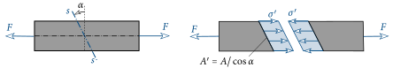{#fig-schraeger-schnitt}

Die Spannung, welche jetzt keine Normalspannung mehr ist, auf die Schnittfläche $A'$ ist gleich

$$
\sigma' = \dfrac{F}{A'} = \dfrac{F}{A}\cos\alpha \; .
$$ {#eq-spannung-schraeg}

Diese Spannung wird mit Hilfe der Winkelfunktionen aufgeteilt in eine Komponente normal und tangential zur Schnittfläche:

$$
\sigma = \sigma'\cos\alpha = \dfrac{F}{A}\cos^2\alpha
\quad \text{und} \quad
\tau = \sigma'\sin\alpha = \dfrac{F}{A}\sin\alpha\cos\alpha \; .
$$ {#eq-sigma-tau}

$\sigma$ ist dann wiederum eine Normalspannung und die in der Schnittfläche wirkende Spannung $\tau$ wollen wir als *Schubspannung* bezeichnen.
Folglich lassen sich Spannungen auch nach ihrer Wirkungsrichtung bezogen auf die Schnittfläche in Normal- und Schubspannungen unterteilen.

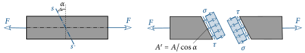{#fig-schubspannungen}

Aus der Beziehung ([-@eq-sigma-tau]) wird klar erkennbar, dass Spannungen von der *Orientierung* der Schnittfläche, auf die sie bezogen werden, abhängig sind.
Im vorliegenden Fall ist $\sigma$ und $\tau$ eine Funktion vom Winkel $\alpha$.

## Dehnung {#sec-dehnung}

Als nächstes wollen wir untersuchen, was mit der Abschleppstange in @fig-abschleppstange bei der Lastaufbringung passiert.
Auch wenn es mit freiem Auge schwer erkennbar ist, wird sich die Abschleppstange durch die Zugkraft dehnen, d.h. sie verlängert sich leicht.
In @fig-gleichmassdehnung ist die Stange vor und nach der Lastaufbringung dargestellt.
Die Änderung der Gesamtlänge beträgt $\Delta l$.
Zusätzlich wollen wir aber auch die Längsverschiebung eines Querschnittes an einer beliebigen Stelle $x$ wissen.
Diese wird mit der Funktion $u$ gemessen (@fig-gleichmassdehnung).

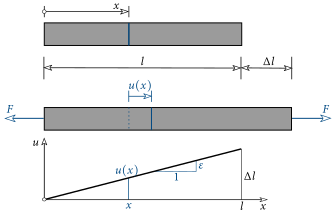{#fig-gleichmassdehnung}

Zusätzlich ist dort auch der Verlauf von $u$ für eine *konstante* Normalkraft dargestellt.
Ausgehend von Null am linken Ende steigt diese linear an und erreicht am rechten Ende den Wert $\Delta l$.
Eine weitere wichtige Größe, nämlich die *Dehnung*, erhalten wir, wenn die Längenänderung $\Delta l$ auf die ursprüngliche Länge $l$ bezogen wird:

$$
\ve = \dfrac{\Delta l}{l} \; .
$$ {#eq-dehnung}

Dieser Wert ist gleich der Steigung von der Längsverschiebung $u$.
Die Dehnung kann auch als relative Abstandsänderung zwischen zwei benachbarten Punkten verstanden werden.

Die Längenänderung ist, nicht wie in @fig-gleichmassdehnung, meist mit dem freien Auge kaum erkennbar, d.h. $\Delta l \ll l$.
Folglich ist auch die Dehnung sehr klein ($\ve\ll 1$) und wird aus diesem Grund meist in Prozent oder Promille angegeben.
Bei einer positiven Dehnung kommt es zu einer Verlängerung des Stabes, bei negativen Werten verkürzt sich der Stab.
Dann spricht man häufig auch von einer Stauchung.

Greift nun beispielsweise entlang des Stabes eine veränderliche verteilte Last an, wodurch auch die Normalkraft dann eine Veränderliche ist, dann ist die Verschiebung nicht mehr eine lineare Funktion, siehe @fig-veraenderliche-dehnung.

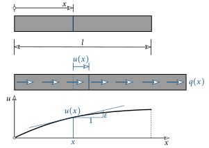{#fig-veraenderliche-dehnung}

Die Dehnung kann aber nach wie vor als die Steigung von $u$ an der Stelle $x$ interpretiert werden.
Mit Hilfe der ersten Ableitung erhalten wir die Steigung bzw. Dehnung:

$$
\myBox{\ve(x)=\dfrac{du}{dx}} \; .
$$ {#eq-dehnung-dudx}

Im Gegensatz zum ersten Lastfall ist diese nun nicht mehr konstant über die Stablänge.
Bei bekannter Dehnung kann durch Integration obiger Beziehung die Verschiebung und damit die Längenänderung des Stabes berechnet werden.

## Werkstoffgesetz {#sec-werkstoffgesetz}

Wir haben nun zwei neue wichtige mechanische Größen eingeführt: Spannung und Dehnung.
Doch besteht auch ein Zusammenhang zwischen den Beiden?
Dazu führen wir einen Zugversuch durch, siehe @fig-zugversuch.
Eine Zugprobe, meist von kreisförmigem Querschnitt, wird in eine entsprechende Maschine eingebaut.
Der untere Rand der Zugprobe ist dabei unverschieblich gelagert.
Im Gegensatz dazu kann der obere Rand durch einen hydraulischen Zylinder bewegt werden.
Daraus ergibt sich das mechanische Modell, welches in @fig-zugversuch dargestellt ist.
Es handelt sich um das gleiche System wie bei der Abschleppstange.
Sowohl die Kraft $F$ als auch die Verschiebung am oberen Rand $\Delta l$ werden während des Versuches gemessen und aufgezeichnet.

{#fig-zugversuch}

Berechnet man sich aus den Messdaten nach ([-@eq-spannung]) die Spannung und nach ([-@eq-dehnung]) die Dehnung und trägt diese in einem Diagramm auf, erhält man die in @fig-arbeitsdiagramm dargestellte Kurve.
Bei der Zugprobe handelt es sich dabei um einen naturharten Stahl.
Der Zusammenhang zwischen Dehnung und Spannung kann aus diesem Diagramm abgelesen werden.
Deutlich erkennbar ist, dass zu Beginn ein *linearer* Zusammenhang zwischen Dehnung und Spannung besteht.
Eine Verdopplung der Dehnung bewirkt folglich eine doppelt so große Spannung.

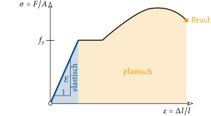{#fig-arbeitsdiagramm}

::: {.callout-important .plot-box icon=false}
## Interaktiv: Arbeitslinien im Vergleich

```{=html}
<div class="werkstoff-controls">
  <span class="wk-label">Werkstoff:</span>
  <button type="button" class="wk-btn" data-mat="S235">S235</button>
  <button type="button" class="wk-btn" data-mat="S355">S355</button>
  <button type="button" class="wk-btn" data-mat="Alu">Alu (AlMgSi)</button>
  <button type="button" class="wk-btn" data-mat="AZ91">AZ91 (Mg)</button>
  <button type="button" class="wk-btn" data-mat="Glas">Glas</button>
  <button type="button" class="wk-btn wk-replay" title="Animation erneut abspielen">▶ Abspielen</button>
</div>
<div id="plot-werkstoffe" style="width:100%;height:440px;"></div>
<script src="https://cdnjs.cloudflare.com/ajax/libs/plotly.js/2.27.0/plotly.min.js"></script>
<script>
(function () {
  var blue = "#004983", orange = "#f49b00", red = "#821131", grey = "#c2c2c2";
  var GD = "plot-werkstoffe";
  function fmt(n) { return n.toString().replace(/\B(?=(\d{3})+(?!\d))/g, " "); }  // 210000 -> 210 000

  // Baustahl: elastisch -> Fließplateau -> Verfestigung -> Einschnürung
  function steelMat(E, fy, fu, esh, eu, ef, sf) {
    var xs = [], ys = [], i, n, e, ey = fy / E;
    n = 12; for (i = 0; i <= n; i++) { e = ey * i / n;              xs.push(e); ys.push(E * e); }
    n = 14; for (i = 1; i <= n; i++) { e = ey + (esh - ey) * i / n; xs.push(e); ys.push(fy); }
    n = 70; for (i = 1; i <= n; i++) { e = esh + (eu - esh) * i / n; var t = (eu - e) / (eu - esh);
            xs.push(e); ys.push(fy + (fu - fy) * (1 - t * t)); }
    n = 24; for (i = 1; i <= n; i++) { e = eu + (ef - eu) * i / n;   xs.push(e); ys.push(fu + (sf - fu) * i / n); }
    var x = xs.map(function (v) { return v * 100; });
    var ann = [
      { x: ey * 100, y: fy, text: "f<sub>y</sub> = " + fy + " MPa", showarrow: true, arrowhead: 2, ax: 55, ay: -14, font: { color: red, size: 14 } },
      { x: eu * 100, y: fu, text: "f<sub>u</sub> = " + fu + " MPa", showarrow: true, arrowhead: 2, ax: -5, ay: -26, font: { color: red, size: 14 } }
    ];
    return { E: E, x: x, y: ys, ann: ann };
  }

  // Alu/Mg: gerundete Kurve ohne Fließplateau, 0,2%-Dehngrenze
  function smoothMat(E, rm, ef) {
    var xs = [], ys = [], i, n = 90, e, k = E / rm;
    for (i = 0; i <= n; i++) { e = ef * i / n; xs.push(e); ys.push(rm * (1 - Math.exp(-k * e))); }
    var x = xs.map(function (v) { return v * 100; });
    var idx = xs.length - 1;
    for (i = 0; i < xs.length; i++) { if (xs[i] - ys[i] / E >= 0.002) { idx = i; break; } }
    var ann = [
      { x: x[idx], y: ys[idx], text: "R<sub>p0,2</sub> ≈ " + Math.round(ys[idx]) + " MPa", showarrow: true, arrowhead: 2, ax: 60, ay: -6, font: { color: red, size: 14 } },
      { x: x[x.length - 1], y: rm, text: "R<sub>m</sub> = " + rm + " MPa", showarrow: true, arrowhead: 2, ax: -5, ay: -26, font: { color: red, size: 14 } }
    ];
    return { E: E, x: x, y: ys, ann: ann };
  }

  // Glas: linear-elastisch bis zum Sprödbruch, keine plastische Verformung
  function brittleMat(E, sf) {
    var ef = sf / E, xs = [], ys = [], i, n = 30, e;
    for (i = 0; i <= n; i++) { e = ef * i / n; xs.push(e); ys.push(E * e); }
    var x = xs.map(function (v) { return v * 100; });
    var ann = [
      { x: x[x.length - 1], y: sf, text: "Sprödbruch bei σ ≈ " + sf + " MPa", showarrow: true, arrowhead: 2, ax: 70, ay: -22, font: { color: red, size: 14 } }
    ];
    return { E: E, x: x, y: ys, ann: ann };
  }

  var MAT = {
    S235: steelMat(210000, 235, 360, 0.018, 0.16, 0.25, 345),
    S355: steelMat(210000, 355, 510, 0.015, 0.14, 0.22, 490),
    Alu:  smoothMat(70000, 310, 0.10),
    AZ91: smoothMat(45000, 230, 0.03),
    Glas: brittleMat(70000, 90)
  };
  var CUR = "S235";
  var ORDER = ["S235", "S355", "Alu", "AZ91", "Glas"];   // alle Kurven als Hintergrund

  function traces(key) {
    var d = MAT[key];
    // alle Materialien punktiert grau im Hintergrund
    var t = ORDER.map(function (k) {
      var m = MAT[k];
      return { x: m.x, y: m.y, mode: "lines", line: { color: grey, width: 1.5, dash: "dot" }, hoverinfo: "skip", showlegend: false };
    });
    // gewähltes Material farbig darüber
    t.push({ x: [d.x[0]], y: [d.y[0]], mode: "lines", line: { color: blue, width: 3 }, showlegend: false });
    t.push({ x: [d.x[0]], y: [d.y[0]], mode: "markers", marker: { color: orange, size: 11, line: { color: red, width: 1.5 } },
      showlegend: false, hovertemplate: "ε = %{x:.2f} %<br>σ = %{y:.0f} MPa<extra></extra>" });
    return t;
  }
  function layoutFor(key) {
    var eAnn = {
      xref: "paper", yref: "paper", x: 0.98, y: 0.07, xanchor: "right", yanchor: "bottom",
      text: "E-Modul = " + fmt(MAT[key].E) + " MPa", showarrow: false,
      font: { color: blue, size: 12 }, align: "right",
      bgcolor: "rgba(0,73,131,.06)", bordercolor: blue, borderwidth: 1, borderpad: 5
    };
    return {
      xaxis: { title: "Dehnung ε in %", range: [-0.6, 26], zeroline: false, gridcolor: "#eee",
               showline: true, linecolor: "#888", linewidth: 1, mirror: true },
      yaxis: { title: "Spannung σ in MPa", range: [0, 560], zeroline: false, gridcolor: "#eee",
               showline: true, linecolor: "#888", linewidth: 1, mirror: true },
      margin: { l: 62, r: 20, t: 20, b: 50 },
      paper_bgcolor: "rgba(0,0,0,0)", plot_bgcolor: "#fff", showlegend: false,
      annotations: MAT[key].ann.concat([eAnn])
    };
  }
  function framesFor(key) {
    var d = MAT[key], f = [], i, j, L = d.x.length - 1;
    var empties = []; for (j = 0; j < ORDER.length; j++) empties.push({});  // Hintergrund-Traces unverändert
    for (i = 1; i < d.x.length; i += 2) {
      f.push({ data: empties.concat([{ x: d.x.slice(0, i + 1), y: d.y.slice(0, i + 1) }, { x: [d.x[i]], y: [d.y[i]] }]) });
    }
    f.push({ data: empties.concat([{ x: d.x, y: d.y }, { x: [d.x[L]], y: [d.y[L]] }]) });
    return f;
  }

  function show(key, animate) {
    CUR = key;
    highlight(key);
    Plotly.react(GD, traces(key), layoutFor(key), { displayModeBar: false, responsive: true }).then(function () {
      if (animate) {
        Plotly.animate(GD, framesFor(key), { frame: { duration: 28, redraw: true }, transition: { duration: 0 }, mode: "immediate" });
      }
    });
  }

  var btns;
  function highlight(key) {
    if (!btns) return;
    btns.forEach(function (b) { b.classList.toggle("active", b.getAttribute("data-mat") === key); });
  }
  function wire() {
    btns = Array.prototype.slice.call(document.querySelectorAll(".werkstoff-controls .wk-btn[data-mat]"));
    btns.forEach(function (b) { b.addEventListener("click", function () { show(b.getAttribute("data-mat"), true); }); });
    var rp = document.querySelector(".werkstoff-controls .wk-replay");
    if (rp) rp.addEventListener("click", function () { show(CUR, true); });
    show("S235", true);
  }
  function ready() { if (window.Plotly) { wire(); } else { setTimeout(ready, 100); } }
  if (document.readyState !== "loading") { ready(); } else { document.addEventListener("DOMContentLoaded", ready); }
})();
</script>
```
:::

Die Steigung der Geraden wird bestimmt durch den *E-Modul*.
Dabei handelt es sich um einen Materialparameter in der Einheit einer Spannung.
Bis zum Erreichen der sogenannten *Fließgrenze* $f_y$ herrscht ein *linearer* Zusammenhang zwischen Dehnung und Spannung in der Form

$$
\myBox{\sigma = E\ve} \; .
$$ {#eq-hooke}

Obige Beziehung wird auch häufig als [Hooke]{.smallcaps}'sches Gesetz bezeichnet.
Im sogenannten *elastischen* Bereich, d.h. wenn die Spannung kleiner der Fließgrenze ist, und nur *hier* gilt dieser Zusammenhang!
Mit elastischem Materialverhalten wird beschrieben, dass wenn die Kraft $F$ wieder auf Null reduziert wird, die Zugprobe in die *unverformte* Ausgangslage zurückkehrt.
Am Ende ist somit die Dehnung wieder Null.

Wird die Fließgrenze erreicht bzw. überschritten, kommt es zu *plastischem* Materialverhalten.
Zunächst kommt es zu einer Zunahme der Dehnung bei gleichbleibender Spannung.
Anschließend kann die Spannung wieder gesteigert werden bis es zu einer Einschnürung der Zugprobe kommt, die in weiterer Folge zum Bruch führt.
Erfährt die Zugprobe eine Belastung im plastischen Bereich, d.h. $\sigma\geq f_y$, dann kehrt sie bei vollständiger Entlastung *nicht* in die unverformte Ausgangslage zurück!
Es verbleibt somit eine Dehnung in der Zugprobe.

Im Rahmen dieser Vorlesung betrachten wir nur den anfänglichen, linear elastischen Bereich.
Wir setzen somit die Gültigkeit des [Hooke]{.smallcaps}'schen Gesetzes ([-@eq-hooke]) voraus.
Somit haben wir einen *linearen* Zusammenhang zwischen Dehnung und Spannung gefunden, wobei der Proportionalitätsfaktor der $E$-Modul (Elastizitätsmodul) ist.
Das [Hooke]{.smallcaps}'sche Gesetz ist bei Beschränkung auf kleine Dehnungen (Verschiebungen) für zahlreiche Materialien anwendbar.
In @tbl-material ist der $E$-Modul für gängige metallische und nichtmetallische Materialien aufgelistet.

| Material        | $E$ (N/mm²)                   | $\alpha$ (1/°C)                      |
|:----------------|:-----------------------------:|:------------------------------------:|
| Stahl           | $2.1\cdot 10^5$               | $1.2\cdot 10^{-5}$                   |
| Aluminium       | $0.7\cdot 10^5$               | $2.3\cdot 10^{-5}$                   |
| Messing         | $1.0\cdot 10^5$               | $1.8\cdot 10^{-5}$                   |
| Gusseisen       | $1.0\cdot 10^5$               | $0.9\cdot 10^{-5}$                   |
| Holz (in Faser) | $0.7\ldots 2.0\cdot 10^4$     | $2.2\ldots 3.1\cdot 10^{-5}$         |
| Beton           | $0.3\cdot 10^5$               | $1.0\cdot 10^{-5}$                   |
| Glasfaser       | $0.8\cdot 10^5$               |                                      |

: Materialkennwerte {#tbl-material}

Neben einer äußeren Belastung kann auch eine Temperatur*änderung* eine Dehnung (Längenänderung) hervorrufen.
Wird der Stab bei einer Temperatur $T_0$ eingebaut und erfährt anschließend eine gleichförmige^[*Jeder* Punkt erfährt die *gleiche* Temperaturänderung!] Temperaturänderung von $\Delta T$, dann lässt sich experimentell zeigen, dass die Dehnung gleich

$$
\ve_T = \alpha\Delta T
$$ {#eq-dehnung-T}

ist.
Der *Wärmeausdehnungskoeffizient* $\alpha$ ist ein weiterer Materialparameter und wird in 1/°C angegeben, siehe @tbl-material.
Dabei ist zu beachten, dass es bei einer Erwärmung ($\Delta T>0$, $\Delta l>0$) zu einer Dehnung ($\ve_T>0$), und bei einer Abkühlung ($\Delta T<0$) zu einer Stauchung ($\ve_T<0$, $\Delta l<0$) kommt.
Zusammen mit dem [Hooke]{.smallcaps}'schen Gesetz ([-@eq-hooke]) ergibt sich die Dehnung zufolge äußerer Belastung und Temperaturänderung zu

$$
\ve = \dfrac{\sigma}{E} + \alpha\Delta T \; .
$$ {#eq-dehnung-gesamt}

Diese Beziehung lässt sich auch umschreiben zu

$$
\sigma = E(\ve-\alpha \Delta T) \; .
$$ {#eq-sigma-T}

::: {.callout-important .video-box icon=false}
## Video


:::

::: {#exm-thermisch}
Ein Stab der Länge $l$ und konstantem Querschnitt $A$ erfährt eine gleichförmige Temperaturänderung $\Delta T$.
Welche Unterschiede ergeben sich bei den zwei verschiedenen Lagerungen des Stabes?

{fig-align="center"}
:::

::: {.callout-tip .loesung collapse="true" icon=false}
## Lösung

Freischneiden der Auflager:

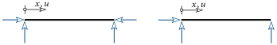{fig-align="center"}

Statisch bestimmt?

$$
\begin{align*}
\text{nein!} & & \text{ja!}
\end{align*}
$$

Gleichgewichtsbedingung in horizontaler Richtung $\sum H = 0$:

$$
\begin{align*}
\Cline[myBlue]{N(x)\neq 0} \rightarrow \sigma(x)\neq 0 & & N(x) = 0 \rightarrow \sigma(x) = 0
\end{align*}
$$

Längsverschiebung $u$:

$$
\begin{align*}
u(x) = 0 \rightarrow \ve = 0 & & \Cline[myBlue]{u(x) \neq 0} \rightarrow \ve\neq0
\end{align*}
$$

Aus ([-@eq-sigma-T]) folgt somit:

$$
\begin{align*}
\ve = 0 = \dfrac{\sigma}{E} + \alpha\Delta T & & \ve = \dfrac{du}{dx} = \alpha\Delta T
\end{align*}
$$

Lösen nach den Unbekannten:

$$
\begin{align*}
\sigma(x) = -E\alpha\Delta T \rightarrow \Cline[myBlue]{N(x) = -EA\alpha\Delta T} & & du = \alpha\Delta T\, dx \rightarrow \int \rightarrow \Cline[myBlue]{u(x) = \alpha\Delta T x}
\end{align*}
$$

Interpretiere die Lösungen! Worin liegt der Unterschied zwischen $\Delta T>0$ und $\Delta T<0$?
:::

Aus diesem einfachen Beispiel stellen wir Folgendes fest: Bei statisch bestimmten Systemen führt eine reine Temperaturänderung zu Dehnungen (Verformungen), aber zu keinen Spannungen!
Anders verhält es sich bei statisch *un*bestimmten Systemen.
Dort entstehen Spannungen und im Allgemeinen auch Verformungen bei veränderter Temperatur!

## Differentialgleichung für den Zug- und Druckstab {#sec-dgl-stab}

Mit den gewonnenen Beziehungen soll nun die Bestimmungsgleichung (Differentialgleichung) des Zug- oder Druckstabes in @fig-allg-zugstab hergeleitet werden.

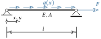{#fig-allg-zugstab}

Diese beschreibt das mechanische Verhalten des Stabes unter Einwirkung einer Einzelkraft $F$ oder einer verteilten Längsbelastung $q$.

In der Mechanik lassen sich drei Kategorien von Gleichungen (Beziehungen) angeben.
Für den Stab in @fig-allg-zugstab lauten diese:

- **Gleichgewicht**

  $$
  \myfrac{dN}{dx} = -q(x)
  $$ {#eq-gg-stab}

  Sprich: Die Änderung der Normalkraft $N$ in Stablängsrichtung $x$ ist gleich der negativen Längsbelastung $q$!

- **Kinematische Beziehungen** (Dehnung)

  $$
  \ve = \dfrac{du}{dx}
  $$ {#eq-kinematik}

- **Konstitutive Beziehungen** (Werkstoffgesetz)

  $$
  \sigma = E\ve
  $$ {#eq-werkstoff}

Aus der kinematischen und konstitutiven Beziehung folgt unter Beachtung von ([-@eq-spannung]) für die Normalkraft

$$
N = A\sigma = A\,E\ve = EA \dfrac{du}{dx} \; .
$$ {#eq-normalkraft}

Einsetzen in die Gleichgewichtsbedingung ([-@eq-gg-stab]) liefert

$$
\dfrac{d}{dx}\left(EA\dfrac{du}{dx}\right) = -q(x) \; .
$$ {#eq-dgl-allg}

Wird angenommen, dass sich der Querschnitt und der $E$-Modul entlang des Stabes nicht ändern ($EA=$ const.), erhalten wir schließlich^[Die beiden Schreibweisen für die Ableitungen sind ident: $\dfrac{d^2 u}{dx^2}\equiv u''$]

$$
\myBox{\dfrac{d^2u}{dx^2}=-\dfrac{q(x)}{EA}} \; .
$$ {#eq-dgl}

Diese *lineare* Differentialgleichung beschreibt das mechanische Verhalten des Zug- oder Druckstabes.
Durch Lösen von ([-@eq-dgl]) können wir bei bekannter äußerer Belastung die Längsverschiebung $u$ bestimmen, und in weiterer Folge mit den kinematischen und konstitutiven Beziehungen die Dehnung und Spannung.

::: {#exm-haengender-stab}
Bestimme den Verschiebungs- und Spannungsverlauf eines hängenden Stabes unter Eigengewicht und einer Einzellast!

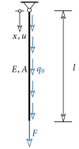{fig-align="center"}
:::

::: {.callout-tip .loesung collapse="true" icon=false}
## Lösung

Das Eigengewicht des Stabes pro Längeneinheit ist gegeben zu

$$
q(x)\equiv q_0 = \rho A g \; .
$$

Die Differentialgleichung ([-@eq-dgl]) lautet somit

$$
\dfrac{d^2u}{dx^2}=-\dfrac{q_0}{EA} \; .
$$

Durch Trennung der veränderlichen Variablen,

$$
d^2u = -\dfrac{q_0}{EA}\,dx^2 \; ,
$$

und anschließend zweimaliges Integrieren erhalten wir:

$$
u(x) = -\dfrac{q_0}{EA}\dfrac{x^2}{2} + C_1x + C_2 \; .
$$ {#eq-bsp-u}

Nun müssen noch die Integrationskonstanten an die *Randbedingungen* angepasst werden.
Am oberen Ende des Stabes muss gelten:

$$
u(x=0) = 0 \; .
$$

Daraus folgt unmittelbar $C_2=0$.
Am unteren Ende können wir keine Aussage über die Verschiebung, jedoch über die Spannung machen:

$$
\sigma(x=l) = \dfrac{F}{A} \; .
$$

Doch wie berechnet sich die Spannung?
Über das [Hooke]{.smallcaps}'sche Gesetz ([-@eq-hooke]) und die Dehnung ([-@eq-dehnung-dudx]) zu

$$
\sigma = E\ve = E\dfrac{du}{dx} \; .
$$

Einsetzen der Längsverschiebung ([-@eq-bsp-u]) und Auswerten an der Stelle $x=l$ ergibt:

$$
\sigma(x=l)=E\ve\big|_{x=l} = E\dfrac{du}{dx}\Bigg|_{x=l} = E\left(-\dfrac{q_0x}{EA}+C_1\right)\Bigg|_{x=l} = E\left(-\dfrac{q_0l}{EA}+C_1\right)=\dfrac{F}{A} \; ,
$$

aus der sich $C_1$ bestimmen lässt zu

$$
C_1 = \dfrac{1}{EA}\left(F+q_0l\right) \; .
$$

Somit ist die Verschiebung längs des Stabes gegeben zu

$$
u(x) = \dfrac{1}{EA}\left(-\dfrac{q_0x^2}{2}+q_0lx+Fx\right) \; .
$$

Skizziere diesen Verlauf und den dazugehörigen Spannungsverlauf!
:::

Anhand vom obigen Beispiel wollen wir die wichtige Bedeutung eines linearen mechanischen Systems hervorheben.
Die äußere Belastung auf den hängenden Stab kann in zwei *Lastfälle* (LF) unterteilt werden:

$$
\color{myBlue}{\text{LF 1}}\rightarrow q_0 \quad \text{und} \quad \color{myOrange}{\text{LF 2}}\rightarrow F \; .
$$

Aufgrund des *linearen* Verhaltens, und der daraus resultierenden *linearen* Differentialgleichung ([-@eq-dgl]), können wir jeden LF *getrennt* berechnen und anschließend die Ergebnisse *addieren* (oder überlagern).
Diese Möglichkeit der Berechnung wird als *Superpositionsprinzip* bezeichnet.
Beispielsweise setzt sich dann die Gesamtverschiebung aus der Summe der einzelnen LF zusammen:

$$
u(x) = u_{LF\;1} + u_{LF\;2} + u_{LF\;3} + \ldots \; .
$$ {#eq-superposition}

Dies erkennt man auch am Ergebnis des vorigen Beispiels:

$$
u(x) = u_{\color{myBlue}{LF\;1}} \bs{+} u_{\color{myOrange}{LF\;2}} = \dfrac{1}{EA}\left(\Cline[myBlue]{\color{myBlue}{q_0}(x^2-lx)} \bs{+} \Cline[myOrange]{\color{myOrange}{F}x}\right) \, .
$$ {#eq-superposition-bsp}

Gleiches gilt auch für jede andere mechanische Größe wie in diesem Fall Spannung und Dehnung.

Besitzt zumindest eine der grundlegenden Beziehungen (Gleichgewicht, kinematische und konstitutive Beziehungen) nichtlinearen Charakter, dann ist das mechanische Verhalten nicht mehr linear!
Als Beispiel hierfür wird das [Hooke]{.smallcaps}'sche Gesetz durch ein nichtlinear elastisches Werkstoffgesetz in der Form

$$
\sigma = C\ln(1+\ve)
$$ {#eq-gummi}

ersetzt, wobei $C$ ein experimentell zu bestimmender Materialparameter ist. Gummi weist ein derartiges Verhalten auf.
In @fig-gummi ist das dazugehörige Spannungs-Dehnungs-Diagramm dargestellt.

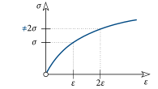{#fig-gummi}

Das mechanische Verhalten ist dann bestimmt durch die *nichtlineare* Differentialgleichung^[vgl. die *lineare* Differentialgleichung ([-@eq-dgl])!]

$$
CA\,\color{myBlue}{\dfrac{1}{1+\dfrac{du}{dx}}}\,\dfrac{d^2u}{dx^2} = q(x) \; .
$$ {#eq-dgl-nichtlinear}

In diesem Fall ist das Superpositionsprinzip *nicht* mehr gültig und anwendbar!
Ein entscheidender Nachteil in der praktischen Berechnung.

## Einfach statisch unbestimmte Systeme {#sec-statisch-unbestimmt}

Bei statisch unbestimmten Systemen reichen die Gleichgewichtsbedingungen nicht aus, um die Auflagerreaktionen und die inneren Stabkräfte zu bestimmen.
Mit Hilfe sogenannter *kinematischer Zwangsbedingungen* gewinnt man zusätzliche Gleichungen zur Berechnung derartiger Systeme.
Anhand eines Beispiels wollen wir die Vorgehensweise diskutieren.
Vorweg lassen sich die wesentlichen Schritte wie folgt angeben:

- Lösen einer Bindung – Rückführung auf ein statisch *bestimmtes* System.
- Berechnung der Verschiebung/Verformung, die am Ort und in Richtung der gelösten Bindung entsteht, am statisch bestimmten System zufolge der äußeren Belastung.
- Ansetzen der zur gelösten Bindung gehörenden, in ihrer Größe unbekannten Kraft $X$ am statisch bestimmten System und Bestimmung der Verschiebung/Verformung am Ort und in Richtung von $X$.
- Aufstellen einer kinematischen Zwangsbedingung und Berechnung der Kraft $X$ aus dieser.

::: {#exm-starre-platte}
Eine *starre*, gewichtslose Platte ist an drei Stäben aufgehängt.
Starr bedeutet, dass sie sich nicht verformt! Zwei Stäbe besitzen eine Dehnsteifigkeit von $EA_1$, der Dritte eine von der Größe $EA_2$.
Alle Stäbe haben die gleiche Länge $l$. Stab $1$ erfährt eine Temperaturänderung von der Größe $\Delta T$.
Im Punkt $A$ wird die starre Platte horizontal gehalten.
Es sind die Normalkräfte in den drei Stäben zu berechnen!

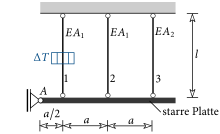{fig-align="center"}
:::

::: {.callout-tip .loesung collapse="true" icon=false}
## Lösung

Um die gesuchten Stabkräfte sichtbar zu machen, schneiden wir die starre Platte heraus, durchtrennen dabei die Stäbe $1$ bis $3$, und tragen anschließend alle Kräfte^[Normalkräfte als Zug positiv eintragen!] in einer Skizze ein (Schnittprinzip):

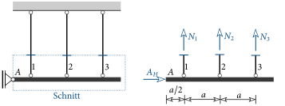{fig-align="center"}

Im Schnitt treten vier unbekannte Kräfte auf.
Für ein ebenes Kraftsystem stehen allerdings nur drei Gleichgewichtsbedingungen zur Verfügung.
Folglich handelt es sich um ein *einfach* ($4-3=1$) statisch *unbestimmtes* System.
Die drei Gleichgewichtsbedingungen lauten:

$$
\begin{aligned}
\sum H=0: &\quad A_H = 0 \\
\sum V=0: &\quad N_1 + N_2 + N_3 = 0 \\
\sum M^{(A)} = 0: &\quad N_1\dfrac{a}{2} + N_2\dfrac{3a}{2} + N_3\dfrac{5a}{2} = 0 \;.
\end{aligned}
$$ {#eq-gg-platte}

Aus der ersten folgt unmittelbar $A_H=0$.
Aus den verbleibenden zwei können wir aber nicht die drei unbekannten Normalkräfte berechnen.

Um die Normalkräfte dennoch berechnen zu können, gehen wir wie folgt vor.
Nun wird eine Bindung gelöst.
Im vorliegenden Fall bedeutet das, dass Stab $3$ unmittelbar oberhalb der Anbindung an die starre Platte durchtrennt wird.
Dadurch wird der Stab wirkungslos, d.h. die Normalkraft im Stab ist Null ($N_3=0$).
Durch diesen Schritt erhält man ein statisch *bestimmtes* System.
Folglich können die Normalkräfte $N_1$ und $N_2$ sowie $A_H$ aus den Gleichgewichtsbedingungen ([-@eq-gg-platte]) ermittelt werden.

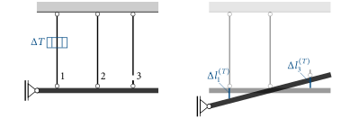{fig-align="center"}

Welche Bindung des statisch unbestimmten Systems gelöst wird, ist gleichgültig.
Es kann auch Stab $1$ oder Stab $3$ durchtrennt werden.

Wenn jetzt der Stab $1$ am obigen System eine Temperaturänderung von $\Delta T$ erfährt, sind die Normalkräfte $1$ und $2$ gleich Null!^[Warum eigentlich? Beachte das Gleichgewicht!]
Folglich ist auch die Normalspannung Null und aus ([-@eq-dehnung-gesamt]) erhält man für die Dehnung im Stab $1$

$$
\ve = \alpha\Delta T \; .
$$

Diese ist *konstant* über die Stablänge und nach ([-@eq-dehnung]) beträgt die Längenänderung dann zufolge Temperaturänderung (Hochzeiger $T$)^[Beachte: Wenn es zu einer Erwärmung ($\Delta T>0$) kommt, dann erfährt Stab $1$ eine Dehnung ($\Delta l_1^{(T)}>0$). Bei einer Abkühlung ($\Delta T<0$) wird der Stab gestaucht ($\Delta l_1^{(T)}<0$).]:

$$
\Delta l_1^{(T)} = \ve l = \alpha\Delta T l \; .
$$

An der Stelle, wo der Stab $3$ durchtrennt wurde, erhalten wir eine Überlappung der beiden Stabenden von der Größe

$$
\Delta l_3^{(T)} = - \Delta l_1^{(T)} \; .
$$

Diese Überlappung tritt am realen System natürlich nicht auf!
Im Stab $2$ wirkt weder eine Normalkraft noch eine Temperaturänderung.
Er erfährt daher keine Dehnung und seine Länge bleibt dadurch unverändert.
Daraus ergibt sich die oben dargestellte Verschiebung der Platte unter Temperatureinwirkung.

Nun wird an den beiden Enden des durchtrennten Stabes eine von der Größe her unbekannte Kraft $X$ angesetzt.
Diese entspricht der Normalkraft im Stab $3$.
Da am realen System zufolge einer positiven Temperaturänderung eine Druckkraft im Stab $3$ wirkt, setzen wir $X$ auch so an.

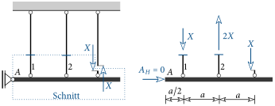{fig-align="center"}

Durch Freischneiden und über die Gleichgewichtsbedingungen erhält man die über die Länge konstanten Normalkräfte in den Stäben $1$ und $2$ zufolge $X$:

$$
N_1^{(X)} = -X \quad \text{und} \quad N_2^{(X)} = 2X\; .
$$

In der oberen Skizze sind diese vorzeichenrichtig eingetragen. Bei Kenntnis der Normalkraft können wir wieder mittels ([-@eq-dehnung]) und ([-@eq-dehnung-gesamt]) die jeweilige Längenänderung der Stäbe bestimmen:

$$
\Delta l_1^{(X)}= \ve l = \dfrac{\sigma}{E}l = \dfrac{N_1^{(X)}}{EA_1}l = -\dfrac{Xl}{EA_1}
\quad \text{und} \quad
\Delta l_2^{(X)}= \dfrac{N_2^{(X)}}{EA}l = \dfrac{2Xl}{EA_1} \; .
$$

Aus geometrischen Überlegungen (Geradengleichung) ergibt sich für diesen Lastfall eine Klaffung der durchtrennten Stabenden des Stabes $3$ zu:

$$
\Delta l_3^{(X)}=\Delta l_1^{(X)} +\dfrac{\Delta l_2^{(X)}-\Delta l_1^{(X)}}{a}2a = 2\Delta l_2^{(X)}-\Delta l_1^{(X)} = \dfrac{5Xl}{EA_1} \; .
$$

Diese ist von der Größe von $X$ abhängig.

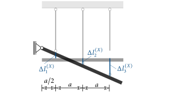{fig-align="center"}

In nachfolgender Skizze ist die vertikale Verschiebung des unteren durchtrennten Stabendes (blauer Strich) zufolge Temperaturänderung und Kraft $X$ dargestellt.
Die unbekannte Kraft $X$ wirkt aber auch auf den oberen Teil des hängenden Stabes $3$.
Die vertikale Verschiebung des oberen Stabendes (oranger Strich) ist

$$
\Delta l_3 = -\dfrac{Xl}{EA_2} \; .
$$

Doch wie groß sind die vertikalen Verschiebungen der beiden durchtrennten Stabenden am realen System?

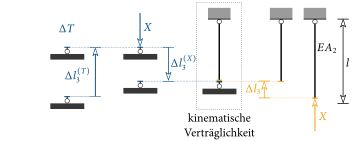{fig-align="center"}

Diese *müssen* sich an derselben Position befinden, d.h. es darf weder zu einer Klaffung noch zu einer Überlappung an der durchtrennten Stelle kommen!
Daraus können wir folgende kinematische Verträglichkeit aufstellen

$$
\Delta l_3^{(T)} + \Delta l_3^{(X)} = \Delta l_3 \; .
$$

Und daraus können wir die unbekannte Kraft $X$ bestimmen:

$$
X = \dfrac{1}{5+\dfrac{EA_1}{EA_2}}\,EA_1\alpha\Delta T \; .
$$

Da $X$ als Druckkraft auf den Stab $3$ angesetzt wurde, ist $N_3=-X$. Durch Lösen der Gleichgewichtsbedingungen ([-@eq-gg-platte]) erhalten wir dann die beiden anderen Normalkräfte:

$$
N_1 = -\dfrac{1}{5+\dfrac{EA_1}{EA_2}}\,EA_1\alpha\Delta T \qquad
N_2 = \dfrac{2}{5+\dfrac{EA_1}{EA_2}}\,EA_1\alpha\Delta T \; .
$$

Bei Kenntnis der Normalkräfte kann anschließend die Längenänderung der Stäbe bestimmt werden:

$$
\Delta l_1= \left(1-\dfrac{1}{5+\dfrac{EA_1}{EA_2}}\right)\alpha\Delta T l \qquad
\Delta l_2= \dfrac{2}{5+\dfrac{EA_1}{EA_2}}\alpha\Delta T l \qquad
\Delta l_3= -\dfrac{1}{5+\dfrac{EA_1}{EA_2}}\alpha\Delta T l \; .
$$

In @fig-steifigkeitsverhaeltnis ist die Normalkraft in den Stäben und ihre Längenänderung für unterschiedliche Steifigkeitsverhältnisse $EA_1/EA_2$ dargestellt.
Daraus geht eindeutig hervor, dass bei einem statisch *unbestimmten* System die Auflagerreaktionen und Schnittgrößen auch vom Steifigkeitsverhältnis abhängig sind!

Die eingetragenen Punkte stellen die Lösung für den dehnstarren Stab dar, d.h. $EA_2\rightarrow\infty$.
In diesem Fall ist die Längenänderung des Stabes $3$ gleich Null.
Der andere Grenzfall, $EA_2=0$, ist gleichbedeutend mit dem Fehlen des Stabes.
Dann wäre das System statisch bestimmt.

Aus diesen Ergebnissen lassen sich wichtige Schlussfolgerungen ziehen:

- Bei statisch *bestimmten* Systemen ($EA_2=0$) bewirkt eine Temperaturänderung Verformungen, aber *keine* zusätzlichen Kräfte!
- Ist das System statisch *unbestimmt*, kommt es bei einer Temperaturänderung zu Verformungen *und* zusätzlichen Kräften!

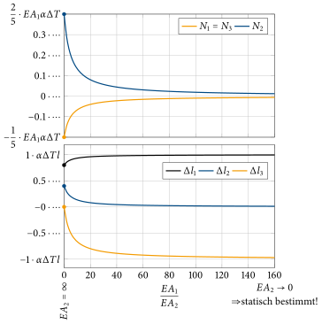{#fig-steifigkeitsverhaeltnis}
:::

::: {#exm-vordach}
Gegeben ist das statische System eines Vordaches. Beide Stäbe haben die gleiche Dehnsteifigkeit $EA$.
Berechne die Stabkräfte, ihre Längenänderung und die Horizontal- und Vertikalverschiebung des Punktes $A$! Dabei werden *kleine* Verschiebungen angenommen!

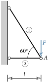{fig-align="center"}
:::

::: {.callout-tip .loesung collapse="true" icon=false}
## Lösung

- Stabkräfte: $S_1 = \dfrac{2F}{\sqrt{3}}, \; S_2=-\dfrac{F}{\sqrt{3}}$
- Längenänderung: $\Delta l_1 = \dfrac{4}{\sqrt{3}}\dfrac{Fl}{EA}, \; \Delta l_2 = -\dfrac{1}{\sqrt{3}}\dfrac{Fl}{EA}$
- Horizontale und vertikale Verschiebung: $u_H = -\dfrac{1}{\sqrt{3}}\dfrac{Fl}{EA},\; u_V = \dfrac{\sqrt{3}}{2}\Delta l_1 + \sqrt{3}|\Delta l_2| = 3\dfrac{Fl}{EA}$
:::

::: {#exm-drei-staebe}
Bestimme die Normalkräfte in den Stäben $1$ bis $3$ sowie die Horizontal- und Vertikalverschiebung des Punktes $A$!

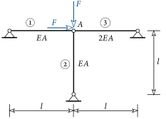{fig-align="center"}
:::

::: {.callout-tip .loesung collapse="true" icon=false}
## Lösung

- Stabkräfte: $S_1 = \dfrac{F}{3}\;, \; S_2 = -F\;, \; S_3 =-\dfrac{2F}{3}$
- Horizontale und vertikale Verschiebung: $u_H=\dfrac{Fl}{3EA}\;, \; u_V=\dfrac{Fl}{EA}$
:::

::: {#exm-starre-platte-T}
Eine starre Platte wird durch eine Einzelkraft $F$ belastet und durch zwei Stäbe gehalten.
Wie groß ist die Absenkung im Punkt $A$?
Um wie viel müsste der Stab $1$ erwärmt werden, damit es zu keiner Absenkung kommt?

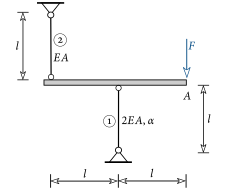{fig-align="center"}
:::

::: {.callout-tip .loesung collapse="true" icon=false}
## Lösung

- Stabkräfte: $S_1 = -2F,\;S_2 = -F$
- Absenkung: $u_V = \dfrac{3Fl}{EA}$
- Erwärmung: $\Delta T = +\dfrac{3F}{2\alpha EA}$
:::

::: {#exm-seilbagger}
Wir betrachten ein vereinfachtes Modell eines Seilbaggers.
Der Ausleger und die Rückverankerung werden als Stäbe mit einer Dehnsteifigkeit von $42000\,\text{kN/cm}$ betrachtet.
Im gemeinsamen Punkt $A$ der beiden Stäbe ist eine Umlenkrolle mit einem Radius von $30\,\text{cm}$ angebracht.
Das Seil mit einer Länge von $15\,\text{m}$ und einer Dehnsteifigkeit von $21000\,\text{kN/cm}$ wird vom Aufhängepunkt $B$ reibungsfrei um diese Rolle zur Winde geführt.
Am Seil wird im Punkt $B$ eine Masse von $2000\,\text{kg}$ angehängt.

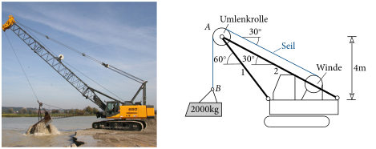{fig-align="center"}

Gesucht sind für den statischen Fall:

1) Seilkraft vor und nach der Umlenkrolle.
2) Krafteinwirkung auf die Stäbe $1$ und $2$ im Punkt $A$.
3) Berechnung der Normalkraft in Stab $1$ und Stab $2$.
4) Horizontale und vertikale Verschiebung des Punktes $A$.
5) Um wie viel senkt sich der Punkt $B$ in Summe ab?
:::

::: {.callout-tip .loesung collapse="true" icon=false}
## Lösung

1) $S_\text{vor}=S_\text{nach}=19.62\,\text{kN}$
2) $F_H=17.0\,\text{kN} \quad F_V=29.43\,\text{kN}$
3) $S_1=33.99\,\text{kN} \quad S_2=0$
4) $u_H=0.19\,\text{cm} \quad u_V=0.32\,\text{cm}$
5) $u_V=1.72\,\text{cm}$
:::
