

# Beam Bending {#sec-balkenbiegung}

## Deformation of the Bar {#sec-verformung-stab}

First we consider the deformation of the bar for different directions of the external load.
For the tension or compression bar, the external forces always act in the direction of the bar axis.
The accompanying deformation of the bar can be described as a change in length, see @fig-verformung-biegung.
This longitudinal displacement is described by the function $u$ in the direction of the coordinate $x$.

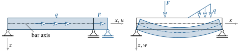{#fig-verformung-biegung}

If the external load now acts perpendicular to the bar axis, a markedly different deformation of the bar occurs, see @fig-verformung-biegung.
The bar experiences a displacement normal to the bar axis.
This transverse displacement in the direction of the $z$-coordinate we shall describe with the function $w$.
In contrast to a pure axial load, a transverse load causes a *curving* of the bar, i.e. in the deformed state the bar is no longer straight.
In engineering usage this type of deformation of the bar is, however, often described as *deflection*.
Hence also the name of this chapter – beam bending.

The direction of the external load also has an influence on the internal forces, however.
Under pure axial load, only a normal force acts in the bar.
Under transverse load, bending moments (and shear forces) appear as internal forces.
The curving of the bar is thus a direct consequence of the bending moment acting in the bar.

From experiments the following statement can furthermore be made: if one considers a cross-section of the bar that in the undeformed state stands perpendicular to the bar axis, then it remains *plane* during the deformation (curving) of the bar, see @fig-eben-querschnitt.

{#fig-eben-querschnitt}

In the side view of the beam (@fig-eben-querschnitt) we see the cross-section projected.
In the deformed state, however, it is still a *plane*.
It can furthermore be seen that the cross-section undergoes a rotation about the axis normal to the plane.
From @fig-eben-querschnitt one recognises that this rotation varies along the bar.

Such a statement about the deformation can only be made for a bar (or beam), not for an arbitrary body.
In mechanics, a bar is a body whose longitudinal dimension $l$ is substantially larger than the cross-sectional dimensions $b$ and $h$, i.e. $l\gg b,h$.
If this applies, the kinematic hypothesis that *the cross-section remains plane* is justified!

## Bending Stresses {#sec-biegespannungen}

A deformation of the bar as shown in @fig-eben-querschnitt is caused by a bending moment.
If one considers the upper outer fibre of the bar, it is compressed and, according to [Hooke]{.smallcaps}'s law, a compressive stress arises.
The same happens to the lower outer fibre, except that it becomes longer and hence a tensile stress develops.
From this we recognise that the bending moment produces variable stresses over the cross-section, and we want to determine these in this section.

In order to compute the stresses in the cross-section, we must first describe the motion of a cross-section.

{#fig-querschnitts-verformung}

During deformation, it experiences a displacement in the direction of $z$ of magnitude $w$ and simultaneously a rotation by the angle $\vp$, see @fig-querschnitts-verformung.
In the case of pure bending, i.e. the shear force acting in the cross-section is zero, the centre of rotation coincides with the centroid.

The displacement of a point $P$ located at a distance $z$ from the centroid, in the direction of $x$, is then equal to

$$
u(x,z) = \sin\vp(x)z \approx \vp(x)z \; .
$$ {#eq-u-querschnitt}

Because of the smallness of the displacements and rotations, in the above relation $\sin\vp$ may be approximated by $\vp$.

The strain of a fibre passing through the point $P$ can be determined according to ([-@eq-dehnung-dudx]) as

$$
\ve = \dfrac{du}{dx} = \dfrac{d\vp}{dx}z \; .
$$ {#eq-dehnung-biegung}

One recognises that the strain varies linearly over the height of the cross-section and takes its minimum or maximum value at the edges.
A fibre at the height of the centroid $S$ experiences no strain.
It is therefore often called the neutral fibre.

Using [Hooke]{.smallcaps}'s law ([-@eq-hooke]), the normal stress at a point $P$ of the cross-section becomes

$$
\sigma = E\ve = E\dfrac{d\vp}{dx}z \; .
$$ {#eq-sigma-biegung}

Like the strain, the normal stresses are also distributed linearly over the height of the cross-section and reach their minimum or maximum value at the edges of the bar.

In the next step a relationship between $\sigma$ and the bending moment about the $y$-axis $M_y$ must be established.
To do so we again consider a point $P$ of a *singly* symmetric cross-section.
At this point the normal stress $\sigma$ acts, see @fig-dMy.

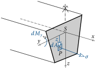{#fig-dMy}

If we multiply this stress by the infinitesimal area element $dA$ on which it acts, we obtain the resultant force.
If this expression is multiplied by the lever arm $z$, then we obtain the moment that the stress at point $P$ generates about the $y$-axis:

$$
dM_y = \sigma \, dA \, z \; .
$$ {#eq-dMy}

For the stress we can insert the expression ([-@eq-sigma-biegung]):

$$
dM_y = E\dfrac{d\vp}{dx}\,z^2\,dA \; .
$$ {#eq-dMy2}

If we compute this moment for every point of the cross-section and sum them up, i.e. integrate, the result is the bending moment about the $y$-axis:

$$
M_y = \int dM_y = E\dfrac{d\vp}{dx}\int\limits_A z^2\,dA = E\dfrac{d\vp}{dx} I_y \; ,
$$ {#eq-My}

with the *second moment of area*

$$
I_y = \int\limits_A z^2\,dA \; .
$$ {#eq-Iy}

$I_y$ has, for example, the unit cm⁴, is always positive, and depends on the cross-sectional geometry.
It can often be taken from reference tables, and for two common cross-sections it is given in @fig-Iy.

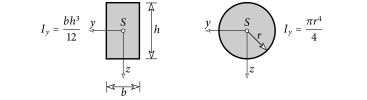{#fig-Iy}

If we rearrange the expression in ([-@eq-My]) to

$$
\dfrac{d\vp}{dx} = \dfrac{M_y}{EI_y}
$$ {#eq-kruemmung}

and then insert this into ([-@eq-sigma-biegung]), we finally obtain the sought relation for computing the normal stress due to a bending moment

$$
\myBox{\sigma(x,z) = \dfrac{M_y(x)}{I_y} \, z} \; .
$$ {#eq-sigma-M}

The normal stress due to a bending moment is distributed linearly over the height of the cross-section, reaches its maximum or minimum in the outer fibres, and is zero at the bar axis (neutral fibre).
The linear distribution stems from the assumption that the cross-section remains plane.

If, in addition, a normal force also acts in the cross-section, then this too causes a normal stress.
Because of the linear behaviour, we can determine the resultant normal stress by applying the principle of superposition, i.e. the relations ([-@eq-spannung]) and ([-@eq-sigma-M]) are to be added:

$$
\myBox{\sigma(x,z) = \dfrac{N(x)}{A} + \dfrac{M_y(x)}{I_y} \, z} \; .
$$ {#eq-sigma-NM}

In @fig-sigma-NM the distribution of the normal stresses due to $N$ and $M$ is shown.
It can be seen that when a normal force occurs, $\sigma$ is no longer zero at the height of the bar axis.

{#fig-sigma-NM}

Furthermore, it is also emphasised that these normal stresses appear in a cross-section normal to the bar axis.
If the cutting direction is changed, the normal stresses take different values and shear stresses then also act in the considered section.

::: {#exm-haltestelle}
In this example the largest compressive and tensile stresses of the main structure of a bus-stop canopy are sought.
The structural system and the cross-section of an I-beam are shown below.

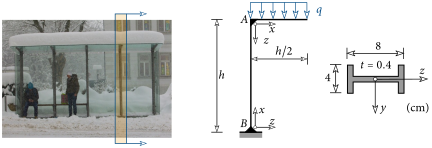{fig-align="center"}
:::

::: {.callout-tip .loesung collapse="true" icon=false}
## Solution

First the internal forces have to be determined, which in this case is possible without prior computation of the support reactions.
First we cut vertically immediately to the *right* of point $A$ and obtain:

::: {layout="[40,60]" layout-valign="center"}
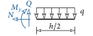

$$
\begin{aligned}
\pnr\sum H=0:&\quad N = 0 \\
\pqo\sum V=0:&\quad Q - \dfrac{qh}{2}=0 \rightarrow Q = \dfrac{qh}{2} \\
\pml\sum M=0:&\quad M_y + \dfrac{qh}{2}\dfrac{h}{4} = 0\rightarrow M = -\dfrac{qh^2}{8}
\end{aligned}
$$
:::

Subsequently we cut horizontally immediately *below* point $A$:

::: {layout="[40,60]" layout-valign="center"}
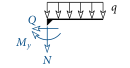

$$
\begin{aligned}
\pnr\sum H=0:&\quad Q = 0 \\
\pqu\sum V=0:&\quad N + \dfrac{qh}{2}=0 \rightarrow N = -\dfrac{qh}{2} \\
\pml\sum M=0:&\quad M_y + \dfrac{qh}{2}\dfrac{h}{4} = 0\rightarrow M = -\dfrac{qh^2}{8}
\end{aligned}
$$
:::

In both cases it is the negative cut face, from which the directions of the internal forces at the cuts follow according to the coordinate systems defined in the problem statement.
The normal-force and bending-moment distributions are shown below.

{fig-align="center"}

The normal force and the bending moment each reach their largest value in magnitude in the vertical bar.
Therefore the largest compressive and tensile stresses also occur there.

For the determination of $\sigma$ according to ([-@eq-sigma-NM]) we first need the cross-sectional area $A$ and the second moment of area $I_y$.
With the dimensions in the problem statement, the cross-section of the I-beam is equal to

$$
A = 6.1\,\text{cm}^2 \; .
$$

Since the cross-section is composed of three rectangular areas, it is easier to compute the second moment of area using the *parallel-axis theorem* ([Steiner]{.smallcaps}'s theorem):

$$
I_y = \sum\limits_{i=1}^n I_{\overline{y},i} + e_i^2A_i \; .
$$

We divide the I-beam into two (three) rectangular cross-sections, i.e. $n=2$.

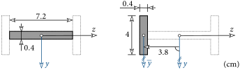{fig-align="center"}

With the figure above, we then obtain, using [Steiner]{.smallcaps}'s theorem, the second moment of area of the I-beam about the $y$-axis as

$$
I_y = \dfrac{0.4\cdot 7.2^3}{12} + \left(\dfrac{4\cdot 0.4^3}{12} + 3.8^2\cdot 4 \cdot 0.4\right)\cdot 2 = 12.4 + 23.1 = 58.7\,\text{cm}^4 \; .
$$

If we choose the height to be $h=4\,\text{m}$ and the uniform load to be $q=1\,\text{kN/m}$, the normal force and the bending moment in the vertical bar are equal to

$$
N = - 2\,\text{kN} \quad \text{and} \quad M_y = -2\,\text{kNm} \; .
$$

Now we can compute the normal stresses at the edges of the bar according to ([-@eq-sigma-NM]):

$$
\begin{aligned}
\sigma&=\dfrac{-2}{6.1}+\dfrac{-200}{58.7}\cdot 4 &&= -14.0\,\text{kN/cm}^2 \\
\sigma&=\dfrac{-2}{6.1}+\dfrac{-200}{58.7}\cdot (-4) &&= +13.3\,\text{kN/cm}^2
\end{aligned}
$$

Represented graphically, the normal-stress distribution is shown in the figure below.
The value at the bar axis is $\sigma(z=0)=N/A=-0.3\,\text{kN/cm}^2$.

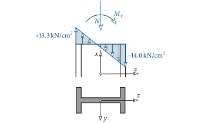{fig-align="center"}
:::

## Deflection Curve {#sec-biegelinie}

In this section we now want to determine the deformation of the bar due to a bending moment (a transverse load).
The displacement of an arbitrary cross-section at position $x$ *transverse* to the bar axis (direction $z$) we measure with the function $w(x)$.
The *deformed* bar axis is often called the *deflection curve*.

Up to now we have assumed that a cross-section of the bar remains plane during deformation (see @fig-eben-querschnitt) and performs a rotation by the angle $\vp$.
For *slender* bars it can furthermore be assumed that the right angle between cross-section and bar axis is preserved.
The deformed, plane cross-section thus also stands *normal* to the *deformed* bar axis, see @fig-bernoulli.

![[Bernoulli]{.smallcaps} hypothesis](images-en/Bernoulli.svg){#fig-bernoulli}

These kinematic assumptions are called the [Bernoulli]{.smallcaps} hypothesis.

Through this assumption a relationship can now be established between the angle $\vp$ and the sought deflection curve $w(x)$.
From @fig-bernoulli it can be seen that the tangent of $\vp$ equals the slope of the tangent to the deflection curve at the considered position:

$$
\tan\vp \approx \vp = -\dfrac{dw}{dx} \; .
$$ {#eq-phi-w}

For *small* $\vp$, $\tan\vp$ can be approximated by $\vp$.^[$\vp\leq10^\circ!\qquad\text{e.g.}\;\vp=10^\circ=0.1745...\,\text{rad}\rightarrow \tan\vp = 0.1763...\approx\vp$]
In @fig-bernoulli the deflection curve has a positive slope.^[$w(x)$ increases monotonically!]
The resulting cross-sectional rotation $\vp$ about the $y$-axis is, however, negative!
This results in the negative sign in ([-@eq-phi-w]).
If we insert this relation for $\vp$ into ([-@eq-My]) and carry out the differentiation, then we obtain the *differential equation of the deflection curve* for a *slender* bar:

$$
\myBox{\dfrac{d^2w}{dx^2} = -\dfrac{M_y(x)}{EI_y}} \; .
$$ {#eq-biegelinie}

This differential equation is also *linear*, i.e. the principle of superposition is again applicable.
However, it is only valid for *slender* bars.
This is the case when the ratio of the length of the bar $l$ to its cross-sectional dimensions

$$
\dfrac{l}{b,\; h} > 10
$$

holds. If the above condition is not fulfilled, then the [Bernoulli]{.smallcaps} hypothesis is not valid and other kinematic approaches must be used, such as that of [Timoshenko]{.smallcaps}.

In accordance with the support conditions, we can make statements in advance at these locations about the magnitude of the deflection or the rotation of the bar axis (or the cross-section).
In @fig-biegelinie-rb these are shown for common support conditions.

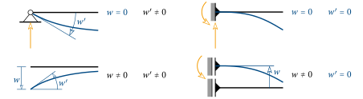{#fig-biegelinie-rb}

In addition, the support reactions are also entered.
These forces and moments bring about precisely that the deflection or rotation of the bar axis at the support is exactly zero!
Support reactions (also *support forces*) are therefore often called *constraint forces*.

Finally we want to examine the sign in ([-@eq-biegelinie]) more closely.
The sign of the curvature is determined by the second derivative of a function.
Here, however, it must be particularly noted that the $z$-axis points *downwards*^[The $z$-axis thus points exactly in the direction of gravity!], and hence the usual definitions are exactly interchanged.

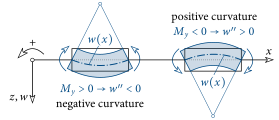{#fig-konkav-konvex}

A positive bending moment produces, according to ([-@eq-biegelinie]), a negative curvature, see @fig-konkav-konvex.
The centre of curvature lies in the negative $z$ range.
The shape of the deflection curve $w$ can also be described as curved to the left, since if one drives with a car in the direction of the $x$-axis, the steering wheel must be turned to the left.
It is exactly the other way round when the bending moment is negative.
Then the deflection curve has a positive curvature, i.e. is curved to the right.

::: {#exm-biegelinie}
Given is the following statically determinate system:

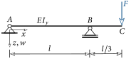{fig-align="center"}

Sought are:

- Deflection curve between $A$ and $B$
- Location and magnitude of the maximum deflection between $A$ and $B$
- Deflection curve between $B$ and $C$
- Deflection at point $C$
:::

::: {.callout-tip .loesung collapse="true" icon=false}
## Solution

To compute the deflection curve with relation ([-@eq-biegelinie]), we must determine the bending moment $M_y$.
One way to do this is to first compute the support reactions using the equilibrium conditions and then the bending moment.
With appropriate practice, in this example the bending-moment distribution can also be determined without knowledge of the support reactions.

{fig-align="center"}

From the above representation of $M_y$ one recognises that $M_y$ exhibits a discontinuity at position $B$.
The entire distribution cannot therefore be described by *one* function, and the segments $A-B$ and $B-C$ must therefore be considered separately.
For this reason two coordinate systems are chosen: in $x_1-z$, with origin at $A$, we measure the deflection between $A$ and $B$, and $x_2-z$, with origin at $B$, takes over this task between $B$ and $C$.

The bending moment as a function of $x_1$ in the region $A-B$ can be determined from a cut at an arbitrary position $x_1$ using the moment equilibrium condition:

::: {layout="[40,60]" layout-valign="center"}
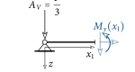

$$
\pmr\sum M=0:\; M_y(x_1) + A_Vx_1 = 0\rightarrow M_y(x_1) = -\dfrac{Fx_1}{3}
$$
:::

In this case the equation of the straight line can also be determined directly from the above bending-moment distribution.
The differential equation of the deflection curve thus reads

$$
\dfrac{d^2w_1}{dx_1^2}=+\dfrac{Fx_1}{3EI_y} \; .
$$

It is again solved by separation of the variables and subsequent double integration:

$$
\begin{aligned}
\dfrac{dw_1}{dx_1} &= \dfrac{Fx_1^2}{6EI_y} + C_1 \\
w_1(x_1) &= \dfrac{Fx_1^3}{18EI_y} + C_1x_1 + C_2 \; .
\end{aligned}
$$

The two constants of integration, $C_1$ and $C_2$, are determined from the boundary conditions (cf. @fig-biegelinie-rb).
Because of the supports at $A$ and $B$, the deflection of the bar is there equal to zero:

$$
\begin{aligned}
w_1(x_1=0) = 0:&\; \rightarrow C_2 = 0 \\
w_1(x_1=l) = 0:&\; \dfrac{Fl^3}{18EI_y} + C_1l = 0 \rightarrow C_1 = -\dfrac{Fl^2}{18EI_y} \; .
\end{aligned}
$$

Thus the deflection curve between $A$ and $B$ reads

$$
w_1(x_1) = \dfrac{F}{18EI_y}(x_1^3-l^2x_1) \; .
$$ {#eq-bsp-w1}

By solving an extremum problem, the location and the maximum deflection between $A$ and $B$ can be determined.
From the condition that the first derivative vanishes, the location can be found:

$$
\dfrac{dw_1}{dx_1} = \dfrac{F}{18EI_y}(3x_1^2-l^2) = 0 \;\rightarrow\; x_m = \dfrac{l}{\sqrt{3}} \; .
$$

Evaluating the deflection curve ([-@eq-bsp-w1]) at this location gives the maximum value:

$$
w_{max} = w_1(x_1=x_m) = -\dfrac{\sqrt{3}}{81}\dfrac{Fl^3}{EI_y} =-0.021...\,\dfrac{Fl^3}{EI_y}\; .
$$

For the determination of the deflection curve between $B$ and $C$ we now switch to the coordinate system $x_2-z$.
The bending-moment distribution is then given by

$$
M_y(x_2) = F\left(x_2-\dfrac{l}{3}\right) \; .
$$

The differential equation then reads

$$
\dfrac{d^2w_2}{dx_2^2}=-\dfrac{F}{EI_y}\left(x_2-\dfrac{l}{3}\right) \; ,
$$

which is solved in the same way as before:

$$
\begin{aligned}
\dfrac{dw_2}{dx_2} &= -\dfrac{F}{EI_y}\left(\dfrac{x_2^2}{2}-\dfrac{lx_2}{3}\right) + C_1\\
w_2(x_2) &= -\dfrac{F}{EI_y}\left(\dfrac{x_2^3}{6}-\dfrac{lx_2^2}{6}\right) + C_1x_2 + C_2 \; .
\end{aligned}
$$

From the condition that the deflection at position $B$ is equal to zero, we obtain

$$
w_2(x_2=0) = 0 \;\rightarrow\;C_2 = 0 \; .
$$

The second constant of integration we can determine from the transition condition

$$
\dfrac{dw_1}{dx_1}\Bigg|_{x_1=l} = \dfrac{dw_2}{dx_2}\Bigg|_{x_2=0}
$$

The tangent to the deflection curves of $w_1$ and $w_2$ has the same slope at position $B$.

{fig-align="center"}

Computing the derivatives

$$
\dfrac{F}{18EI_y}\left(3x_1^2-l^2\right)\Bigg|_{x_1=l}=-\dfrac{F}{EI_y}\left(\dfrac{3x_2^2}{6}-\dfrac{2lx_2}{6}\right)+C_1\,\Bigg|_{x_2=0}
$$

and evaluating at position $B$ thus gives

$$
C_1 = \dfrac{Fl^2}{9EI_y} \; .
$$

The deflection curve in the region $B-C$ is thus given by

$$
w_2(x_2) = \dfrac{F}{EI_y}\left(\dfrac{l^2x_2}{9}+\dfrac{lx_2^2}{6}-\dfrac{x_2^3}{6}\right)\; .
$$

To determine the deflection at point $C$ we must evaluate this deflection curve for $x_2=l/3$ and obtain

$$
w_{2,C} = w_2\left(x_2=\dfrac{l}{3}\right)=\dfrac{4}{81}\dfrac{Fl^3}{EI_y}=0.049...\,\dfrac{Fl^3}{EI_y} \;.
$$

The entire deflection curve of the beam is shown below.

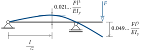{fig-align="center"}
:::

::: {#exm-biegelinie-dreieckslast}
Determine the deflection curve of the following system!
Estimate the location of the largest deflection!

{fig-align="center"}
:::

::: {.callout-tip .loesung collapse="true" icon=false}
## Solution

- Bending-moment distribution: $M_y(x) = \dfrac{q_0}{6}\left(lx-\dfrac{x^3}{l}\right)$
- Deflection curve: $w(x) = \dfrac{q_0}{EI_y}\left(-\dfrac{lx^3}{36}+\dfrac{x^5}{120l}+C_1x + C_2\right)$
- Constants of integration from boundary conditions: $C_2=0,\quad C_1=\dfrac{7l^3}{360}$
- Deflection curve: $w(x) = \dfrac{q_0}{EI_y}\left(\dfrac{7l^3x}{360}-\dfrac{lx^3}{36}+\dfrac{x^5}{120l}\right)$
:::

::: {#exm-biegelinie-rahmen}
Determine the deflection curve between the points $A$ and $B$!
How large is the horizontal and vertical displacement of point $C$?

{fig-align="center"}
:::

::: {.callout-tip .loesung collapse="true" icon=false}
## Solution

- Bending-moment distribution: $M_y(x)=\dfrac{q}{2}(l^2-x^2)$
- Deflection curve: $w(x) = \dfrac{q}{EI_y}\left(-\dfrac{l^2x^2}{4}+\dfrac{x^4}{24}+C_1x+C_2\right)$
- Constants of integration from boundary conditions: $C_1=0,\;C_2=\dfrac{5l^4}{24}$
- Deflection curve between $A$ and $B$: $w(x) = \dfrac{q}{4EI_y}\left(-l^2x^2+\dfrac{x^4}{6}+\dfrac{5l^4}{6}\right)$
- Horizontal displacement of point $C$: $w_{C} = -\dfrac{ql^4}{6EI_y}$
:::

::: {#exm-biegelinie-zwei-bereiche}
Determine the deflection curve $w_1(x_1)$ in the region $A - B$ and $w_2(x_2)$ between $B - C$!

{fig-align="center"}
:::

::: {.callout-tip .loesung collapse="true" icon=false}
## Solution

Region $A - B$:

- Bending-moment distribution: $M_y(x_1) = -\dfrac{ql}{2}\left(l-x_1\right)$
- Deflection curve: $w_1(x_1) = \dfrac{q}{EI_y}\left(\dfrac{l^2x_1^2}{4}-\dfrac{lx_1^3}{12}\right)$

Region $B - C$:

- Bending-moment distribution: $M_y(x_2) = \dfrac{q}{2}(lx_2 - x_2^2)$
- Deflection curve: $w_2(x_2) = \dfrac{q}{EI_y}\left(\dfrac{x_2^4}{24}-\dfrac{lx_2^3}{12}+C_1x_2 + C_2\right)$
- Constants of integration from boundary conditions: $C_1 = -\dfrac{l^3}{8},\;C_2=\dfrac{l^4}{6}$
- Deflection curve: $w_2(x_2) = \dfrac{q}{EI_y}\left(\dfrac{x_2^4}{24}-\dfrac{lx_2^3}{12}-\dfrac{l^3x_2}{8}+\dfrac{l^4}{6}\right)$
:::

## Simply Statically Indeterminate Systems {#sec-biegung-statisch-unbestimmt}

A quite essential property of the differential equation of the deflection curve ([-@eq-biegelinie]) is its *linearity*.
Consequently, we can again compute statically indeterminate systems with the principle of superposition.
Here, however, we restrict ourselves to simply statically indeterminate systems.

For kinematic compatibility, the displacement or rotation of the bar axis must be computed at the locations where a constraint has been released.
For frequently occurring load cases, the deflection curve for the single-span beam and the cantilever beam is listed in tabular form in @tbl-einfeldtraeger and @tbl-kragtraeger.
For their use, dimensionless parameters are needed, which are defined as follows:

$$
\xi=\dfrac{x}{l}\, , \quad \alpha=\dfrac{a}{l}\quad\text{and}\quad \beta=\dfrac{b}{l}\; .
$$

Furthermore, the [Macauley]{.smallcaps} bracket is also applied:

$$
\big\langle \xi-\alpha\big\rangle^n =
\left\{
\begin{array}{l l}
(\xi-\alpha)^n & \text{for }\;\xi>\alpha\\
0 & \text{for }\;\xi\leq\alpha\; .
\end{array}
\right.
$$

In most cases the bending-moment distribution cannot be represented by *one* function over the entire length of the bar.
Mathematically elegantly, however, such cases can be described with the [Macauley]{.smallcaps} bracket.
In the cases considered here, it becomes active after the discontinuity ($\xi>\alpha$).

| No | Load case | $w_A'$ | $w_B'$ | $w(x)$ |
|:--:|:--------:|:------:|:------:|:------:|
| 1 | {width=170} | $\dfrac{Fl^2}{6EI_y}(\beta-\beta^3)$ | $-\dfrac{Fl^2}{6EI_y}(\alpha-\alpha^3)$ | $\dfrac{Fl^3}{6EI_y}\Big[\beta\xi(1-\beta^2-\xi^2)+\big\langle \xi-\alpha\big\rangle^3\Big]$ |
| 2 | 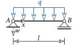{width=170} | $\dfrac{ql^3}{24EI_y}$ | $-\dfrac{ql^3}{24EI_y}$ | $\dfrac{ql^4}{24EI_y}\left(\xi-2\xi^3+\xi^4\right)$ |
| 3 | 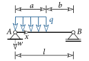{width=170} | $\dfrac{ql^3}{24EI_y}(1-\beta^2)^2$ | $\dfrac{ql^3}{24EI_y}\Big[4(1-\beta^3)-6(1-\beta^2)+(1-\beta^2)^2\Big]$ | $\dfrac{ql^4}{24EI_y}\Big[\xi^4 -\big\langle\xi-\alpha\big\rangle^4-2(1-\beta^2)\xi^3+(1-\beta^2)^2\xi\Big]$ |
| 4 | 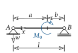{width=170} | $\dfrac{M_0l}{6EI_y}(3\beta^2-1)$ | $\dfrac{M_0l}{6EI_y}(3\alpha^2-1)$ | $\dfrac{M_0l^2}{6EI_y}\Big[\xi(3\beta^2-1)+\xi^3-3\big\langle\xi-\alpha\big\rangle^2\Big]$ |

: Elementary load cases of the single-span beam {#tbl-einfeldtraeger tbl-colwidths="[5,20,20,25,30]"}

| No | Load case | $w_A'$ | $w_B'$ | $w(x)$ |
|:--:|:--------:|:------:|:------:|:------:|
| 5 | {width=170} | $0$ | $\dfrac{Fa^2}{2EI_y}$ | $\dfrac{Fl^3}{6EI_y}\Big[3\xi^2\alpha-\xi^3+\big\langle \xi -\alpha\big\rangle^3\Big]$ |
| 6 | 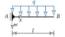{width=170} | $0$ | $\dfrac{ql^3}{6EI_y}$ | $\dfrac{ql^4}{24EI_y}\left(6\xi^2-4\xi^3+\xi^4\right)$ |
| 7 | 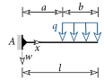{width=170} | $0$ | $-\dfrac{ql^3}{6EI_y}\beta(\beta^2-3\beta+3)$ | $\dfrac{ql^4}{24EI_y}\Big[\big\langle\xi-\alpha\big\rangle^4-4\beta\xi^3+6\beta(2-\beta)\xi^2\Big]$ |
| 8 | 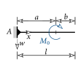{width=170} | $0$ | $M_0a$ | $\dfrac{M_0l^2}{2EI_y}\Big[\xi^2-\big\langle\xi-\alpha\big\rangle^2\Big]$ |

: Elementary load cases of the cantilever beam {#tbl-kragtraeger tbl-colwidths="[5,20,15,25,35]"}

::: {#exm-gelenkig-gestuetzt}
The system considered here consists of a horizontal and a vertical bar, which are connected to each other by a hinge at point $B$.
Consequently, only forces, but no moments, can be transmitted^[cf. the hinge of a door!].
The horizontal bar, which is loaded by a constant uniform load $q$, is clamped at point $A$.
Both bars have length $l$.
To be determined are the support reactions at $A$ as well as the bending-moment distribution and the deflection curve of the horizontal bar.

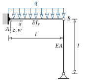{fig-align="center"}
:::

::: {.callout-tip .loesung collapse="true" icon=false}
## Solution

To determine the support reactions we cut the horizontal bar out and enter all forces made visible by the cut in a sketch.

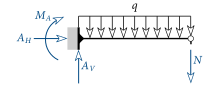{fig-align="center"}

Due to the hinged connection of the two bars, the only internal force acting in the vertical bar is a normal force.
In total four unknown force quantities appear, which cannot be determined solely from the three equilibrium conditions.
This example is a simply ($4-3=1$) statically *indeterminate* system.

As in the example of the suspended plate, here too a constraint is released in order to obtain a statically determinate system.
If the connection between the two bars is released, then the above system reduces to a statically determinate cantilever beam.
The vertical bar then experiences no load.
Now we again apply the unknown force $X$ associated with the released constraint as the unknown to the statically determinate system.
The direction may be chosen freely. On the cantilever beam the vertical bar acts in support, i.e. we apply $X$ upwards.
According to [Newton]{.smallcaps}'s third law, we must apply $X$ on the vertical bar in the other direction.
These essential steps are shown graphically below.

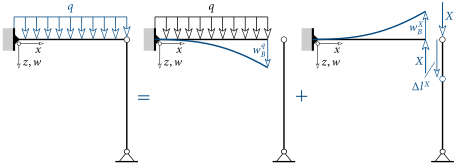{fig-align="center"}

But how can $X$ be computed? By releasing the constraint, both bars can freely displace relative to each other at point $B$.
In the real system, however, the deflection of the horizontal bar at $B$ equals the change in length of the vertical bar.
Via this condition (kinematic compatibility) $X$ can be determined.

First the deflection at point $B$ must therefore be determined.
With the help of @tbl-kragtraeger, for the uniform load one obtains

$$
\text{LC No. 6: } \xi=1.0 \quad\rightarrow\quad w_B^q=\dfrac{ql^4}{24EI_y}(3)=\dfrac{ql^4}{8EI_y} \; .
$$

For the unknown $X$ one likewise obtains from @tbl-kragtraeger

$$
\text{LC No. 5: } \xi=1.0 \quad \alpha=1.0 \quad\rightarrow\quad w_B^X=-\dfrac{Xl^3}{6EI_y}(2)=-\dfrac{Xl^3}{3EI_y} \; .
$$

By *superposition* the total deflection at $B$ becomes

$$
w_B = w_B^q + w_B^X \; .
$$

The change in length of the vertical bar is

$$
\Delta l^X = \dfrac{Xl}{EA} \; ,
$$

and this must equal the deflection $w_B$:

$$
w_B=w_B^q + w_B^X = \Delta l^X \; .
$$

From the above relation the unknown $X$, or $N$, can now be determined:

$$
X\equiv-N = \dfrac{3ql}{8}\dfrac{1}{1+3\dfrac{EI_y}{EAl^2}}=\dfrac{3ql}{8}\dfrac{1}{1+3\beta} \; ,
$$

where the ratio of the bending stiffness $EI_y$ of the horizontal bar to the axial stiffness $EA$ of the vertical bar is expressed by $\beta=EI_y/EAl^2$.

If $N$ is now known, the support reactions can be determined from the first cut:

$$
\begin{aligned}
\pml\sum M &= 0: M_A+ql\dfrac{l}{2} + Nl = 0 &\rightarrow\;& M_A = -ql^2\left(1-\dfrac{3}{8}\dfrac{1}{1+3\beta}\right) \\
\pqo\sum V &= 0: A_V - ql - N = 0 &\rightarrow\;& A_V = ql\left(1-\dfrac{3}{8}\dfrac{1}{1+3\beta}\right) \; .
\end{aligned}
$$

Since this is a statically indeterminate system, these depend on the stiffness ratio.
This dependence of $A_V$ is shown below.

{fig-align="center"}

If the axial stiffness of the vertical bar is very large, i.e. $EA\rightarrow\infty$, then the change in length of the bar tends to zero, which is equivalent to a vertical support.
In this limiting case $A_V$ is then equal to $5/8\, ql$.
This also means that more than half of the resultant uniform load $ql$ goes into the left support.
If the axial stiffness is reduced, $A_V$ grows and reaches in the limiting case $EA\rightarrow 0$ the maximum value of $ql$.
This system then corresponds to the classical cantilever beam, where the entire vertical load goes into the left support.

By a cut at an arbitrary position $x$ along the horizontal bar, the bending-moment distribution can again be determined via equilibrium considerations:

$$
M_y(x) = ql\left(\dfrac{3}{8}\dfrac{1}{1+3\beta}(l-x)\right)-\dfrac{(l-x)^2}{2} \; .
$$

The deflection curve can be computed by superposing the two load cases $q$ and $X$ with the help of @tbl-kragtraeger:

$$
\begin{aligned}
w(x) &= w^q(x) + w^X(x) \\
&= \dfrac{ql^4}{24EI_y}\left(\dfrac{6x^2}{l^2}-\dfrac{4x^3}{l^3}+\dfrac{x^4}{l^4}\right) -\dfrac{3ql}{8}\dfrac{1}{1+3\beta}\dfrac{l^3}{6EI_y}\left(\dfrac{3x^2}{l^2}-\dfrac{x^3}{l^3}\right) \\
&=\dfrac{ql^4}{48EI_y}\left[-\dfrac{3}{1+3\beta}\left(\dfrac{3x^2}{l^2}-\dfrac{x^3}{l^3}\right)+\dfrac{12x^2}{l^2}-\dfrac{8x^3}{l^3}+\dfrac{2x^4}{l^4}\right]
\end{aligned}
$$

The distribution of the bending moment as well as of the deflection curve is shown for different stiffness ratios in the figure below.
If $EA\rightarrow\infty$, then the smallest bending moment in magnitude is reached, whereby the deflections are also smallest.
The overall system has the greatest stiffness in this case.

{fig-align="center"}

A continuous reduction of $EA$ leads to a bending moment that becomes ever larger in magnitude.
The same applies to the deflection.
The maximum values are reached when $EA\rightarrow 0$.
In this case (cantilever beam) both the bending moment and the deflection curve reach their maximum values.
:::

::: {#exm-stat-unb-1}
Compute all support reactions of the system shown below and the deflection at point $C$!

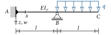{fig-align="center"}
:::

::: {.callout-tip .loesung collapse="true" icon=false}
## Solution

- Support reactions: $B=\dfrac{7}{4}ql\,,\; A_V=-\dfrac{3}{4}ql\,,\; M_A = \dfrac{1}{4}ql^2$
- Deflection at $C$: $w_C=\dfrac{ql^4}{4EI_y}$
:::

::: {#exm-stat-unb-2}
Compute all support reactions of the system shown below! Where between $A$ and $B$ does the largest deflection occur and how large is it?

{fig-align="center"}

*Hint*:
The vertical bar is a statically determinate extension. Its effect on the horizontal bar can be replaced by a horizontal force and a bending moment! Note also: reactio = actio!

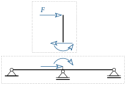{fig-align="center"}
:::

::: {.callout-tip .loesung collapse="true" icon=false}
## Solution

- Support reactions: $A_V = -C = \dfrac{F}{4}\,,\; B=0$
- Deflection curve between $A$ and $B$: $w(x) = \dfrac{Fl^3}{24EI_y}\left(\dfrac{x^3}{l^3}-\dfrac{x}{l}\right)\;\rightarrow\;x_m=\dfrac{l}{\sqrt{3}}\;\rightarrow\;w_{max} = -\dfrac{Fl^3}{36\sqrt{3}EI_y}$
:::

::: {#exm-stat-unb-3}
Determine the normal force in the vertical bar!

{fig-align="center"}
:::

::: {.callout-tip .loesung collapse="true" icon=false}
## Solution

- $N=-\dfrac{22Fl^2}{96\left(\dfrac{EI_y}{EA}+\dfrac{l^2}{6}\right)}$
:::
