

# Balkenbiegung {#sec-balkenbiegung}

## Verformung des Stabes {#sec-verformung-stab}

Zunächst betrachten wir die Verformung des Stabes bei unterschiedlicher Richtung der äußeren Belastung.
Beim Zug- oder Druckstab greifen die äußeren Kräfte immer in Richtung der Stabachse an.
Die einhergehende Verformung des Stabes kann als eine Längenänderung beschrieben werden, siehe @fig-verformung-biegung.
Diese Längsverschiebung wird beschrieben mit der Funktion $u$ in Richtung der Koordinate $x$.

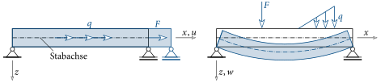{#fig-verformung-biegung}

Wirkt die äußere Belastung nun senkrecht zur Stabachse, kommt es zu einer deutlich anderen Verformung des Stabes, siehe @fig-verformung-biegung.
Der Stab erfährt eine Verschiebung normal zur Stabachse.
Diese Querverschiebung in Richtung der $z$-Koordinate wollen wir mit der Funktion $w$ beschreiben.
Im Gegensatz zu einer reinen Axialbelastung bewirkt eine Querbelastung eine *Verkrümmung* des Stabes, d.h. der Stab ist in der verformten Lage nicht mehr gerade.
Im technischen Gebrauch wird diese Art der Verformung des Stabes aber häufig als *Durchbiegung* beschrieben.
Daher auch der Name dieses Kapitels – Balkenbiegung.

Die Richtung der äußeren Belastung hat aber auch einen Einfluss auf die Schnittgrößen.
Bei reiner Axialbelastung wirkt im Stab nur eine Normalkraft.
Bei Querbelastung treten als Schnittgrößen Biegemomente (und Querkräfte) auf.
Die Verkrümmung des Stabes ist somit eine direkte Folge des im Stab wirkenden Biegemomentes.

Aus Experimenten lässt sich weiters folgende Aussage treffen: Betrachtet man einen Querschnitt des Stabes, der im unverformten Zustand senkrecht zur Stabachse steht, dann bleibt dieser während der Verformung (Verkrümmung) des Stabes *eben*, siehe @fig-eben-querschnitt.

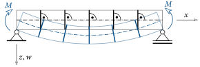{#fig-eben-querschnitt}

In der Balkenansicht (@fig-eben-querschnitt) sehen wir den Querschnitt projizierend.
Im verformten Zustand ist dieser aber nach wie vor eine *Ebene*.
Es lässt sich weiters erkennen, dass der Querschnitt eine Verdrehung um die Achse normal zur Ebene durchführt.
Aus @fig-eben-querschnitt erkennt man, dass diese Verdrehung veränderlich entlang des Stabes ist.

Eine derartige Aussage über die Verformung lässt sich nur für einen Stab (bzw. Balken) angeben, nicht für einen beliebigen Körper.
In der Mechanik ist ein Stab ein Körper, dessen Längsabmessung $l$ wesentlich größer als die Querschnittsabmessungen $b$ und $h$ ist, d.h. $l\gg b,h$.
Trifft dies zu, ist die kinematische Hypothese vom *Ebenbleiben des Querschnittes* gerechtfertigt!

## Biegespannungen {#sec-biegespannungen}

Eine Verformung des Stabes, wie sie in @fig-eben-querschnitt dargestellt ist, wird durch ein Biegemoment hervorgerufen.
Betrachtet man die obere Randfaser des Stabes, so wird diese gestaucht und entsprechend dem [Hooke]{.smallcaps}'schen Gesetz kommt es zu einer Druckspannung.
Gleiches passiert mit der unteren Randfaser, nur dass diese länger wird und sich dadurch eine Zugspannung ausbildet.
Daraus erkennen wir, dass das Biegemoment veränderliche Spannungen über den Querschnitt hervorruft und diese wollen wir in diesem Abschnitt bestimmen.

Um die Spannungen im Querschnitt berechnen zu können, müssen wir zu Beginn die Bewegung eines Querschnittes beschreiben.

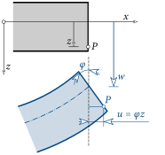{#fig-querschnitts-verformung}

Während der Verformung erfährt dieser eine Verschiebung in Richtung von $z$ von der Größe $w$ und gleichzeitig eine Verdrehung um den Winkel $\vp$, siehe @fig-querschnitts-verformung.
Im Falle reiner Biegung, d.h. die im Querschnitt wirkende Querkraft ist Null, fällt der Drehpunkt mit dem Schwerpunkt zusammen.

Die Verschiebung eines Punktes $P$, der in einem Abstand $z$ vom Schwerpunkt liegt, in Richtung von $x$ ist dann gleich

$$
u(x,z) = \sin\vp(x)z \approx \vp(x)z \; .
$$ {#eq-u-querschnitt}

Aufgrund der Kleinheit der Verschiebungen und Verdrehungen darf in obiger Beziehung $\sin\vp$ durch $\vp$ approximiert werden.

Die Dehnung einer Faser, die durch den Punkt $P$ geht, kann nach ([-@eq-dehnung-dudx]) bestimmt werden zu

$$
\ve = \dfrac{du}{dx} = \dfrac{d\vp}{dx}z \; .
$$ {#eq-dehnung-biegung}

Man erkennt, dass die Dehnung linear über die Querschnittshöhe verläuft und an den Rändern den Minimal- bzw. Maximalwert annimmt.
Eine Faser in Höhe des Schwerpunktes $S$ erfährt keine Dehnung.
Sie wird daher auch oft neutrale Faser bezeichnet.

Mit Hilfe des [Hooke]{.smallcaps}'schen Gesetzes ([-@eq-hooke]) ergibt sich die Normalspannung in einem Punkt $P$ des Querschnittes zu

$$
\sigma = E\ve = E\dfrac{d\vp}{dx}z \; .
$$ {#eq-sigma-biegung}

Wie die Dehnung sind auch die Normalspannungen linear über die Querschnittshöhe verteilt und erreichen ihren Minimal- bzw. Maximalwert an den Rändern des Stabes.

Im nächsten Schritt gilt es, einen Zusammenhang zwischen $\sigma$ und dem Biegemoment um die $y$-Achse $M_y$ herzustellen.
Dazu betrachten wir wiederum einen Punkt $P$ eines *einfach* symmetrischen Querschnittes.
In diesem Punkt wirkt die Normalspannung $\sigma$, siehe @fig-dMy.

{#fig-dMy}

Multiplizieren wir diese Spannung mit dem infinitesimalen Flächenelement $dA$, auf das sie wirkt, erhalten wir die resultierende Kraft.
Wird dieser Ausdruck multipliziert mit dem Hebelarm $z$, dann erhalten wir das Moment, welches die Spannung im Punkt $P$ um die $y$-Achse erzeugt:

$$
dM_y = \sigma \, dA \, z \; .
$$ {#eq-dMy}

Für die Spannung können wir den Ausdruck ([-@eq-sigma-biegung]) einsetzen:

$$
dM_y = E\dfrac{d\vp}{dx}\,z^2\,dA \; .
$$ {#eq-dMy2}

Berechnen wir dieses Moment für jeden Punkt des Querschnittes und summieren diese auf, sprich integrieren, ist das Ergebnis das Biegemoment um die $y$-Achse:

$$
M_y = \int dM_y = E\dfrac{d\vp}{dx}\int\limits_A z^2\,dA = E\dfrac{d\vp}{dx} I_y \; ,
$$ {#eq-My}

mit dem *Flächenträgheitsmoment*

$$
I_y = \int\limits_A z^2\,dA \; .
$$ {#eq-Iy}

$I_y$ hat als Einheit beispielsweise cm⁴, ist immer positiv und ist abhängig von der Querschnittsgeometrie.
Häufig kann dieses Tabellenwerken entnommen werden und für zwei gängige Querschnitte ist es in @fig-Iy angegeben.

{#fig-Iy}

Formen wir den Ausdruck in ([-@eq-My]) um auf

$$
\dfrac{d\vp}{dx} = \dfrac{M_y}{EI_y}
$$ {#eq-kruemmung}

und setzen diesen dann in ([-@eq-sigma-biegung]) ein, erhalten wir schließlich die gesuchte Beziehung für die Berechnung der Normalspannung zufolge eines Biegemomentes

$$
\myBox{\sigma(x,z) = \dfrac{M_y(x)}{I_y} \, z} \; .
$$ {#eq-sigma-M}

Die Normalspannung zufolge eines Biegemomentes ist linear über die Querschnittshöhe verteilt, erreicht ihr Maximum bzw. Minimum in den Randfasern und ist Null in der Stabachse (neutrale Faser).
Die lineare Verteilung rührt von der Annahme des Ebenbleibens des Querschnittes her.

Wirkt nun zusätzlich noch eine Normalkraft im Querschnitt, dann verursacht auch diese eine Normalspannung.
Aufgrund des linearen Verhaltens können wir die resultierende Normalspannung durch Anwendung des Superpositionsprinzips bestimmen, d.h. die Beziehungen ([-@eq-spannung]) und ([-@eq-sigma-M]) sind zu addieren:

$$
\myBox{\sigma(x,z) = \dfrac{N(x)}{A} + \dfrac{M_y(x)}{I_y} \, z} \; .
$$ {#eq-sigma-NM}

In @fig-sigma-NM ist der Verlauf der Normalspannungen zufolge $N$ und $M$ dargestellt.
Erkennbar ist, dass bei Auftreten einer Normalkraft $\sigma$ auf Höhe der Stabachse nicht mehr Null ist.

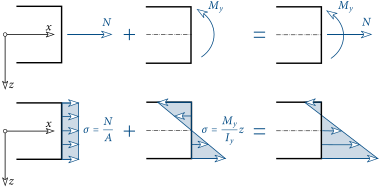{#fig-sigma-NM}

Des Weiteren wird auch betont, dass diese Normalspannungen in einem Querschnitt normal zur Stabachse auftreten.
Wird die Schnittrichtung geändert, nehmen die Normalspannungen andere Werte an und es wirken dann auch Schubspannungen im betrachteten Schnitt.

::: {#exm-haltestelle}
In diesem Beispiel sind die größten Druck- und Zugspannungen der Hauptkonstruktion einer Haltestellen-Überdachung gesucht.
Das statische System und der Querschnitt eines I-Trägers sind nachfolgend dargestellt.

{fig-align="center"}
:::

::: {.callout-tip .loesung collapse="true" icon=false}
## Lösung

Zunächst gilt es die Schnittgrößen zu ermitteln, was in diesem Fall ohne vorherige Berechnung der Auflagerreaktionen möglich ist.
Zuerst schneiden wir vertikal unmittelbar *rechts* vom Punkt $A$ durch und erhalten:

::: {layout="[40,60]" layout-valign="center"}

$$
\begin{aligned}
\pnr\sum H=0:&\quad N = 0 \\
\pqo\sum V=0:&\quad Q - \dfrac{qh}{2}=0 \rightarrow Q = \dfrac{qh}{2} \\
\pml\sum M=0:&\quad M_y + \dfrac{qh}{2}\dfrac{h}{4} = 0\rightarrow M = -\dfrac{qh^2}{8}
\end{aligned}
$$
:::

Nachfolgend schneiden wir horizontal unmittelbar *unterhalb* des Punktes $A$:

::: {layout="[40,60]" layout-valign="center"}

$$
\begin{aligned}
\pnr\sum H=0:&\quad Q = 0 \\
\pqu\sum V=0:&\quad N + \dfrac{qh}{2}=0 \rightarrow N = -\dfrac{qh}{2} \\
\pml\sum M=0:&\quad M_y + \dfrac{qh}{2}\dfrac{h}{4} = 0\rightarrow M = -\dfrac{qh^2}{8}
\end{aligned}
$$
:::

In beiden Fällen handelt es sich um das negative Schnittufer, woraus sich die Richtungen der Schnittgrößen bei den Schnitten nach den definierten Koordinatensystemen in der Angabe ergeben.
Der Normalkraft- und Biegemomentenverlauf sind nachfolgend dargestellt.

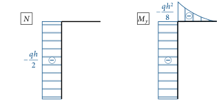{fig-align="center"}

Die Normalkraft und das Biegemoment erreichen jeweils im vertikalen Stab ihren betragsmäßig größten Wert.
Daher treten dort auch die größten Druck- und Zugspannungen auf.

Für die Bestimmung von $\sigma$ nach ([-@eq-sigma-NM]) brauchen wir zunächst die Querschnittsfläche $A$ und das Flächenträgheitsmoment $I_y$.
Mit den Abmessungen in der Angabe ist der Querschnitt des I-Trägers gleich

$$
A = 6.1\,\text{cm}^2 \; .
$$

Da sich der Querschnitt aus drei Rechtecksflächen zusammensetzt, ist es einfacher, das Flächenträgheitsmoment mit dem *Satz von [Steiner]{.smallcaps}* zu berechnen:

$$
I_y = \sum\limits_{i=1}^n I_{\overline{y},i} + e_i^2A_i \; .
$$

Den I-Träger teilen wir in zwei (drei) Rechteckquerschnitte auf, d.h. $n=2$.

{fig-align="center"}

Mit der oberen Abbildung erhalten wir dann mit dem Satz von [Steiner]{.smallcaps} das Flächenträgheitsmoment des I-Trägers um die $y$-Achse zu

$$
I_y = \dfrac{0.4\cdot 7.2^3}{12} + \left(\dfrac{4\cdot 0.4^3}{12} + 3.8^2\cdot 4 \cdot 0.4\right)\cdot 2 = 12.4 + 23.1 = 58.7\,\text{cm}^4 \; .
$$

Wählen wir die Höhe zu $h=4\,\text{m}$ und die Gleichlast zu $q=1\,\text{kN/m}$, ist die Normalkraft und das Biegemoment im vertikalen Stab gleich

$$
N = - 2\,\text{kN} \quad \text{und} \quad M_y = -2\,\text{kNm} \; .
$$

Nun können wir die Normalspannungen an den Rändern des Stabes nach ([-@eq-sigma-NM]) berechnen:

$$
\begin{aligned}
\sigma&=\dfrac{-2}{6.1}+\dfrac{-200}{58.7}\cdot 4 &&= -14.0\,\text{kN/cm}^2 \\
\sigma&=\dfrac{-2}{6.1}+\dfrac{-200}{58.7}\cdot (-4) &&= +13.3\,\text{kN/cm}^2
\end{aligned}
$$

Grafisch dargestellt ist der Normalspannungsverlauf in der unteren Abbildung.
Die Größe in der Stabachse ist $\sigma(z=0)=N/A=-0.3\,\text{kN/cm}^2$.

{fig-align="center"}
:::

## Biegelinie {#sec-biegelinie}

In diesem Abschnitt wollen wir nun die Verformung des Stabes zufolge eines Biegemomentes (einer Querbelastung) bestimmen.
Die Verschiebung eines beliebigen Querschnittes an der Stelle $x$ *quer* zur Stabachse (Richtung $z$) messen wir mit der Funktion $w(x)$.
Die *verformte* Stabachse wird häufig als *Biegelinie* bezeichnet.

Bis jetzt haben wir angenommen, dass ein Querschnitt des Stabes während der Verformung eben bleibt (siehe @fig-eben-querschnitt) und eine Drehung um den Winkel $\vp$ durchführt.
Bei *schlanken* Stäben kann des Weiteren angenommen werden, dass der rechte Winkel zwischen Querschnitt und Stabachse erhalten bleibt.
Der verformte, ebene Querschnitt steht somit auch *normal* auf die *verformte* Stabachse, siehe @fig-bernoulli.

![[Bernoulli]{.smallcaps}-Hypothese](images/Bernoulli.svg){#fig-bernoulli}

Diese kinematischen Annahmen werden als [Bernoulli]{.smallcaps}-Hypothese bezeichnet.

Durch diese Annahme kann nun ein Zusammenhang zwischen dem Winkel $\vp$ und der gesuchten Biegelinie $w(x)$ hergestellt werden.
Aus @fig-bernoulli lässt sich erkennen, dass der Tangens von $\vp$ gleich der Steigung der Tangente der Biegelinie an der betrachteten Stelle ist:

$$
\tan\vp \approx \vp = -\dfrac{dw}{dx} \; .
$$ {#eq-phi-w}

Für *kleine* $\vp$ lässt sich $\tan\vp$ durch $\vp$ approximieren.^[$\vp\leq10^\circ!\qquad\text{z.B.}\;\vp=10^\circ=0.1745...\,\text{rad}\rightarrow \tan\vp = 0.1763...\approx\vp$]
Die Biegelinie besitzt in @fig-bernoulli eine positive Steigung.^[$w(x)$ nimmt monoton zu!]
Die daraus folgende Querschnittsverdrehung $\vp$ um die $y$-Achse ist allerdings negativ!
Daraus resultiert das negative Vorzeichen in ([-@eq-phi-w]).
Setzen wir für $\vp$ diese Beziehung in ([-@eq-My]) ein und führen die Ableitung aus, dann erhalten wir die *Differentialgleichung der Biegelinie* für einen *schlanken* Stab:

$$
\myBox{\dfrac{d^2w}{dx^2} = -\dfrac{M_y(x)}{EI_y}} \; .
$$ {#eq-biegelinie}

Auch diese Differentialgleichung ist *linear*, d.h. das Superpositionsprinzip ist wieder anwendbar.
Allerdings ist sie nur gültig für *schlanke* Stäbe.
Dies ist dann der Fall, wenn das Verhältnis der Länge des Stabes $l$ zu seinen Querschnittsabmessungen

$$
\dfrac{l}{b,\; h} > 10
$$

ist. Wird obige Bedingung nicht erfüllt, dann ist die [Bernoulli]{.smallcaps}-Hypothese nicht gültig und es sind andere kinematische Ansätze zu verwenden, wie z.B. jene von [Timoshenko]{.smallcaps}.

Entsprechend den Auflagerbedingungen können wir an diesen Stellen im Vorhinein Aussagen über die Größe der Durchbiegung oder die Verdrehung der Stabachse (bzw. des Querschnittes) treffen.
In @fig-biegelinie-rb sind diese für gängige Auflagerbedingungen dargestellt.

{#fig-biegelinie-rb}

Zusätzlich sind auch die Auflagerreaktionen eingetragen.
Diese Kräfte und Momente bewirken eben genau, dass die Durchbiegung oder Verdrehung der Stabachse am Auflager genau Null ist!
Auflagerreaktionen (auch *Auflagerkräfte*) werden daher auch oft als *Zwangskräfte* bezeichnet.

Abschließend wollen wir noch das Vorzeichen in ([-@eq-biegelinie]) genauer untersuchen.
Über die zweite Ableitung einer Funktion ist das Vorzeichen der Krümmung bestimmt.
Hier gilt es aber besonders zu beachten, dass die $z$-Achse nach *unten*^[Die $z$-Achse zeigt somit genau in Richtung der Gravitation!] zeigt und sich dadurch die gewöhnlichen Definitionen genau vertauschen.

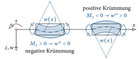{#fig-konkav-konvex}

Ein positives Biegemoment erzeugt nach ([-@eq-biegelinie]) eine negative Krümmung, siehe @fig-konkav-konvex.
Der Krümmungsmittelpunkt liegt im negativen $z$-Bereich.
Die Form der Biegelinie $w$ lässt sich aber auch als linksgekrümmt beschreiben, denn fährt man mit dem Auto in Richtung der $x$-Achse, muss das Lenkrad links eingeschlagen werden.
Genau anders verhält es sich, wenn das Biegemoment negativ ist.
Dann besitzt die Biegelinie eine positive Krümmung bzw. ist rechtsgekrümmt.

::: {#exm-biegelinie}
Gegeben ist folgendes statisch bestimmte System:

{fig-align="center"}

Gesucht sind:

- Biegelinie zwischen $A$ und $B$
- Ort und Größe der maximalen Durchbiegung zwischen $A$ und $B$
- Biegelinie zwischen $B$ und $C$
- Durchbiegung im Punkt $C$
:::

::: {.callout-tip .loesung collapse="true" icon=false}
## Lösung

Zur Berechnung der Biegelinie mit der Beziehung ([-@eq-biegelinie]) müssen wir das Biegemoment $M_y$ bestimmen.
Ein Weg hierfür ist, mit Hilfe der Gleichgewichtsbedingungen zuerst die Auflagerreaktionen und anschließend das Biegemoment zu berechnen.
Bei entsprechender Übung kann bei diesem Beispiel der Biegemomentenverlauf auch ohne Kenntnis der Auflagerreaktionen ermittelt werden.

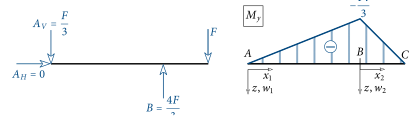{fig-align="center"}

Aus obiger Darstellung für $M_y$ erkennt man, dass $M_y$ an der Stelle $B$ eine Unstetigkeit aufweist.
Der gesamte Verlauf lässt sich damit nicht mit *einer* Funktion beschreiben und die Abschnitte $A-B$ und $B-C$ müssen daher getrennt betrachtet werden.
Aus diesem Grund werden zwei Koordinatensysteme gewählt: In $x_1-z$, mit Ursprung in $A$, messen wir die Durchbiegung zwischen $A$ und $B$, und $x_2-z$, mit Ursprung in $B$, übernimmt diese Aufgabe zwischen $B$ und $C$.

Das Biegemoment als Funktion von $x_1$ im Bereich $A-B$ kann aus einem Schnitt an einer beliebigen Stelle $x_1$ aus der Momentengleichgewichtsbedingung bestimmt werden:

::: {layout="[40,60]" layout-valign="center"}

$$
\pmr\sum M=0:\; M_y(x_1) + A_Vx_1 = 0\rightarrow M_y(x_1) = -\dfrac{Fx_1}{3}
$$
:::

Die Geradengleichung kann in diesem Fall auch direkt aus dem obigen Biegemomentenverlauf bestimmt werden.
Die Differentialgleichung der Biegelinie lautet somit

$$
\dfrac{d^2w_1}{dx_1^2}=+\dfrac{Fx_1}{3EI_y} \; .
$$

Gelöst wird diese wiederum durch Trennung der veränderlichen Variablen und anschließende zweimalige Integration:

$$
\begin{aligned}
\dfrac{dw_1}{dx_1} &= \dfrac{Fx_1^2}{6EI_y} + C_1 \\
w_1(x_1) &= \dfrac{Fx_1^3}{18EI_y} + C_1x_1 + C_2 \; .
\end{aligned}
$$

Die beiden Integrationskonstanten, $C_1$ und $C_2$, werden aus den Randbedingungen bestimmt (vgl. @fig-biegelinie-rb).
Aufgrund der Auflager in $A$ und $B$ ist dort die Durchbiegung des Stabes gleich Null:

$$
\begin{aligned}
w_1(x_1=0) = 0:&\; \rightarrow C_2 = 0 \\
w_1(x_1=l) = 0:&\; \dfrac{Fl^3}{18EI_y} + C_1l = 0 \rightarrow C_1 = -\dfrac{Fl^2}{18EI_y} \; .
\end{aligned}
$$

Somit lautet die Biegelinie zwischen $A$ und $B$

$$
w_1(x_1) = \dfrac{F}{18EI_y}(x_1^3-l^2x_1) \; .
$$ {#eq-bsp-w1}

Durch Lösen einer Extremwertaufgabe lässt sich der Ort und die maximale Durchbiegung zwischen $A$ und $B$ bestimmen.
Aus der Bedingung, dass die erste Ableitung verschwindet, lässt sich der Ort ermitteln:

$$
\dfrac{dw_1}{dx_1} = \dfrac{F}{18EI_y}(3x_1^2-l^2) = 0 \;\rightarrow\; x_m = \dfrac{l}{\sqrt{3}} \; .
$$

Auswerten der Biegelinie ([-@eq-bsp-w1]) an dieser Stelle ergibt den Maximalwert:

$$
w_{max} = w_1(x_1=x_m) = -\dfrac{\sqrt{3}}{81}\dfrac{Fl^3}{EI_y} =-0.021...\,\dfrac{Fl^3}{EI_y}\; .
$$

Für die Bestimmung der Biegelinie zwischen $B$ und $C$ wechseln wir nun zum Koordinatensystem $x_2-z$.
Der Biegemomentenverlauf ist dann gegeben zu

$$
M_y(x_2) = F\left(x_2-\dfrac{l}{3}\right) \; .
$$

Die Differentialgleichung lautet dann

$$
\dfrac{d^2w_2}{dx_2^2}=-\dfrac{F}{EI_y}\left(x_2-\dfrac{l}{3}\right) \; ,
$$

die gleich gelöst wird wie vorhin:

$$
\begin{aligned}
\dfrac{dw_2}{dx_2} &= -\dfrac{F}{EI_y}\left(\dfrac{x_2^2}{2}-\dfrac{lx_2}{3}\right) + C_1\\
w_2(x_2) &= -\dfrac{F}{EI_y}\left(\dfrac{x_2^3}{6}-\dfrac{lx_2^2}{6}\right) + C_1x_2 + C_2 \; .
\end{aligned}
$$

Aus der Bedingung, dass die Durchbiegung an der Stelle $B$ gleich Null ist, erhalten wir

$$
w_2(x_2=0) = 0 \;\rightarrow\;C_2 = 0 \; .
$$

Die zweite Integrationskonstante können wir aus der Übergangsbedingung

$$
\dfrac{dw_1}{dx_1}\Bigg|_{x_1=l} = \dfrac{dw_2}{dx_2}\Bigg|_{x_2=0}
$$

bestimmen. Die Tangente an die Biegelinie von $w_1$ und $w_2$ hat an der Stelle $B$ die gleiche Steigung.

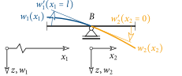{fig-align="center"}

Berechnung der Ableitungen

$$
\dfrac{F}{18EI_y}\left(3x_1^2-l^2\right)\Bigg|_{x_1=l}=-\dfrac{F}{EI_y}\left(\dfrac{3x_2^2}{6}-\dfrac{2lx_2}{6}\right)+C_1\,\Bigg|_{x_2=0}
$$

und Auswerten an der Stelle $B$ ergibt somit

$$
C_1 = \dfrac{Fl^2}{9EI_y} \; .
$$

Die Biegelinie im Bereich $B-C$ ist somit gegeben durch

$$
w_2(x_2) = \dfrac{F}{EI_y}\left(\dfrac{l^2x_2}{9}+\dfrac{lx_2^2}{6}-\dfrac{x_2^3}{6}\right)\; .
$$

Zur Bestimmung der Durchbiegung im Punkt $C$ müssen wir diese Biegelinie für $x_2=l/3$ auswerten und erhalten

$$
w_{2,C} = w_2\left(x_2=\dfrac{l}{3}\right)=\dfrac{4}{81}\dfrac{Fl^3}{EI_y}=0.049...\,\dfrac{Fl^3}{EI_y} \;.
$$

Die gesamte Biegelinie des Trägers ist unten dargestellt.

{fig-align="center"}
:::

::: {#exm-biegelinie-dreieckslast}
Bestimme vom folgenden System die Biegelinie!
Schätze den Ort der größten Durchbiegung ab!

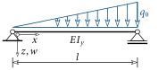{fig-align="center"}
:::

::: {.callout-tip .loesung collapse="true" icon=false}
## Lösung

- Biegemomentenverlauf: $M_y(x) = \dfrac{q_0}{6}\left(lx-\dfrac{x^3}{l}\right)$
- Biegelinie: $w(x) = \dfrac{q_0}{EI_y}\left(-\dfrac{lx^3}{36}+\dfrac{x^5}{120l}+C_1x + C_2\right)$
- Integrationskonstanten aus Randbedingung: $C_2=0,\quad C_1=\dfrac{7l^3}{360}$
- Biegelinie: $w(x) = \dfrac{q_0}{EI_y}\left(\dfrac{7l^3x}{360}-\dfrac{lx^3}{36}+\dfrac{x^5}{120l}\right)$
:::

::: {#exm-biegelinie-rahmen}
Bestimme die Biegelinie zwischen den Punkten $A$ und $B$!
Wie groß ist die horizontale und vertikale Verschiebung des Punktes $C$?

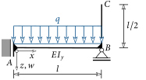{fig-align="center"}
:::

::: {.callout-tip .loesung collapse="true" icon=false}
## Lösung

- Biegemomentenverlauf: $M_y(x)=\dfrac{q}{2}(l^2-x^2)$
- Biegelinie: $w(x) = \dfrac{q}{EI_y}\left(-\dfrac{l^2x^2}{4}+\dfrac{x^4}{24}+C_1x+C_2\right)$
- Integrationskonstanten aus Randbedingungen: $C_1=0,\;C_2=\dfrac{5l^4}{24}$
- Biegelinie zwischen $A$ und $B$: $w(x) = \dfrac{q}{4EI_y}\left(-l^2x^2+\dfrac{x^4}{6}+\dfrac{5l^4}{6}\right)$
- Horizontale Verschiebung von Punkt $C$: $w_{C} = -\dfrac{ql^4}{6EI_y}$
:::

::: {#exm-biegelinie-zwei-bereiche}
Bestimme die Biegelinie $w_1(x_1)$ im Bereich $A - B$ und $w_2(x_2)$ zwischen $B - C$!

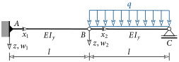{fig-align="center"}
:::

::: {.callout-tip .loesung collapse="true" icon=false}
## Lösung

Bereich $A - B$:

- Biegemomentenverlauf: $M_y(x_1) = -\dfrac{ql}{2}\left(l-x_1\right)$
- Biegelinie: $w_1(x_1) = \dfrac{q}{EI_y}\left(\dfrac{l^2x_1^2}{4}-\dfrac{lx_1^3}{12}\right)$

Bereich $B - C$:

- Biegemomentenverlauf: $M_y(x_2) = \dfrac{q}{2}(lx_2 - x_2^2)$
- Biegelinie: $w_2(x_2) = \dfrac{q}{EI_y}\left(\dfrac{x_2^4}{24}-\dfrac{lx_2^3}{12}+C_1x_2 + C_2\right)$
- Integrationskonstanten aus Randbedingungen: $C_1 = -\dfrac{l^3}{8},\;C_2=\dfrac{l^4}{6}$
- Biegelinie: $w_2(x_2) = \dfrac{q}{EI_y}\left(\dfrac{x_2^4}{24}-\dfrac{lx_2^3}{12}-\dfrac{l^3x_2}{8}+\dfrac{l^4}{6}\right)$
:::

## Einfach statisch unbestimmte Systeme {#sec-biegung-statisch-unbestimmt}

Eine ganz wesentliche Eigenschaft der Differentialgleichung der Biegelinie ([-@eq-biegelinie]) ist ihre *Linearität*.
Folglich können wir wiederum mit dem Superpositionsprinzip statisch unbestimmte Systeme berechnen.
Wir beschränken uns hier aber auf einfach statisch unbestimmte Systeme.

Für die kinematische Verträglichkeit muss an den Stellen, wo eine Bindung gelöst wurde, die Verschiebung oder Verdrehung der Stabachse berechnet werden.
Für häufig auftretende Lastfälle ist die Biegelinie für den Einfeld- und Kragträger in @tbl-einfeldtraeger und @tbl-kragtraeger tabellarisch aufgelistet.
Zur Anwendung werden dimensionslose Parameter benötigt, die wie folgt definiert sind:

$$
\xi=\dfrac{x}{l}\, , \quad \alpha=\dfrac{a}{l}\quad\text{und}\quad \beta=\dfrac{b}{l}\; .
$$

Des Weiteren kommt auch die [Macauley]{.smallcaps}-Klammer zur Anwendung:

$$
\big\langle \xi-\alpha\big\rangle^n =
\left\{
\begin{array}{l l}
(\xi-\alpha)^n & \text{für }\;\xi>\alpha\\
0 & \text{für }\;\xi\leq\alpha\; .
\end{array}
\right.
$$

In den meisten Fällen ist der Biegemomentenverlauf nicht mit *einer* Funktion über die gesamte Stablänge darstellbar.
Mathematisch elegant kann man solche Fälle aber mit der [Macauley]{.smallcaps}-Klammer beschreiben.
Diese wird in den hier betrachteten Fällen nach der Unstetigkeitsstelle ($\xi>\alpha$) aktiv.

| Nr | Lastfall | $w_A'$ | $w_B'$ | $w(x)$ |
|:--:|:--------:|:------:|:------:|:------:|
| 1 | 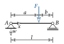{width=170} | $\dfrac{Fl^2}{6EI_y}(\beta-\beta^3)$ | $-\dfrac{Fl^2}{6EI_y}(\alpha-\alpha^3)$ | $\dfrac{Fl^3}{6EI_y}\Big[\beta\xi(1-\beta^2-\xi^2)+\big\langle \xi-\alpha\big\rangle^3\Big]$ |
| 2 | {width=170} | $\dfrac{ql^3}{24EI_y}$ | $-\dfrac{ql^3}{24EI_y}$ | $\dfrac{ql^4}{24EI_y}\left(\xi-2\xi^3+\xi^4\right)$ |
| 3 | {width=170} | $\dfrac{ql^3}{24EI_y}(1-\beta^2)^2$ | $\dfrac{ql^3}{24EI_y}\Big[4(1-\beta^3)-6(1-\beta^2)+(1-\beta^2)^2\Big]$ | $\dfrac{ql^4}{24EI_y}\Big[\xi^4 -\big\langle\xi-\alpha\big\rangle^4-2(1-\beta^2)\xi^3+(1-\beta^2)^2\xi\Big]$ |
| 4 | {width=170} | $\dfrac{M_0l}{6EI_y}(3\beta^2-1)$ | $\dfrac{M_0l}{6EI_y}(3\alpha^2-1)$ | $\dfrac{M_0l^2}{6EI_y}\Big[\xi(3\beta^2-1)+\xi^3-3\big\langle\xi-\alpha\big\rangle^2\Big]$ |

: Elementare Lastfälle des Einfeldträgers {#tbl-einfeldtraeger tbl-colwidths="[5,20,20,25,30]"}

| Nr | Lastfall | $w_A'$ | $w_B'$ | $w(x)$ |
|:--:|:--------:|:------:|:------:|:------:|
| 5 | 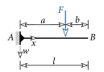{width=170} | $0$ | $\dfrac{Fa^2}{2EI_y}$ | $\dfrac{Fl^3}{6EI_y}\Big[3\xi^2\alpha-\xi^3+\big\langle \xi -\alpha\big\rangle^3\Big]$ |
| 6 | {width=170} | $0$ | $\dfrac{ql^3}{6EI_y}$ | $\dfrac{ql^4}{24EI_y}\left(6\xi^2-4\xi^3+\xi^4\right)$ |
| 7 | {width=170} | $0$ | $-\dfrac{ql^3}{6EI_y}\beta(\beta^2-3\beta+3)$ | $\dfrac{ql^4}{24EI_y}\Big[\big\langle\xi-\alpha\big\rangle^4-4\beta\xi^3+6\beta(2-\beta)\xi^2\Big]$ |
| 8 | {width=170} | $0$ | $M_0a$ | $\dfrac{M_0l^2}{2EI_y}\Big[\xi^2-\big\langle\xi-\alpha\big\rangle^2\Big]$ |

: Elementare Lastfälle des Kragträgers {#tbl-kragtraeger tbl-colwidths="[5,20,15,25,35]"}

::: {#exm-gelenkig-gestuetzt}
Das hier betrachtete System besteht aus einem horizontalen und vertikalen Stab, die im Punkt $B$ gelenkig miteinander verbunden sind.
Folglich können nur Kräfte, aber keine Momente übertragen werden^[Vgl. Scharnier einer Türe!].
Der horizontale Stab, welcher durch eine konstante Gleichlast $q$ belastet wird, ist im Punkt $A$ eingespannt.
Beide Stäbe sind von der Länge $l$.
Zu bestimmen sind die Auflagerreaktionen in $A$ sowie der Biegemomentenverlauf und die Biegelinie des horizontalen Stabes.

{fig-align="center"}
:::

::: {.callout-tip .loesung collapse="true" icon=false}
## Lösung

Zur Ermittlung der Auflagerreaktionen schneiden wir den horizontalen Stab heraus und tragen alle durch den Schnitt sichtbar gewordenen Kräfte in eine Skizze ein.

{fig-align="center"}

Durch die gelenkige Verbindung der beiden Stäbe wirkt im vertikalen Stab als einzige Schnittgröße eine Normalkraft.
In Summe treten vier unbekannte Kraftgrößen auf, die nicht alleinig aus den drei Gleichgewichtsbedingungen bestimmt werden können.
Es handelt sich bei diesem Beispiel um ein einfach ($4-3=1$) statisch *unbestimmtes* System.

Wie beim Beispiel der abgehängten Platte wird auch hier eine Bindung gelöst, um ein statisch bestimmtes System zu erhalten.
Wird die Verbindung zwischen den beiden Stäben gelöst, dann reduziert sich obiges System zu einem statisch bestimmten Kragträger.
Der vertikale Stab erfährt dann keine Belastung.
Nun setzen wir wieder die zur gelösten Bindung gehörende, unbekannte Kraft $X$ als Unbekannte an das statisch bestimmte System an.
Dabei darf die Richtung frei gewählt werden. Am Kragträger wirkt der vertikale Stab stützend, d.h. wir setzen $X$ nach oben an.
Nach dem dritten [Newton]{.smallcaps}'schen Axiom müssen wir $X$ am vertikalen Stab in die andere Richtung ansetzen.
Diese wesentlichen Schritte sind nachfolgend grafisch dargestellt.

{fig-align="center"}

Doch wie kann $X$ berechnet werden? Durch das Lösen der Bindung können sich beide Stäbe frei voneinander im Punkt $B$ verschieben.
Doch am realen System ist die Durchbiegung des horizontalen Stabes in $B$ gleich der Längenänderung des vertikalen Stabes.
Über diese Bedingung (kinematische Verträglichkeit) lässt sich $X$ bestimmen.

Zunächst muss daher die Durchbiegung im Punkt $B$ bestimmt werden.
Mit Hilfe von @tbl-kragtraeger ergibt sich für die Gleichlast

$$
\text{LF Nr. 6: } \xi=1.0 \quad\rightarrow\quad w_B^q=\dfrac{ql^4}{24EI_y}(3)=\dfrac{ql^4}{8EI_y} \; .
$$

Für die Unbekannte $X$ erhält man ebenfalls aus @tbl-kragtraeger

$$
\text{LF Nr. 5: } \xi=1.0 \quad \alpha=1.0 \quad\rightarrow\quad w_B^X=-\dfrac{Xl^3}{6EI_y}(2)=-\dfrac{Xl^3}{3EI_y} \; .
$$

Durch *Superposition* ergibt sich die Gesamtdurchbiegung in $B$ zu

$$
w_B = w_B^q + w_B^X \; .
$$

Die Längenänderung des vertikalen Stabes ist

$$
\Delta l^X = \dfrac{Xl}{EA} \; ,
$$

und diese muss gleich der Durchbiegung $w_B$ sein:

$$
w_B=w_B^q + w_B^X = \Delta l^X \; .
$$

Aus obiger Beziehung lässt sich nun die Unbekannte $X$, bzw. $N$, bestimmen:

$$
X\equiv-N = \dfrac{3ql}{8}\dfrac{1}{1+3\dfrac{EI_y}{EAl^2}}=\dfrac{3ql}{8}\dfrac{1}{1+3\beta} \; ,
$$

wobei das Verhältnis der Biegesteifigkeit $EI_y$ des horizontalen Stabes zur Dehnsteifigkeit $EA$ des vertikalen Stabes mit $\beta=EI_y/EAl^2$ ausgedrückt wird.

Ist nun $N$ bekannt, können aus dem ersten Schnitt die Auflagerreaktionen bestimmt werden:

$$
\begin{aligned}
\pml\sum M &= 0: M_A+ql\dfrac{l}{2} + Nl = 0 &\rightarrow\;& M_A = -ql^2\left(1-\dfrac{3}{8}\dfrac{1}{1+3\beta}\right) \\
\pqo\sum V &= 0: A_V - ql - N = 0 &\rightarrow\;& A_V = ql\left(1-\dfrac{3}{8}\dfrac{1}{1+3\beta}\right) \; .
\end{aligned}
$$

Da es sich um ein statisch unbestimmtes System handelt, sind diese abhängig vom Steifigkeitsverhältnis.
Nachfolgend ist diese Abhängigkeit von $A_V$ dargestellt.

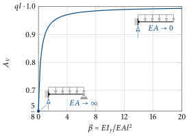{fig-align="center"}

Ist die Dehnsteifigkeit des vertikalen Stabes sehr groß, d.h. $EA\rightarrow\infty$, dann geht die Längenänderung des Stabes gegen Null, was gleichbedeutend mit einem vertikalen Auflager ist.
In diesem Grenzfall ist $A_V$ dann gleich $5/8\, ql$.
Das bedeutet auch, dass über die Hälfte der resultierenden Gleichlast $ql$ in das linke Auflager geht.
Wird die Dehnsteifigkeit verringert, wächst $A_V$ an und erreicht im Grenzfall $EA\rightarrow 0$ den Größtwert von $ql$.
Dieses System entspricht dann dem klassischen Kragträger, wo die gesamte vertikale Belastung in das linke Auflager geht.

Durch einen Schnitt an einer beliebigen Stelle $x$ entlang des horizontalen Stabes lässt sich wiederum über Gleichgewichtsbetrachtungen der Biegemomentenverlauf bestimmen:

$$
M_y(x) = ql\left(\dfrac{3}{8}\dfrac{1}{1+3\beta}(l-x)\right)-\dfrac{(l-x)^2}{2} \; .
$$

Die Biegelinie lässt sich durch Überlagerung der beiden Lastfälle $q$ und $X$ mit Hilfe von @tbl-kragtraeger berechnen:

$$
\begin{aligned}
w(x) &= w^q(x) + w^X(x) \\
&= \dfrac{ql^4}{24EI_y}\left(\dfrac{6x^2}{l^2}-\dfrac{4x^3}{l^3}+\dfrac{x^4}{l^4}\right) -\dfrac{3ql}{8}\dfrac{1}{1+3\beta}\dfrac{l^3}{6EI_y}\left(\dfrac{3x^2}{l^2}-\dfrac{x^3}{l^3}\right) \\
&=\dfrac{ql^4}{48EI_y}\left[-\dfrac{3}{1+3\beta}\left(\dfrac{3x^2}{l^2}-\dfrac{x^3}{l^3}\right)+\dfrac{12x^2}{l^2}-\dfrac{8x^3}{l^3}+\dfrac{2x^4}{l^4}\right]
\end{aligned}
$$

Der Verlauf des Biegemomentes sowie der Biegelinie ist für unterschiedliche Steifigkeitsverhältnisse in nachstehender Abbildung dargestellt.
Geht $EA\rightarrow\infty$, dann wird betragsmäßig das kleinste Biegemoment erreicht, wodurch auch die Durchbiegungen am kleinsten sind.
Das Gesamtsystem hat in diesem Fall die größte Steifigkeit.

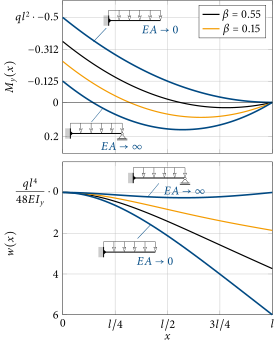{fig-align="center"}

Eine stetige Reduktion von $EA$ führt zu einem betragsmäßig immer größer werdenden Biegemoment.
Gleiches gilt für die Durchbiegung.
Die Größtwerte werden erreicht, wenn $EA\rightarrow 0$ geht.
In diesem Fall (Kragträger) erreichen sowohl das Biegemoment wie auch die Biegelinie ihre Größtwerte.
:::

::: {#exm-stat-unb-1}
Berechne alle Auflagerreaktionen des unten dargestellten Systems und die Durchbiegung im Punkt $C$!

{fig-align="center"}
:::

::: {.callout-tip .loesung collapse="true" icon=false}
## Lösung

- Auflagerreaktionen: $B=\dfrac{7}{4}ql\,,\; A_V=-\dfrac{3}{4}ql\,,\; M_A = \dfrac{1}{4}ql^2$
- Durchbiegung in $C$: $w_C=\dfrac{ql^4}{4EI_y}$
:::

::: {#exm-stat-unb-2}
Berechne alle Auflagerreaktionen des unten dargestellten Systems! Wo tritt zwischen $A$ und $B$ die größte Durchbiegung auf und wie groß ist diese?

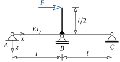{fig-align="center"}

*Hinweis*:
Der vertikale Stab ist eine statisch bestimmte Erweiterung. Seine Wirkung auf den horizontalen Stab kann durch eine horizontale Kraft und ein Biegemoment ersetzt werden! Beachte auch: reactio = actio!

{fig-align="center"}
:::

::: {.callout-tip .loesung collapse="true" icon=false}
## Lösung

- Auflagerreaktionen: $A_V = -C = \dfrac{F}{4}\,,\; B=0$
- Biegelinie zwischen $A$ und $B$: $w(x) = \dfrac{Fl^3}{24EI_y}\left(\dfrac{x^3}{l^3}-\dfrac{x}{l}\right)\;\rightarrow\;x_m=\dfrac{l}{\sqrt{3}}\;\rightarrow\;w_{max} = -\dfrac{Fl^3}{36\sqrt{3}EI_y}$
:::

::: {#exm-stat-unb-3}
Bestimme die Normalkraft im vertikalen Stab!

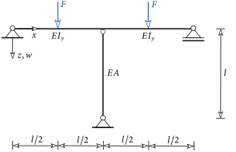{fig-align="center"}
:::

::: {.callout-tip .loesung collapse="true" icon=false}
## Lösung

- $N=-\dfrac{22Fl^2}{96\left(\dfrac{EI_y}{EA}+\dfrac{l^2}{6}\right)}$
:::
