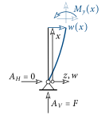
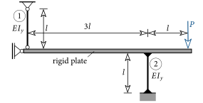
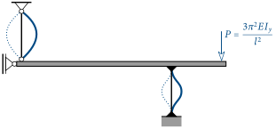
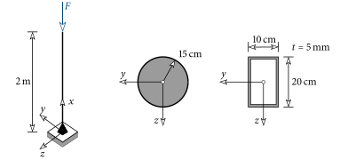



# Buckling of Bars {#sec-stabknickung}

## The [Euler]{.smallcaps} Column {#sec-euler-stab}

In this section we want to investigate the mechanical behaviour of the bar shown in @fig-euler-stab.
It is a vertical bar of length $l$ and bending stiffness $EI_y$, which is hinged at both ends and loaded at its upper end by a vertical force $F$.
This structural system is often called the [Euler]{.smallcaps} column.

![The [Euler]{.smallcaps} column](images-en/EulerStab.svg){#fig-euler-stab}

On this system the force $F$ is now continuously increased starting from zero.
The mechanical behaviour is represented in the form of a load-displacement diagram.
Here, the deflection, i.e. the horizontal displacement at mid-span $\overline{w}$ (@fig-euler-stab), is plotted against the force $F$ in a diagram, see @fig-euler-ld.

![Load-displacement diagram of the [Euler]{.smallcaps} column with increasing load](images-en/EulerStabLD.svg){#fig-euler-ld}

If a small force $F$ now acts on the bar, it is compressed, but it experiences no deflection, i.e. $\overline{w}=0$ (@fig-euler-ld(a)). A *compressive force* acts in the bar.
If $F$ is increased further, the compression increases, but the bar still remains straight.

If, however, a certain magnitude of the force of $F_k$ is now reached, the bar suddenly deflects to the left or right (@fig-euler-ld(b)).
The deflection at mid-span $\overline{w}$ is then no longer zero and, depending on the direction of deflection, either positive or negative.
This sudden lateral deflection of the bar is called *buckling*.
A real bar is never perfectly straight^[*"No Body is perfect!"*], since, for example, its bar axis is slightly curved or the bar stands slightly inclined.
And these so-called (geometric) imperfections decide whether the bar buckles to the left or to the right.

With a further increase of $F$, the deflection at mid-span increases disproportionately.
These large displacements lead to plastic deformations and subsequently to complete failure of the bar (@fig-euler-ld(c)).
If the bar were actually perfectly straight, then it would also remain straight for $F>F_k$ and no buckling would occur.
This state is, however, *unstable*, i.e. upon a small external disturbance^[E.g. by the beat of a butterfly's wing!] the bar would immediately transition into the *stable*, bent configuration (@fig-euler-ld(c)).

To avoid such a failure of a compression bar, the external force $F$ must be smaller than the so-called *critical load* $F_k$ (or buckling load).
But how can we now compute this? To do so we consider @fig-euler-ld(b) once more and observe the following: upon reaching $F_k$, the bar deflects.
Consequently, at this force an equilibrium state *first* also appears on the *deformed* bar!
To determine $F_k$ we must therefore formulate the equilibrium on the *deformed* bar, see @fig-euler-gleichgewicht.

{#fig-euler-gleichgewicht}

With the help of @fig-euler-gleichgewicht we formulate the moment equilibrium on the *deformed* bar and obtain

$$
\pmr\sum M = 0: M_y(x) - F\,w(x) = 0 \;\rightarrow\; M_y(x) = F\,w(x) \; .
$$ {#eq-knick-moment}

The bending moment $M_y$ is in this case dependent on the deflection $w$ and varies along the bar.
To determine $w$ we insert ([-@eq-knick-moment]) into the differential equation of the deflection curve ([-@eq-biegelinie]) and obtain

$$
\dfrac{d^2w}{dx^2}=-\dfrac{F\,w(x)}{EI_y} \;\rightarrow\;\dfrac{d^2w}{dx^2}+\dfrac{F}{EI_y}w(x) = 0 \; .
$$ {#eq-knick-dgl}

By using the parameter $\alpha$, this differential equation can also be written as:

$$
\dfrac{d^2w}{dx^2} + \alpha^2 w = 0 \quad\text{with}\quad\alpha=\sqrt{\dfrac{F}{EI_y}} \; .
$$ {#eq-knick-dgl-alpha}

A solution of the above equation is

$$
w(x) = C_1\sin(\alpha x) + C_2\cos(\alpha x) \; .
$$ {#eq-knick-loesung}

As a check we insert this into the differential equation and see that it is satisfied:

$$
-\alpha^2 C_1\sin(\alpha x) -\alpha^2 C_2\cos(\alpha x) + \alpha^2(C_1\sin(\alpha x) + C_2\cos(\alpha x)) = 0 \; \checkmark
$$ {#eq-knick-kontrolle}

Now the constants $C_1$ and $C_2$ still have to be determined. From the boundary condition that the deflection at the lower end of the bar ($x=0$) is zero, one obtains

$$
w(x=0) = 0:C_1\cdot 0 + C_2\cdot 1 = 0 \;\rightarrow\; C_2 = 0 \; .
$$ {#eq-knick-rb1}

At the upper end of the bar ($x=l$) the deflection is also zero:

$$
w(x=l) = C_1\sin(\alpha l) = 0 \; .
$$ {#eq-knick-rb2}

This condition is satisfied if $C_1$ is zero.
In this case the bar would experience no deflection, i.e. $w(x) = 0$.
But the equilibrium position on the *deformed* bar is sought.
Thus $w(x)\neq0$ must hold. The above condition is, however, also satisfied if the argument of the sine function $\alpha l$ takes the value of a multiple of $\pi$:

$$
\alpha l = n\pi
$$ {#eq-knick-eigenwert}

with $n=1,2,3,\ldots\;$.
With the definition of $\alpha$, the force at which equilibrium on the deformed bar is satisfied can be determined from this:

$$
\sqrt{\dfrac{F}{EI_y}}l=n\pi\;\rightarrow\; F=\dfrac{n^2EI_y\pi^2}{l^2} \; .
$$ {#eq-knick-Fn}

The smallest value we obtain for the case $n=1$.
This force then corresponds to the sought critical force $F_k$ at which the bar buckles:

$$
\myBox{F_k=\dfrac{EI_y\pi^2}{l^2}} \; .
$$ {#eq-knicklast}

## The Four [Euler]{.smallcaps} Cases {#sec-euler-faelle}

For the derivation of the critical force according to the above scheme, the boundary conditions of the bar are needed.
If the bar is now not hinged at both ends, the critical force also changes.
In this case, in the computation of $F_k$, the length $l$ in ([-@eq-knicklast]) is to be replaced by the so-called *buckling length* $l_k$.
This gives the distance between the inflection points (IP) of the buckling shape. In @fig-euler-faelle the buckling shape as well as the buckling length are shown for four different support types of the bar.
These are also called the four [Euler]{.smallcaps} cases.

![Buckling lengths of the four [Euler]{.smallcaps} cases](images-en/EulerFaelle.svg){#fig-euler-faelle}

The buckling length decreases from left to right, which has the consequence that the critical force increases for the same cross-section and material^[<https://www.youtube.com/watch?v=TUE7DKNBIrU> (accessed: 21.03.2017)].
This can also be justified by the fact that, compared to the free upper end, a hinged support or a clamping increases the horizontal stiffness of the bar.
The bar then deflects horizontally only at a higher load.

A sudden change of the deformation can, however, also occur in a cylinder when a negative pressure prevails inside^[<https://www.youtube.com/watch?v=Zz95_VvTxZM> (accessed: 23.03.2017)].

::: {#exm-knick-zwei-staebe}
Are the two bending bars $\circled{1}$ and $\circled{2}$ at risk of buckling in the system shown below?
If so, which bar buckles first and at what load?

{fig-align="center"}
:::

::: {.callout-tip .loesung collapse="true" icon=false}
## Solution

Via the equilibrium conditions the two bar forces can be determined as

$$
N_1 = -\dfrac{P}{3}\quad\text{and}\quad N_2 = -\dfrac{4P}{3} \; .
$$

Both bars have a compressive force and can therefore buckle.
The critical forces of the two bars are:

$$
\begin{aligned}
\text{Bar }\circled{1} \; &\rightarrow \; \text{Euler case 2} \;\rightarrow\;l_k=l \;&\rightarrow&\; F_k^{\circled{1}} = \dfrac{\pi^2EI_y}{l^2} \\
\text{Bar }\circled{2} \; &\rightarrow \; \text{Euler case 4} \;\rightarrow\;l_k=0.5l \;&\rightarrow&\; F_k^{\circled{2}} = \dfrac{\pi^2EI_y}{(0.5l)^2}=\dfrac{1}{0.25}\dfrac{\pi^2EI_y}{l^2}=4F_k^{\circled{1}}\;.
\end{aligned}
$$

If the normal force equals the critical load ($|N_i|=F_k^{\circled{i}}$), the bar buckles. From this we obtain the magnitude of $P$ at which the two bars buckle:

$$
\begin{aligned}
\text{Bar }\circled{1} \; &\rightarrow \; \left|N_1\right|=F_k^{\circled{1}} \;&\rightarrow&\; P=\dfrac{3\pi^2EI_y}{l^2} \\
\text{Bar }\circled{2} \; &\rightarrow \; \left|N_2\right|=F_k^{\circled{2}} \;&\rightarrow&\; P=\dfrac{3}{4}\dfrac{4\pi^2EI_y}{l^2}=\dfrac{3\pi^2EI_y}{l^2}\;.
\end{aligned}
$$

In this example *both* bars buckle (theoretically) simultaneously at a load of $P=3\pi^2EI_y/l^2$.
Failure occurs under this load.
What changes if bar $\circled{2}$ has a length of $2l$?

{fig-align="center"}
:::

::: {#exm-knick-kragtraeger}
Given is a spatial cantilever beam.
At what load and in which direction does the bar buckle for the two given cross-sections? (steel $E=21000\,\text{kN/cm}^2$)

{fig-align="center"}
:::

::: {#exm-knick-linienlast}
At what magnitude of the line load $q$ does the vertical bar buckle? Both bars are made of steel ($E=21000\,\text{kN/cm}^2$) of cross-section type HEB^[[Wide-flange beam (Wikipedia)](https://en.wikipedia.org/wiki/Wide_flange) (accessed: 29.03.2017)].

::: {layout="[65,35]" layout-valign="center"}

**HEB 160**\
$A=54.3\,\text{cm}^2$, $I_y=2490\,\text{cm}^4$

**HEB 140**\
$A=43.0\,\text{cm}^2$, $I_y=1510\,\text{cm}^4$
:::
:::

::: {.callout-tip .loesung collapse="true" icon=false}
## Solution

From the normal force in the vertical bar of $N=-245.81\,q$, the critical line load results as $q=16.23\,\text{kN/m}$.
:::
