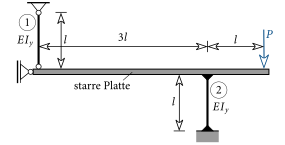
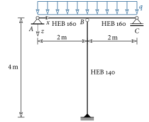



# Stabknickung {#sec-stabknickung}

## Der [Euler]{.smallcaps}-Stab {#sec-euler-stab}

In diesem Abschnitt wollen wir das mechanische Verhalten des in @fig-euler-stab dargestellten Stabes untersuchen.
Dabei handelt es sich um einen vertikalen Stab der Länge $l$ und der Biegesteifigkeit $EI_y$, der beidseitig gelenkig gelagert ist und an seinem oberen Ende durch eine vertikale Kraft $F$ belastet wird.
Dieses statische System wird häufig als [Euler]{.smallcaps}-Stab bezeichnet.

![Der [Euler]{.smallcaps}-Stab](images/EulerStab.svg){#fig-euler-stab}

An diesem System wird nun die Kraft $F$ ausgehend von Null kontinuierlich gesteigert.
Das mechanische Verhalten wird dabei in Form eines Last-Verschiebungsdiagramms dargestellt.
Dabei wird die Durchbiegung bzw. die horizontale Verschiebung in Stabmitte $\overline{w}$ (@fig-euler-stab) gegenüber der Kraft $F$ in einem Diagramm aufgetragen, siehe @fig-euler-ld.

![Last-Verschiebungsdiagramm des [Euler]{.smallcaps}-Stabes mit größer werdender Belastung](images/EulerStabLD.svg){#fig-euler-ld}

Wirkt nun eine kleine Kraft $F$ am Stab, wird dieser gestaucht, aber er erfährt keine Durchbiegung, d.h. $\overline{w}=0$ (@fig-euler-ld(a)). Im Stab wirkt eine *Druckkraft*.
Wird $F$ weiter erhöht, nimmt die Stauchung zu, aber der Stab bleibt nach wie vor gerade.

Wird nun aber eine bestimmte Größe der Kraft von $F_k$ erreicht, weicht der Stab plötzlich nach links oder rechts aus (@fig-euler-ld(b)).
Die Durchbiegung in Stabmitte $\overline{w}$ ist dann nicht mehr Null und entsprechend der Ausweichrichtung entweder positiv oder negativ.
Dieses plötzliche seitliche Ausweichen des Stabes wird als *Stabknickung* bezeichnet.
Ein realer Stab ist niemals perfekt gerade^[*„No Body is perfect!“*], da beispielsweise seine Stabachse leicht gekrümmt ist oder der Stab leicht schräg steht.
Und diese sogenannten (geometrischen) Imperfektionen entscheiden, ob der Stab nach links oder rechts knickt.

Bei einer weiteren Steigerung von $F$ nimmt die Durchbiegung in Stabmitte überproportional zu.
Diese großen Verschiebungen führen zu plastischen Verformungen und in weiterer Folge zum vollständigen Versagen des Stabes (@fig-euler-ld(c)).
Wäre der Stab tatsächlich perfekt gerade, dann bliebe er auch bei $F>F_k$ gerade und es käme zu keiner Stabknickung.
Dieser Zustand ist aber *instabil*, d.h. bei einer kleinen äußeren Störung^[Z.B. durch den Flügelschlag eines Schmetterlings!] würde der Stab sofort in die *stabile*, gebogene Konfiguration übergehen (@fig-euler-ld(c)).

Um ein derartiges Versagen eines Druckstabes zu vermeiden, muss die äußere Kraft $F$ kleiner als die sogenannte *kritische Last* $F_k$ (oder Knicklast) sein.
Doch wie können wir nun diese berechnen? Dazu betrachten wir nochmals @fig-euler-ld(b) und stellen Folgendes fest: Bei Erreichen von $F_k$ kommt es zum Ausweichen des Stabes.
Folglich tritt bei dieser Kraft *erstmalig* auch ein Gleichgewichtszustand am *verformten* Stab auf!
Zur Bestimmung von $F_k$ müssen wir daher das Gleichgewicht am *verformten* Stab formulieren, siehe @fig-euler-gleichgewicht.

{#fig-euler-gleichgewicht}

Mit Hilfe von @fig-euler-gleichgewicht formulieren wir das Momentengleichgewicht am *verformten* Stab und erhalten

$$
\pmr\sum M = 0: M_y(x) - F\,w(x) = 0 \;\rightarrow\; M_y(x) = F\,w(x) \; .
$$ {#eq-knick-moment}

Das Biegemoment $M_y$ ist in diesem Fall abhängig von der Durchbiegung $w$ und ist veränderlich entlang des Stabes.
Zur Bestimmung von $w$ setzen wir ([-@eq-knick-moment]) in die Differentialgleichung der Biegelinie ([-@eq-biegelinie]) ein und erhalten

$$
\dfrac{d^2w}{dx^2}=-\dfrac{F\,w(x)}{EI_y} \;\rightarrow\;\dfrac{d^2w}{dx^2}+\dfrac{F}{EI_y}w(x) = 0 \; .
$$ {#eq-knick-dgl}

Durch Verwendung des Parameters $\alpha$ lässt sich diese Differentialgleichung auch anschreiben zu:

$$
\dfrac{d^2w}{dx^2} + \alpha^2 w = 0 \quad\text{mit}\quad\alpha=\sqrt{\dfrac{F}{EI_y}} \; .
$$ {#eq-knick-dgl-alpha}

Eine Lösung von obiger Gleichung ist

$$
w(x) = C_1\sin(\alpha x) + C_2\cos(\alpha x) \; .
$$ {#eq-knick-loesung}

Zur Kontrolle setzen wir diese in die Differentialgleichung ein und sehen, dass diese erfüllt ist:

$$
-\alpha^2 C_1\sin(\alpha x) -\alpha^2 C_2\cos(\alpha x) + \alpha^2(C_1\sin(\alpha x) + C_2\cos(\alpha x)) = 0 \; \checkmark
$$ {#eq-knick-kontrolle}

Nun gilt es noch die Konstanten $C_1$ und $C_2$ zu bestimmen. Aus der Randbedingung, dass die Durchbiegung am unteren Ende des Stabes ($x=0$) Null ist, erhält man

$$
w(x=0) = 0:C_1\cdot 0 + C_2\cdot 1 = 0 \;\rightarrow\; C_2 = 0 \; .
$$ {#eq-knick-rb1}

Auch am oberen Ende des Stabes ($x=l$) ist die Durchbiegung Null:

$$
w(x=l) = C_1\sin(\alpha l) = 0 \; .
$$ {#eq-knick-rb2}

Diese Bedingung ist erfüllt, wenn $C_1$ Null ist.
In diesem Fall würde der Stab keine Durchbiegung erfahren, d.h. $w(x) = 0$.
Es wird aber die Gleichgewichtslage am *verformten* Stab gesucht.
Also muss $w(x)\neq0$ sein. Obige Bedingung ist aber auch erfüllt, wenn das Argument der Sinusfunktion $\alpha l$ den Wert eines Vielfachen von $\pi$ annimmt:

$$
\alpha l = n\pi
$$ {#eq-knick-eigenwert}

mit $n=1,2,3,\ldots\;$.
Mit der Definition von $\alpha$ lässt sich daraus die Kraft bestimmen, bei der das Gleichgewicht am verformten Stab erfüllt ist:

$$
\sqrt{\dfrac{F}{EI_y}}l=n\pi\;\rightarrow\; F=\dfrac{n^2EI_y\pi^2}{l^2} \; .
$$ {#eq-knick-Fn}

Den kleinsten Wert erhalten wir für den Fall $n=1$.
Diese Kraft entspricht dann der gesuchten kritischen Kraft $F_k$, bei der der Stab knickt:

$$
\myBox{F_k=\dfrac{EI_y\pi^2}{l^2}} \; .
$$ {#eq-knicklast}

## Die vier [Euler]{.smallcaps}-Fälle {#sec-euler-faelle}

Für die Herleitung der kritischen Kraft nach obigem Schema werden die Randbedingungen des Stabes benötigt.
Ist der Stab nun nicht beidseitig gelenkig gelagert, ändert sich auch die kritische Kraft.
In diesem Fall ist bei der Berechnung von $F_k$ die Länge $l$ in ([-@eq-knicklast]) durch die sogenannte *Knicklänge* $l_k$ zu ersetzen.
Diese gibt den Abstand der Wendepunkte (WP) der Knickfigur an. In @fig-euler-faelle ist die Knickfigur sowie die Knicklänge für vier verschiedene Lagerungsarten des Stabes dargestellt.
Diese werden auch als die vier [Euler]{.smallcaps}-Fälle bezeichnet.

![Knicklängen der vier [Euler]{.smallcaps}-Fälle](images/EulerFaelle.svg){#fig-euler-faelle}

Die Knicklänge nimmt von links nach rechts ab, was zur Folge hat, dass die kritische Kraft bei gleichem Querschnitt und Material zunimmt^[<https://www.youtube.com/watch?v=TUE7DKNBIrU> (Abruf: 21.03.2017)].
Dies lässt sich auch damit begründen, dass im Vergleich zum freien oberen Ende ein gelenkiges Lager bzw. eine Einspannung die horizontale Steifigkeit des Stabes erhöht.
Der Stab weicht dann erst bei einer höheren Belastung horizontal aus.

Zu einer schlagartigen Änderung der Verformung kann es aber auch bei einem Zylinder kommen, wenn im Inneren ein Unterdruck herrscht^[<https://www.youtube.com/watch?v=Zz95_VvTxZM> (Abruf: 23.03.2017)].

::: {#exm-knick-zwei-staebe}
Sind die beiden Biegestäbe $\circled{1}$ und $\circled{2}$ im nachfolgend abgebildeten System knickgefährdet?
Wenn ja, welcher Stab knickt zuerst bei welcher Belastung?

{fig-align="center"}
:::

::: {.callout-tip .loesung collapse="true" icon=false}
## Lösung

Über die Gleichgewichtsbedingungen lassen sich die beiden Stabkräfte bestimmen zu

$$
N_1 = -\dfrac{P}{3}\quad\text{und}\quad N_2 = -\dfrac{4P}{3} \; .
$$

Beide Stäbe besitzen eine Druckkraft und können daher knicken.
Die kritischen Kräfte der beiden Stäbe sind:

$$
\begin{aligned}
\text{Stab }\circled{1} \; &\rightarrow \; \text{Euler-Fall 2} \;\rightarrow\;l_k=l \;&\rightarrow&\; F_k^{\circled{1}} = \dfrac{\pi^2EI_y}{l^2} \\
\text{Stab }\circled{2} \; &\rightarrow \; \text{Euler-Fall 4} \;\rightarrow\;l_k=0.5l \;&\rightarrow&\; F_k^{\circled{2}} = \dfrac{\pi^2EI_y}{(0.5l)^2}=\dfrac{1}{0.25}\dfrac{\pi^2EI_y}{l^2}=4F_k^{\circled{1}}\;.
\end{aligned}
$$

Ist die Normalkraft gleich der kritischen Last ($|N_i|=F_k^{\circled{i}}$), knickt der Stab aus. Daraus erhalten wir die Größe von $P$, bei der die zwei Stäbe knicken:

$$
\begin{aligned}
\text{Stab }\circled{1} \; &\rightarrow \; \left|N_1\right|=F_k^{\circled{1}} \;&\rightarrow&\; P=\dfrac{3\pi^2EI_y}{l^2} \\
\text{Stab }\circled{2} \; &\rightarrow \; \left|N_2\right|=F_k^{\circled{2}} \;&\rightarrow&\; P=\dfrac{3}{4}\dfrac{4\pi^2EI_y}{l^2}=\dfrac{3\pi^2EI_y}{l^2}\;.
\end{aligned}
$$

In diesem Beispiel knicken *beide* Stäbe (theoretisch) gleichzeitig bei einer Last von $P=3\pi^2EI_y/l^2$ aus.
Es kommt unter dieser Belastung zum Versagen.
Was ändert sich, wenn der Stab $\circled{2}$ eine Länge von $2l$ hat?

{fig-align="center"}
:::

::: {#exm-knick-kragtraeger}
Gegeben ist ein räumlicher Kragträger.
Bei welcher Last und in welche Richtung knickt der Stab für die gegebenen zwei Querschnitte aus? (Stahl $E=21000\,\text{kN/cm}^2$)

{fig-align="center"}
:::

::: {#exm-knick-linienlast}
Bei welcher Größe der Linienlast $q$ knickt der vertikale Stab aus? Beide Stäbe sind aus Stahl ($E=21000\,\text{kN/cm}^2$) vom Querschnitt-Typ HEB^[[Breitflanschträger (Wikipedia)](https://de.wikipedia.org/wiki/Breitflanschtr%C3%A4ger) (Abruf: 29.03.2017)].

::: {layout="[65,35]" layout-valign="center"}

**HEB 160**\
$A=54.3\,\text{cm}^2$, $I_y=2490\,\text{cm}^4$

**HEB 140**\
$A=43.0\,\text{cm}^2$, $I_y=1510\,\text{cm}^4$
:::
:::

::: {.callout-tip .loesung collapse="true" icon=false}
## Lösung

Aus der Normalkraft im vertikalen Stab von $N=-245.81\,q$ ergibt sich die kritische Linienlast zu $q=16.23\,\text{kN/m}$.
:::
