

# Shear Stresses in the Bar Cross-Section {#sec-schub}

## Shear Force {#sec-querkraft}

In the previous chapters the normal stress due to a normal force and a bending moment in the bar cross-section was discussed.
The distribution of the normal stress under pure moment loading is shown for a T-cross-section in @fig-stab-schub(a).
If a shear force now also acts at this position of the bar, this also produces *shear stresses* in the cross-section (cf. @fig-stab-schub(b)).

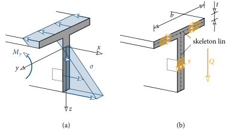{#fig-stab-schub}

In the computation of these shear stresses due to shear force we restrict ourselves here to *thin-walled, open* cross-sections.
Thin-walled means that the thickness $t$ of the plates of which the cross-section is composed is *small* compared to the outer cross-sectional dimensions, i.e. $t\ll b$.
The centre line of the plates, which is entered in @fig-stab-schub(b) as a dash-dotted line, is called the skeleton line.
If this skeleton line is *not* a closed curve, then it is an *open* cross-section.
Many well-known cross-sections from steel construction fall into this category, but not square or circular hollow sections.

For a thin-walled, open cross-section, the following assumptions can be made about the course and the distribution of the shear stress:

- Because of the small plate thickness $t$, the shear stress can only form in the direction of the skeleton line.
- The shear stress is *constant* over the plate thickness $t$.

These properties of $\tau$ are shown in @fig-stab-schub(b).

But in which cut surfaces does this shear stress now act?
To answer this we cut an infinitesimal element out of the bar, which is shown dotted in @fig-stab-schub(b).
First we enter the acting normal stress and the shear stress acting on the front cut surface (@fig-satz-schub(a)).
Since this surface is the positive cut face, we enter $\tau$ in the positive $z$-direction.
The same applies to $\sigma$.
*Equilibrium* must prevail on this element!
Under this stress state, however, neither the vertical force equilibrium nor the moment equilibrium is satisfied.

{#fig-satz-schub}

To satisfy the vertical force equilibrium, a shear stress of equal magnitude must act upwards on the opposite cut surface (@fig-satz-schub(b)).
The moment equilibrium is, however, still not satisfied.
For this, a shear stress must act in the upper and lower cut surface.
If this acts in the direction shown in @fig-satz-schub(c), then all three equilibrium conditions are satisfied.
From this consideration one recognises that in all four cut surfaces the *same* magnitude of shear stress must act, in the directions according to @fig-satz-schub(c).
This important property of $\tau$ is called the theorem of associated shear stresses.

The magnitude of the shear stress under shear-force loading at an arbitrary position $s$ on the skeleton line can be computed with the following relation:

$$
\myBox{\tau(s) = -\dfrac{Q}{I_y}\dfrac{S_y(s)}{t}} \; .
$$ {#eq-tau-Q}

Here $Q$ is the shear force acting at position $x$ and $I_y$ is the second moment of area of the cross-section about the $y$-axis.
In the examples considered here we assume a constant plate thickness $t$.
With the coordinate $s$ a point on the skeleton line is described.

{#fig-berechnung-schub}

$S_y$ is the first moment of area of the separated partial area of the cross-section.
If one wants, for example, to compute the shear stress at point 1 of the I-cross-section in @fig-berechnung-schub, then in ([-@eq-tau-Q]) one must insert for $S_y$ the first moment of area of the orange partial area about the $y$-axis.
For $\tau$ at point 2, $S_y$ of the blue partial area must be inserted in ([-@eq-tau-Q]).
From this one recognises clearly that the first moment of area changes along the skeleton line and that hence the shear stress is also variable, i.e. $\tau$ is a function of $s$.
With the relation ([-@eq-tau-Q]) the shear stress at the junction points of the plates cannot be computed (crossed-out areas in @fig-berechnung-schub).

::: {#exm-leimfuge-holz}
A beam is to be glued together from two wooden parts. What stress must the glue joint transmit?
Where is the loading greatest?

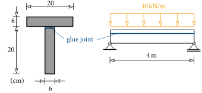{fig-align="center"}
:::

::: {.callout-tip .loesung collapse="true" icon=false}
## Solution

To compute the shear stresses, the cross-sectional properties must first be determined.
The cross-sectional area is

$$
A = 20\cdot 6\cdot 2 = 240\,\text{cm}^2 \; .
$$

The centroid lies on the axis of symmetry of the cross-section.
To determine its vertical position, the first moment of area about the $\overline{y}$-axis at the upper edge is computed (see the following sketch):

$$
S_{\overline{y}} = 20\cdot 6\cdot 3 + 20\cdot 6\cdot 16 = 2280\,\text{cm}^3\;.
$$

The vertical distance of the centroid from the upper edge is thus

$$
\overline{z}_S = \dfrac{S_{\overline{y}}}{A}=\dfrac{2280}{240} = 9.5\,\text{cm}\;.
$$

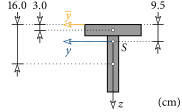{fig-align="center"}

The second moment of area about the $y$-axis is computed as

$$
I_y = \dfrac{20\cdot 6^3}{12}+20\cdot 6 \cdot(9.5-3)^2 + \dfrac{6\cdot 20^3}{12}+20\cdot 6\cdot(6+10-9.5)^2=14500\,\text{cm}^4 \; .
$$

To compute the shear stress at the location of the glue joint, we cut the cross-section apart exactly there and consider the upper part.
The first moment of area of this partial area about the $y$-axis is equal to

$$
S_y = 20\cdot 6\cdot (-6.5) = -780\,\text{cm}^3
$$

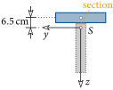{fig-align="center"}

The largest shear force in the bar occurs at the supports and is equal to $Q=10\cdot 4/2 = 20\,\text{kN}$.
Thus the shear stress in the glue joint at the supports is obtained with ([-@eq-tau-Q]) as

$$
\tau = -\dfrac{Q}{I_y}\dfrac{S_y}{t} = -\dfrac{20}{14500}\dfrac{-780}{6}= 0.18\,\text{kN/cm}^2\; .
$$

Because of the theorem of associated shear stresses, a shear stress of equal magnitude acts in the glue joint.

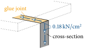{fig-align="center"}
:::

::: {#exm-offener-querschnitt}
Given is an open cross-section with a plate thickness of $2\,\text{cm}$.
Compute the shear stress due to shear force at the blue points in the cross-section!
In which direction does the shear stress act at these points?

{fig-align="center"}
:::

::: {.callout-tip .loesung collapse="true" icon=false}
## Solution

- Second moment of area: $I_y = 628.4\,\text{cm}^4$
- Shear stresses: $\tau_1 = \tau_4 = \tau_7 = 0\,,\; \tau_2 = \tau_6 = 0.71\,\text{kN/cm}^2\,,\; \tau_3=\tau_5=0.57\,\text{kN/cm}^2$
:::

## Torsion of the Circular Shaft {#sec-torsion-welle}

Torsion denotes the loading of a bar by a moment about its bar axis.
Compared to other bar cross-sections, the circular shaft (circular cross-section) takes a special position in the computation of the resulting stresses and deformations.
We therefore consider in this section such a shaft, loaded by a constant torsional moment $M_t$ along its length.

The circular shaft shown in @fig-torsion-welle, with radius $R$ and length $l$, is loaded at one end by a torsional moment $M_t$, and at the other end the rotation about the $x$-axis is blocked.
First we observe the resulting deformation of the shaft.
To do so, the displacement of an arbitrary point $B$ at the edge of the shaft is considered.

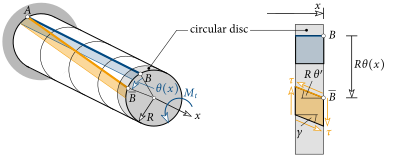{#fig-torsion-welle}

Through the torsional moment, a displacement in the circumferential direction occurs (point $\ol{B}$ in @fig-torsion-welle), but *no* displacement in the direction of the bar axis!
For a circular cross-section, and only for this one, this applies to all points of the circular cross-section.
The cross-section thus remains *plane* under torsional loading!
The rotation from point $B$ to $\ol{B}$ is measured by the angle $\theta$, which (for a constant torsional moment) increases linearly between the points $A$ and $B$.

To describe the deformation of the shaft, a thin circular disc is cut off at the end and the displacement in the circumferential direction is considered.
The point $B$ experiences a displacement of magnitude $R\theta$.
A square element on the shaft surface (blue area in @fig-torsion-welle) is deformed by the torsion into a rhombus (orange area).
This deformation can be described by the change of the right angle.
This change of angle is called *shear strain* $\gamma$ and takes a magnitude of $R\theta'$ at the surface of the shaft.
In @fig-torsion-verteilung(a) the displacement in the circumferential direction in the circular cross-section is shown.

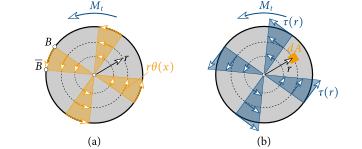{#fig-torsion-verteilung}

This is zero at the centroid, grows linearly with the distance $r$, and reaches its maximum value at the surface of the shaft.
Thus the shear strain also grows linearly with $r$:

$$
\gamma = r\theta' \; .
$$ {#eq-gleitung}

The blue area element in @fig-torsion-welle is deformed into a rhombus by a shear stress $\tau$.
If it is assumed that the angle $\theta$ is small, then the lengths of the two curves $A-B$ and $A-\ol{B}$ in @fig-torsion-welle are equal, whereby no normal stresses arise.
The connection between the shear stress and the shear strain is given by the *shear modulus* $G$, which is a material parameter.
For the shaft one thus obtains

$$
\tau(r) = G\gamma = Gr\theta' \; .
$$ {#eq-tau-welle}

The shear stress thus also increases linearly with the distance to the centroid and reaches its maximum value at the surface of the shaft, see @fig-torsion-verteilung(b).

Next, a relationship between the torsional moment and the shear stress must be established.
The shear stress $\tau$, which acts in the area element $dA$, generates a moment about the centroid of magnitude $r\,\tau dA$.
Summing up (i.e. integrating) over the circular cross-section gives, together with ([-@eq-tau-welle]), the torsional moment:

$$
M_t = \int\limits_A r\tau(r)\,dA = \int\limits_0^R\int\limits_0^{2\pi} r\,Gr\theta'\,r\,d\alpha\, dr = G\theta'\int\limits_0^R\int\limits_0^{2\pi} r^3\,d\alpha\, dr = G\theta'\dfrac{\pi R^4}{2} = GI_t \theta'\;.
$$ {#eq-Mt-welle}

Here $I_t$ is the *polar moment of inertia* (or torsional moment of inertia) of a circular cross-section with radius $R$:

$$
I_t = \dfrac{\pi R^4}{2} \; .
$$ {#eq-It-kreis}

By rearranging, the following relationship is finally obtained between the rotation of the shaft and the torsional moment:

$$
\myBox{\theta'=\dfrac{M_t}{GI_t}} \; .
$$ {#eq-verdrillung}

If one inserts this expression into ([-@eq-tau-welle]), then we obtain the relation for computing the shear stress at every point of the circular cross-section, as shown in @fig-torsion-verteilung(b):

$$
\myBox{\tau(r) = \dfrac{M_t}{I_t}r} \; .
$$ {#eq-tau-Mt}

::: {#exm-getriebe}
Given is a gear transmission consisting of two solid shafts, connected to each other via gears ($D_1$, $D_2$).
Shaft $\circled{2}$ is loaded by the torsional moment $M_t^{(2)}$.
Sought are the torsional moment in shaft $\circled{1}$, the maximum shear stresses in shaft $\circled{2}$, and the rotation at point $C$ when point $A$ is held!

{fig-align="center"}
:::

::: {.callout-tip .loesung collapse="true" icon=false}
## Solution

From the moment equilibrium on the subsystems it follows:

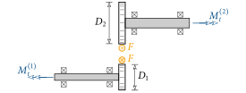{fig-align="center"}

$$
M_t^{(2)}=F\dfrac{D_2}{2} \quad \text{and} \quad M_t^{(1)}=-F\dfrac{D_1}{2} \; .
$$

From this it finally follows that

$$
M_t^{(1)} = -\dfrac{D_1}{D_2}M_t^{(2)} \; .
$$

The polar moment of inertia of shaft $\circled{2}$ is given by

$$
I_t^{(2)} = \dfrac{\pi R_2^4}{2}
$$

and thus the maximum shear stresses in the shaft according to ([-@eq-tau-Mt]) as

$$
\tau = \dfrac{M_t^{(2)}}{I_t}R_2 = \dfrac{2M_t^{(2)}}{\pi R_2^3} \; .
$$

If point $A$ is held, then the rotation at point $B$ of shaft $\circled{1}$ according to ([-@eq-verdrillung]) is equal to

$$
\theta_B^{(1)} = \int\limits_0^l\theta'\,dx = \int\limits_0^l\dfrac{M_t^{(1)}}{GI_t^{(1)}}\,dx = \dfrac{M_t^{(1)}l}{GI_t^{(1)}}=-\dfrac{2M_t^{(2)}l}{G\pi R_1^4}\dfrac{D_1}{D_2} \; .
$$

From the rolling condition, the rotation at point $B$ of shaft $\circled{2}$ results:

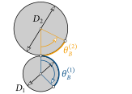{fig-align="center"}

$$
-\dfrac{D_1}{2}\theta_B^{(1)} = \dfrac{D_2}{2}\theta_B^{(2)} \; \rightarrow \; \theta_B^{(2)} = -\dfrac{D_1}{D_2}\theta_B^{(1)} \; .
$$

The rotation of the shaft at point $C$ is thus

$$
\theta_C=\theta_B^{(2)} + \int\limits_0^l\dfrac{M_t^{(2)}}{GI_t^{(2)}}\,dx = \dfrac{2M_t^{(2)}l}{G\pi R_1^4}\left(\dfrac{D_1}{D_2}\right)^2 + \dfrac{2M_t^{(2)}l}{G\pi R_2^4} =
\dfrac{2M_tl}{G\pi}\left[\left(\dfrac{D_1}{D_2}\right)^2\dfrac{1}{R_1^4}+\dfrac{1}{R_2^4}\right] \; .
$$

Interpret the result!
:::

## Torsion of the Thin-Walled Cross-Section {#sec-torsion-duennwandig}

The computation of shear stresses due to torsion in bars is associated with increased mathematical effort.
An exception is formed by thin-walled cross-sections.
For these, the same assumptions can be made for the resulting shear stresses as for loading due to shear force, i.e. shear stresses form only in the direction of the skeleton line.
Furthermore, it is assumed that the bar can displace *freely* in the longitudinal direction ($x$-direction), so that *no* normal stresses $\sigma$ arise in the cross-section.
This case of so-called [Saint-Venant]{.smallcaps} torsion is considered in the following for thin-walled closed^[[Closed cross-section](http://www.buschen-stahl.de/stahlrohre.htm) (accessed: 20.4.2017)] and open^[[Open cross-sections](http://www.buschen-stahl.de/stahlprofile.htm) (accessed: 20.4.2017)] cross-sections.

### The Closed Cross-Section {#sec-geschlossener-qs}

A general closed cross-section, loaded by a torsional moment $M_t$, is shown in @fig-geschlossener-qs.
The skeleton line $\mathcal{C}$ is a closed curve!
Through $M_t$ the shear stresses shown arise in the cross-section, which are constant over the plate thickness $t$.
From equilibrium considerations one obtains that the magnitude of the shear stresses does not change over the arc length $s$ of the skeleton line.
For simplification we consider here only cross-sections with a constant plate thickness.

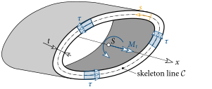{#fig-geschlossener-qs}

Now a relationship between the shear stresses and the torsional moment must be established.
To do so one considers an infinitesimal piece of the cross-section of length $ds$, which has an area of $dA=t\,ds$.
Multiplication of this area by the shear stress gives the resultant force acting on it.
And this generates a moment $dM_t$ about the centroidal axis of magnitude

$$
dM_t = r_n\,\tau dA = r_n\,\tau t\, ds \; .
$$ {#eq-dMt}

Note here that, to form the moment, the normal distance $r_n$ must be used, as entered in @fig-geschlossener-qs2.

{#fig-geschlossener-qs2}

From this one also recognises that the expression $r_n\,ds$ equals twice the area of the orange triangle $dA_s$ entered in @fig-geschlossener-qs2(a).
If we sum (i.e. integrate) ([-@eq-dMt]) along the closed skeleton line ($\rightarrow\oint$), we obtain the acting torsional moment:

$$
M_t = \oint\limits_\mathcal{C} dM_t = \oint\limits_\mathcal{C} r_n\,\tau t\, ds = \tau t \oint\limits_\mathcal{C} r_n\,ds = \tau t \oint\limits_\mathcal{C}2\,dA_s = \tau t\, 2A_s \; .
$$ {#eq-Mt-geschlossen}

With the help of @fig-geschlossener-qs2(a) it becomes apparent that the integration of $dA_s$ along the closed skeleton line $\mathcal{C}$ equals the area $A_s$ enclosed by it (see @fig-geschlossener-qs2(b)).
Rearranging ([-@eq-Mt-geschlossen]) finally gives the sought relationship between the shear stress and the torsional moment:

$$
\myBox{\tau = \dfrac{M_t}{2A_s\,t}} \; .
$$ {#eq-tau-geschlossen}

In @fig-verwoelbung the deformation of a rectangular hollow section under torsional loading is shown in blue.
In contrast to the circular shaft, a non-uniform displacement in the longitudinal direction ($x$-direction) occurs!
Consequently, the cross-section does not remain plane but *warps*.

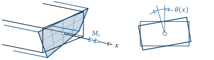{#fig-verwoelbung}

Furthermore, through $M_t$, as with the circular shaft, a rotation of the cross-section about the $x$-axis occurs that varies over the length of the bar and is measured by the angle $\theta(x)$.
In analogy to the circular shaft we want to compute this rotation with the relation

$$
\theta' = \dfrac{M_t}{GI_t} \; .
$$ {#eq-verdrillung-allg}

The torsional moment of inertia for a closed cross-section is now, however, computed as

$$
\myBox{I_t = \dfrac{4A_s^2t}{U_s}} \; ,
$$ {#eq-It-geschlossen}

where $U_s$ is the arc length of the skeleton line, see @fig-geschlossener-qs2(b).

### The Open Cross-Section {#sec-offener-qs}

First we consider a single plate loaded by a torsional moment (@fig-offener-qs).
Again we assume that shear stresses can form only in the direction of the skeleton line.
In order for the torsional moment to result from the shear stresses, a linear distribution of $\tau$ over the plate thickness $t$ is assumed.
For the given torsional moment, the shear stresses act upwards to the right of $z$ and downwards to the left of it.
The largest shear stresses $\tau_0$ occur at the two lateral edges of the cross-section.
At an arbitrary position $y$ the shear stress is thus equal to (cf. @fig-offener-qs)

$$
\tau(y) = \tau_0\dfrac{y}{t/2} \; .
$$ {#eq-tau-blech}

Approximately, the plate can be divided into thin-walled, closed cross-sections.
One of these cross-sections is shown in orange in @fig-offener-qs.

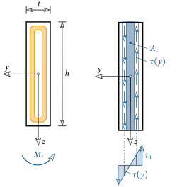{#fig-offener-qs}

If the horizontal transition region is neglected, one obtains with ([-@eq-tau-geschlossen]) the magnitude of the torsional moment acting in the orange cross-section, where $A_s$ is assumed to be $2yh$:

$$
\tau(y) = \tau_0\dfrac{2y}{t} = \dfrac{dM_t}{2\,A_s\,dy} = \dfrac{dM_t}{2\,2yh\,dy} \;\rightarrow\;dM_t = \dfrac{8\tau_0h}{t}y^2dy \; .
$$ {#eq-dMt-blech}

Now we assemble the rectangular cross-section from the individual closed cross-sections and obtain the torsional moment, i.e. ([-@eq-dMt-blech]) must be integrated over half the plate thickness:

$$
M_t = \int dM_t = \dfrac{8\tau_0h}{t}\int\limits_0^{t/2}y^2\,dy = \dfrac{8\tau_0h}{t}\dfrac{t^3}{24} = \dfrac{\tau_0ht^2}{3} \; .
$$ {#eq-Mt-blech}

Thus the relationship between the torsional moment $M_t$ and the maximum shear stress $\tau_0$ is found.

The torsional moment of inertia of the closed orange cross-section in @fig-offener-qs can be computed with ([-@eq-It-geschlossen]) as

$$
dI_t = \dfrac{4A_s^2dy}{U_s} = \dfrac{4(2yh)^2dy}{2h}=8h\,y^2dy \; .
$$ {#eq-dIt-blech}

Again, by integration, the torsional moment of inertia of a rectangular plate is obtained from this:

$$
I_t = \int dI_t = 8h\int\limits_0^{t/2}y^2\,dy = 8h\dfrac{t^3}{24} = \dfrac{ht^3}{3} \; .
$$ {#eq-It-blech}

Thus the relationship between $M_t$ and $\tau_0$ according to ([-@eq-Mt-blech]) can be stated as:

$$
\myBox{\tau_0 = \dfrac{M_t}{I_t}t} \; .
$$ {#eq-tau0}

Usually an open cross-section is composed of $n$ rectangular plates.
If it is assumed that the plate thickness $t$ is the same for all $n$ plates, then in this case the torsional moment of inertia equals the sum of the individual plates:

$$
\myBox{I_t = \dfrac{t^3}{3}\sum\limits_{i=1}^n h_i} \; .
$$ {#eq-It-offen}

For example, the I-cross-section shown in @fig-offener-qs-zusammen is composed of three plates ($n=3$).
For this cross-section $I_t$ according to ([-@eq-It-offen]) is then equal to

$$
I_t = \dfrac{t^3}{3}\sum\limits_{i=1}^3 h_i=\dfrac{t^3}{3}(h_1+h_2+h_3) \; .
$$ {#eq-It-I}

The maximum value of the shear stress is then of equal magnitude in all plates and can be determined with ([-@eq-tau0]).

{#fig-offener-qs-zusammen}

::: {#exm-torsion-querschnitte}
A rigid plate is welded to a circular bar made of steel ($G=8076\,\text{kN/cm}^2$).
A couple of forces acts on this plate and loads the bar in torsion.
At the other end the bar is held fixed.
To be determined is the vertical displacement at the points of application of the forces for the following three circular cross-sections!
All cross-sections have the same outer radius.
Which of the three cross-sections is the most efficient, i.e. for which is the ratio of material usage to displacement the most favourable?

{fig-align="center"}

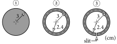{fig-align="center"}
:::

::: {.callout-tip .loesung collapse="true" icon=false}
## Solution

The couple of forces generates a torsional moment in the bar of

$$
M_t = 4\cdot 10 = 40\,\text{kNcm} \; .
$$

All other internal forces are zero.

To determine the vertical displacement at the points of application of the forces we first need the rotation of the bar.
To do so we integrate ([-@eq-verdrillung]) and obtain for the rotation at the end of the bar

$$
\theta = \int\limits_0^l\theta'\,dx = \int\limits_0^l\dfrac{M_t}{GI_t}\,dx = \dfrac{M_t}{GI_t}l = \dfrac{40\cdot 100}{8076}\dfrac{1}{I_t} = 0.4953\dfrac{1}{I_t} \; .
$$

Now the torsional moment of inertia of the individual cross-sections still has to be determined.

- Cross-section $\circled{1}$: Circular shaft according to ([-@eq-It-kreis])
  $$
  I_t = \dfrac{\pi\cdot 3^4}{2} = 127.2\,\text{cm}^4
  $$
- Cross-section $\circled{2}$: Thin-walled *closed* cross-section according to ([-@eq-It-geschlossen])
  $$
  I_t = \dfrac{4\cdot(2.7^2\cdot\pi)^2\cdot 0.6}{2\cdot2.7\cdot\pi} = 74.2\,\text{cm}^4
  $$
- Cross-section $\circled{3}$: Thin-walled *open* cross-section according to ([-@eq-It-offen])
  $$
  I_t = \dfrac{0.6^3}{3}\cdot 2\cdot 2.7\cdot\pi = 1.2\,\text{cm}^4
  $$

The bar-end rotation is thus

$$
\circled{1}\rightarrow\theta = 0.0039\,\text{rad} = 0.22^\circ \quad \circled{2}\rightarrow\theta = 0.0067\,\text{rad} = 0.38^\circ \quad \circled{3}\rightarrow\theta = 0.4128\,\text{rad} = 23.7^\circ \; .
$$

Under the assumption of small rotations ($\tan\theta\approx\theta$), the vertical displacement of the force-application points is $w=\theta\cdot 10/2$.
For the three cross-sections one thus obtains

$$
\circled{1}\rightarrow w = 0.02\,\text{cm} \quad \circled{2}\rightarrow w = 0.03\,\text{cm} \quad \circled{3}\rightarrow w = 2.06\,\text{cm} \; .
$$

The smallest displacement is, as expected, achieved with the circular shaft.
For the hollow shaft (cross-section $\circled{2}$) it increases by a factor of 1.5, and for cross-section $\circled{3}$ by a factor of 103!

The vertical displacement depends primarily on the torsional moment of inertia of the cross-section.
If we set this in relation to the volume $V$ (= material) of the bar, we obtain

$$
\circled{1}\rightarrow V/I_t = 22.2 \quad \circled{2}\rightarrow V/I_t = 13.7\rightarrow\text{min!} \quad \circled{3}\rightarrow V/I_t = 848.2 \; .
$$

From this we see that cross-section $\circled{2}$ is the most efficient, since for the same material usage the greatest torsional stiffness is achieved there.
At the same time it becomes apparent that thin-walled open cross-sections are suitable only for very small torsional loads!
:::

::: {#exm-biegung-torsion}
Compute the vertical displacement of the force-application point of the following system due to bending and torsion (steel: $E=21000\,\text{kN/cm}^2$ and $G=8076\,\text{kN/cm}^2$)!
Which contribution is larger and why?

{fig-align="center"}
:::

::: {.callout-tip .loesung collapse="true" icon=false}
## Solution

Bending: $w_B = 0.13\,\text{cm}$, torsion: $w_T = 0.96\,\text{cm}$, total: $w = 1.1\,\text{cm}$ $\;\rightarrow\; w_T>w_B$!
:::

::: {#exm-torsionsmoment-verlauf}
The following bar is loaded in torsion.
Sought is the distribution of the torsional moment along the bar for $F=10\,\text{kN}$ and $h=2\,\text{m}$.
Furthermore, the rotations about the bar axis at points $A$ and $B$ are to be determined for the given cross-section (steel: $G=8076\,\text{kN/cm}^2$).
The dimensioning refers to the skeleton line!

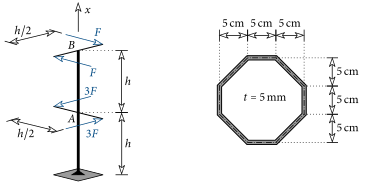{fig-align="center"}
:::

::: {.callout-tip .loesung collapse="true" icon=false}
## Solution

$\theta_A = 0.039\,\text{rad} = 2.2^\circ$ and $\theta_B = 0.019\,\text{rad} = 1.1^\circ$
:::
