

# Schubspannungen im Stabquerschnitt {#sec-schub}

## Querkraft {#sec-querkraft}

In den vorherigen Kapiteln wurde die Normalspannung zufolge einer Normalkraft und eines Biegemomentes im Stabquerschnitt diskutiert.
Der Verlauf der Normalspannung bei reiner Momentenbeanspruchung ist für einen T-Querschnitt in @fig-stab-schub(a) dargestellt.
Wirkt nun an dieser Stelle des Stabes auch eine Querkraft, werden dadurch auch *Schubspannungen* im Querschnitt hervorgerufen (vgl. @fig-stab-schub(b)).

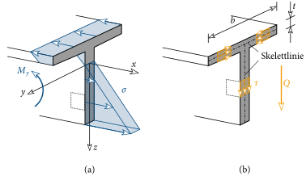{#fig-stab-schub}

Bei der Berechnung dieser Schubspannungen zufolge Querkraft beschränken wir uns hier auf *dünnwandige, offene* Querschnitte.
Dünnwandig bedeutet, dass die Dicke $t$ der Bleche, aus denen sich der Querschnitt zusammensetzt, *klein* gegenüber den äußeren Querschnittsabmessungen ist, d.h. $t\ll b$.
Die Mittellinie der Bleche, die in @fig-stab-schub(b) als strichpunktierte Linie eingetragen ist, wird als Skelettlinie bezeichnet.
Ist diese Skelettlinie *keine* geschlossene Kurve, dann handelt es sich um einen *offenen* Querschnitt.
Viele bekannte Querschnitte aus dem Stahlbau fallen in diese Kategorie, nicht jedoch quadratische oder kreisförmige Hohlprofile.

Für einen dünnwandigen, offenen Querschnitt können über den Verlauf und die Verteilung der Schubspannung folgende Annahmen getroffen werden:

- Aufgrund der kleinen Blechdicke $t$ kann sich die Schubspannung nur in Richtung der Skelettlinie ausbilden.
- Die Schubspannung ist *konstant* über die Blechdicke $t$.

Diese Eigenschaften von $\tau$ sind in @fig-stab-schub(b) dargestellt.

Doch in welchen Schnittflächen wirkt jetzt diese Schubspannung?
Dazu schneiden wir ein infinitesimales Element aus dem Stab heraus, welches in @fig-stab-schub(b) punktiert dargestellt ist.
Zunächst tragen wir die wirkende Normalspannung und die an der vorderen Schnittfläche wirkende Schubspannung ein (@fig-satz-schub(a)).
Da es sich bei dieser Fläche um das positive Schnittufer handelt, tragen wir $\tau$ in die positive $z$-Richtung ein.
Gleiches gilt für $\sigma$.
An diesem Element muss *Gleichgewicht* herrschen!
Unter diesem Spannungszustand ist aber weder das vertikale Kräftegleichgewicht noch das Momentengleichgewicht erfüllt.

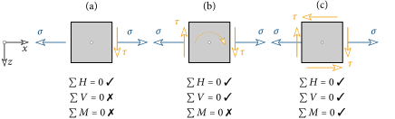{#fig-satz-schub}

Zur Erfüllung des vertikalen Kräftegleichgewichtes muss an der gegenüberliegenden Schnittfläche die gleich große Schubspannung nach oben wirken (@fig-satz-schub(b)).
Das Momentengleichgewicht ist aber nach wie vor nicht erfüllt.
Dafür muss in der oberen und unteren Schnittfläche eine Schubspannung wirken.
Wirkt diese in der in @fig-satz-schub(c) dargestellten Richtung, dann sind alle drei Gleichgewichtsbedingungen erfüllt.
Aus dieser Betrachtung erkennt man, dass in allen vier Schnittflächen die *gleich* große Schubspannung wirken muss, in den Richtungen nach @fig-satz-schub(c).
Diese wichtige Eigenschaft von $\tau$ wird als Satz der zugeordneten Schubspannungen bezeichnet.

Die Größe der Schubspannung unter Querkraftbeanspruchung an einer beliebigen Stelle $s$ an der Skelettlinie lässt sich mit folgender Beziehung berechnen:

$$
\myBox{\tau(s) = -\dfrac{Q}{I_y}\dfrac{S_y(s)}{t}} \; .
$$ {#eq-tau-Q}

Darin ist $Q$ die an der Stelle $x$ wirkende Querkraft und $I_y$ das Flächenträgheitsmoment des Querschnittes um die $y$-Achse.
Bei den hier betrachteten Beispielen gehen wir von einer gleichbleibenden Blechdicke $t$ aus.
Mit der Koordinate $s$ wird ein Punkt auf der Skelettlinie beschrieben.

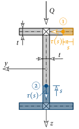{#fig-berechnung-schub}

$S_y$ ist das statische Moment der abgetrennten Teilfläche des Querschnitts.
Will man beispielsweise im Punkt 1 des I-Querschnittes in @fig-berechnung-schub die Schubspannung berechnen, dann ist in ([-@eq-tau-Q]) für $S_y$ das statische Moment der orangen Teilfläche um die $y$-Achse einzusetzen.
Für $\tau$ im Punkt 2 muss $S_y$ von der blauen Teilfläche in ([-@eq-tau-Q]) eingesetzt werden.
Daraus erkennt man deutlich, dass sich das statische Moment entlang der Skelettlinie ändert und dadurch auch die Schubspannung veränderlich ist, d.h. $\tau$ ist eine Funktion von $s$.
Mit der Beziehung ([-@eq-tau-Q]) kann die Schubspannung in den Kreuzungspunkten der Bleche nicht berechnet werden (ausgekreuzte Flächen in @fig-berechnung-schub).

::: {#exm-leimfuge-holz}
Ein Träger soll aus zwei Holzteilen verleimt werden. Welche Spannung muss die Leimfuge übertragen?
Wo ist die Beanspruchung am größten?

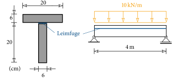{fig-align="center"}
:::

::: {.callout-tip .loesung collapse="true" icon=false}
## Lösung

Zur Berechnung der Schubspannungen müssen zuerst die Querschnittskennwerte ermittelt werden.
Die Querschnittsfläche ergibt sich zu

$$
A = 20\cdot 6\cdot 2 = 240\,\text{cm}^2 \; .
$$

Der Schwerpunkt liegt auf der Symmetrieachse des Querschnittes.
Zur Bestimmung seiner vertikalen Position wird das statische Moment um die $\overline{y}$-Achse am oberen Rand berechnet (siehe nachfolgende Skizze):

$$
S_{\overline{y}} = 20\cdot 6\cdot 3 + 20\cdot 6\cdot 16 = 2280\,\text{cm}^3\;.
$$

Der vertikale Abstand des Schwerpunktes vom oberen Rand ergibt sich damit zu

$$
\overline{z}_S = \dfrac{S_{\overline{y}}}{A}=\dfrac{2280}{240} = 9.5\,\text{cm}\;.
$$

{fig-align="center"}

Das Flächenträgheitsmoment um die $y$-Achse berechnet sich zu

$$
I_y = \dfrac{20\cdot 6^3}{12}+20\cdot 6 \cdot(9.5-3)^2 + \dfrac{6\cdot 20^3}{12}+20\cdot 6\cdot(6+10-9.5)^2=14500\,\text{cm}^4 \; .
$$

Zur Berechnung der Schubspannung an der Stelle der Leimfuge schneiden wir den Querschnitt genau dort auseinander und betrachten den oberen Teil.
Das statische Moment dieser Teilfläche um die $y$-Achse ist gleich

$$
S_y = 20\cdot 6\cdot (-6.5) = -780\,\text{cm}^3
$$

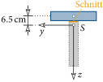{fig-align="center"}

Die größte Querkraft im Stab tritt an den Auflagern auf und ist gleich $Q=10\cdot 4/2 = 20\,\text{kN}$.
Damit ergibt sich die Schubspannung in der Leimfuge an den Auflagern mit ([-@eq-tau-Q]) zu

$$
\tau = -\dfrac{Q}{I_y}\dfrac{S_y}{t} = -\dfrac{20}{14500}\dfrac{-780}{6}= 0.18\,\text{kN/cm}^2\; .
$$

Aufgrund des Satzes der zugeordneten Schubspannungen wirkt die gleich große Schubspannung in der Leimfuge.

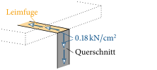{fig-align="center"}
:::

::: {#exm-offener-querschnitt}
Gegeben ist ein offener Querschnitt mit einer Blechstärke von $2\,\text{cm}$.
Berechne an den blauen Punkten im Querschnitt die Schubspannung zufolge Querkraft!
In welche Richtung wirkt die Schubspannung an diesen Punkten?

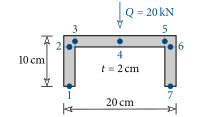{fig-align="center"}
:::

::: {.callout-tip .loesung collapse="true" icon=false}
## Lösung

- Flächenträgheitsmoment: $I_y = 628.4\,\text{cm}^4$
- Schubspannungen: $\tau_1 = \tau_4 = \tau_7 = 0\,,\; \tau_2 = \tau_6 = 0.71\,\text{kN/cm}^2\,,\; \tau_3=\tau_5=0.57\,\text{kN/cm}^2$
:::

## Torsion der runden Welle {#sec-torsion-welle}

Mit Torsion wird die Beanspruchung eines Stabes durch ein Moment um seine Stabachse bezeichnet.
Im Vergleich zu anderen Stabquerschnitten nimmt die runde Welle (kreisförmiger Querschnitt) eine besondere Stellung bei der Berechnung der auftretenden Spannungen und Verformungen ein.
Daher betrachten wir in diesem Abschnitt eine solche Welle, die durch ein konstantes Torsionsmoment $M_t$ entlang der Länge beansprucht wird.

Die in @fig-torsion-welle dargestellte runde Welle, mit Radius $R$ und Länge $l$, wird an einem Ende durch ein Torsionsmoment $M_t$ beansprucht und am anderen Ende ist die Verdrehung um die $x$-Achse blockiert.
Zu Beginn beobachten wir die auftretende Verformung der Welle.
Dazu wird die Verschiebung eines beliebigen Punktes $B$ am Rand der Welle betrachtet.

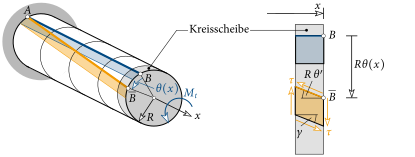{#fig-torsion-welle}

Durch das Torsionsmoment kommt es zu einer Verschiebung in Umfangsrichtung (Punkt $\ol{B}$ in @fig-torsion-welle), aber zu *keiner* Verschiebung in Richtung der Stabachse!
Für einen Kreisquerschnitt, und nur für diesen, trifft dies für alle Punkte des Kreisquerschnittes zu.
Der Querschnitt bleibt damit bei Torsionsbeanspruchung *eben*!
Die Drehung vom Punkt $B$ in $\ol{B}$ wird mit dem Winkel $\theta$ gemessen, der (bei einem konstanten Torsionsmoment) linear zwischen den Punkten $A$ und $B$ anwächst.

Zur Beschreibung der Verformung der Welle wird am Ende eine dünne Kreisscheibe heruntergeschnitten und die Verschiebung in Umfangsrichtung betrachtet.
Der Punkt $B$ erfährt eine Verschiebung von der Größe $R\theta$.
Ein quadratisches Element auf der Wellenoberfläche (blaue Fläche in @fig-torsion-welle) wird durch die Torsion zu einer Raute (orange Fläche) verformt.
Diese Verformung lässt sich mit der Änderung des rechten Winkels beschreiben.
Diese Winkeländerung wird als *Gleitung* $\gamma$ bezeichnet und nimmt an der Oberfläche der Welle eine Größe von $R\theta'$ an.
In @fig-torsion-verteilung(a) ist die Verschiebung in Umfangsrichtung im Kreisquerschnitt dargestellt.

{#fig-torsion-verteilung}

Diese ist Null im Schwerpunkt, wächst linear mit dem Abstand $r$ an und erreicht den Größtwert an der Oberfläche der Welle.
Damit wächst auch die Gleitung linear mit $r$:

$$
\gamma = r\theta' \; .
$$ {#eq-gleitung}

Das blaue Flächenelement in @fig-torsion-welle wird durch eine Schubspannung $\tau$ zu einer Raute verformt.
Wird davon ausgegangen, dass der Winkel $\theta$ klein ist, dann ist die Länge der beiden Kurven $A-B$ und $A-\ol{B}$ in @fig-torsion-welle gleich groß, wodurch keine Normalspannungen entstehen.
Die Verbindung zwischen der Schubspannung und der Gleitung wird durch den *Schubmodul* $G$ angegeben, der ein Materialparameter ist.
Für die Welle erhält man somit

$$
\tau(r) = G\gamma = Gr\theta' \; .
$$ {#eq-tau-welle}

Die Schubspannung nimmt somit auch linear mit dem Abstand zum Schwerpunkt zu und erreicht ihren Größtwert an der Oberfläche der Welle, siehe @fig-torsion-verteilung(b).

Als nächstes gilt es einen Zusammenhang zwischen dem Torsionsmoment und der Schubspannung herzustellen.
Die Schubspannung $\tau$, welche im Flächenelement $dA$ wirkt, erzeugt ein Moment um den Schwerpunkt von der Größe $r\,\tau dA$.
Aufsummieren (sprich Integrieren) über den Kreisquerschnitt ergibt zusammen mit ([-@eq-tau-welle]) das Torsionsmoment:

$$
M_t = \int\limits_A r\tau(r)\,dA = \int\limits_0^R\int\limits_0^{2\pi} r\,Gr\theta'\,r\,d\alpha\, dr = G\theta'\int\limits_0^R\int\limits_0^{2\pi} r^3\,d\alpha\, dr = G\theta'\dfrac{\pi R^4}{2} = GI_t \theta'\;.
$$ {#eq-Mt-welle}

Dabei ist $I_t$ das *polare Trägheitsmoment* (bzw. Torsionsträgheitsmoment) eines Kreisquerschnittes mit Radius $R$:

$$
I_t = \dfrac{\pi R^4}{2} \; .
$$ {#eq-It-kreis}

Durch Umformung ergibt sich schließlich zwischen der Verdrehung der Welle und dem Torsionsmoment folgender Zusammenhang:

$$
\myBox{\theta'=\dfrac{M_t}{GI_t}} \; .
$$ {#eq-verdrillung}

Setzt man diesen Ausdruck in ([-@eq-tau-welle]) ein, dann erhalten wir die Beziehung zur Berechnung der Schubspannung in jedem Punkt des Kreisquerschnittes, wie er in @fig-torsion-verteilung(b) dargestellt ist:

$$
\myBox{\tau(r) = \dfrac{M_t}{I_t}r} \; .
$$ {#eq-tau-Mt}

::: {#exm-getriebe}
Gegeben ist ein Getriebe aus zwei Vollwellen, die über Zahnräder ($D_1$, $D_2$) miteinander verbunden sind.
Die Welle $\circled{2}$ wird durch das Torsionsmoment $M_t^{(2)}$ belastet.
Gesucht ist das Torsionsmoment in der Welle $\circled{1}$, die maximalen Schubspannungen in der Welle $\circled{2}$ und die Verdrehung im Punkt $C$, wenn der Punkt $A$ gehalten wird!

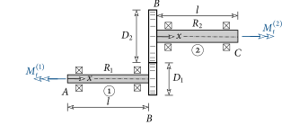{fig-align="center"}
:::

::: {.callout-tip .loesung collapse="true" icon=false}
## Lösung

Aus dem Momentengleichgewicht an den Teilsystemen folgt:

{fig-align="center"}

$$
M_t^{(2)}=F\dfrac{D_2}{2} \quad \text{und} \quad M_t^{(1)}=-F\dfrac{D_1}{2} \; .
$$

Daraus folgt schließlich

$$
M_t^{(1)} = -\dfrac{D_1}{D_2}M_t^{(2)} \; .
$$

Das polare Trägheitsmoment der Welle $\circled{2}$ ist zu

$$
I_t^{(2)} = \dfrac{\pi R_2^4}{2}
$$

gegeben und damit die maximalen Schubspannungen in der Welle nach ([-@eq-tau-Mt]) zu

$$
\tau = \dfrac{M_t^{(2)}}{I_t}R_2 = \dfrac{2M_t^{(2)}}{\pi R_2^3} \; .
$$

Wird der Punkt $A$ gehalten, dann ist die Verdrehung im Punkt $B$ der Welle $\circled{1}$ nach ([-@eq-verdrillung]) gleich

$$
\theta_B^{(1)} = \int\limits_0^l\theta'\,dx = \int\limits_0^l\dfrac{M_t^{(1)}}{GI_t^{(1)}}\,dx = \dfrac{M_t^{(1)}l}{GI_t^{(1)}}=-\dfrac{2M_t^{(2)}l}{G\pi R_1^4}\dfrac{D_1}{D_2} \; .
$$

Aus der Abrollbedingung ergibt sich die Verdrehung im Punkt $B$ der Welle $\circled{2}$:

{fig-align="center"}

$$
-\dfrac{D_1}{2}\theta_B^{(1)} = \dfrac{D_2}{2}\theta_B^{(2)} \; \rightarrow \; \theta_B^{(2)} = -\dfrac{D_1}{D_2}\theta_B^{(1)} \; .
$$

Die Verdrehung der Welle im Punkt $C$ ergibt sich damit zu

$$
\theta_C=\theta_B^{(2)} + \int\limits_0^l\dfrac{M_t^{(2)}}{GI_t^{(2)}}\,dx = \dfrac{2M_t^{(2)}l}{G\pi R_1^4}\left(\dfrac{D_1}{D_2}\right)^2 + \dfrac{2M_t^{(2)}l}{G\pi R_2^4} =
\dfrac{2M_tl}{G\pi}\left[\left(\dfrac{D_1}{D_2}\right)^2\dfrac{1}{R_1^4}+\dfrac{1}{R_2^4}\right] \; .
$$

Interpretiere das Ergebnis!
:::

## Torsion am dünnwandigen Querschnitt {#sec-torsion-duennwandig}

Die Berechnung von Schubspannungen zufolge Torsion in Stäben ist mit einem erhöhten mathematischen Aufwand verbunden.
Eine Ausnahme bilden dabei dünnwandige Querschnitte.
Bei diesen können für die resultierenden Schubspannungen die gleichen Annahmen getroffen werden wie bei der Beanspruchung zufolge Querkraft, d.h. es bilden sich Schubspannungen nur in Richtung der Skelettlinie aus.
Des Weiteren wird angenommen, dass sich der Stab *frei* in Längsrichtung ($x$-Richtung) verschieben kann und somit *keine* Normalspannungen $\sigma$ im Querschnitt entstehen.
Dieser Fall der sogenannten [Saint-Venant]{.smallcaps}'schen Torsion wird im Folgenden für dünnwandig geschlossene^[[Geschlossener Querschnitt](http://www.buschen-stahl.de/stahlrohre.htm) (Abruf: 20.4.2017)] und offene^[[Offene Querschnitte](http://www.buschen-stahl.de/stahlprofile.htm) (Abruf: 20.4.2017)] Querschnitte betrachtet.

### Der geschlossene Querschnitt {#sec-geschlossener-qs}

Ein allgemeiner geschlossener Querschnitt, der durch ein Torsionsmoment $M_t$ beansprucht wird, ist in @fig-geschlossener-qs dargestellt.
Die Skelettlinie $\mathcal{C}$ ist eine geschlossene Kurve!
Durch $M_t$ entstehen im Querschnitt die eingetragenen Schubspannungen, die über die Blechdicke $t$ konstant sind.
Aus Gleichgewichtsbetrachtungen erhält man, dass sich die Größe der Schubspannungen über die Bogenlänge $s$ der Skelettlinie nicht ändert.
Zur Vereinfachung betrachten wir hier nur Querschnitte mit einer konstanten Blechdicke.

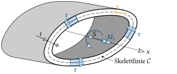{#fig-geschlossener-qs}

Nun gilt es einen Zusammenhang zwischen den Schubspannungen und dem Torsionsmoment herzustellen.
Dazu betrachtet man ein infinitesimales Stück des Querschnittes von der Länge $ds$, welches eine Fläche von $dA=t\,ds$ besitzt.
Multiplikation dieser Fläche mit der Schubspannung ergibt die darauf wirkende resultierende Kraft.
Und diese erzeugt ein Moment $dM_t$ um die Schwerachse von der Größe

$$
dM_t = r_n\,\tau dA = r_n\,\tau t\, ds \; .
$$ {#eq-dMt}

Dabei ist zu beachten, dass zur Bildung des Momentes der Normalabstand $r_n$ zu verwenden ist, wie er in @fig-geschlossener-qs2 eingetragen ist.

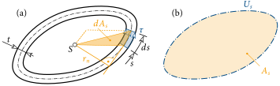{#fig-geschlossener-qs2}

Daraus erkennt man aber auch, dass der Ausdruck $r_n\,ds$ gleich der doppelten Fläche des in @fig-geschlossener-qs2(a) eingetragenen orangen Dreiecks $dA_s$ ist.
Summieren (sprich Integrieren) wir ([-@eq-dMt]) entlang der geschlossenen Skelettlinie ($\rightarrow\oint$) auf, erhalten wir das wirkende Torsionsmoment:

$$
M_t = \oint\limits_\mathcal{C} dM_t = \oint\limits_\mathcal{C} r_n\,\tau t\, ds = \tau t \oint\limits_\mathcal{C} r_n\,ds = \tau t \oint\limits_\mathcal{C}2\,dA_s = \tau t\, 2A_s \; .
$$ {#eq-Mt-geschlossen}

Mit Hilfe von @fig-geschlossener-qs2(a) wird ersichtlich, dass die Integration von $dA_s$ entlang der geschlossenen Skelettlinie $\mathcal{C}$ gleich der von ihr eingeschlossenen Fläche $A_s$ ist (siehe @fig-geschlossener-qs2(b)).
Umformen von ([-@eq-Mt-geschlossen]) ergibt schließlich den gesuchten Zusammenhang zwischen der Schubspannung und dem Torsionsmoment:

$$
\myBox{\tau = \dfrac{M_t}{2A_s\,t}} \; .
$$ {#eq-tau-geschlossen}

In @fig-verwoelbung ist die Verformung eines rechteckigen Hohlprofils bei einer Torsionsbeanspruchung mit blauer Farbe dargestellt.
Im Gegensatz zur runden Welle kommt es zu einer ungleichförmigen Verschiebung in Längsrichtung ($x$-Richtung)!
Folglich bleibt der Querschnitt nicht eben, sondern *verwölbt* sich.

{#fig-verwoelbung}

Des Weiteren kommt es durch $M_t$ wie bei der runden Welle zu einer über die Stablänge veränderlichen Verdrehung des Querschnittes um die $x$-Achse, die mit dem Winkel $\theta(x)$ gemessen wird.
In Analogie zur runden Welle wollen wir diese Verdrehung berechnen mit der Beziehung

$$
\theta' = \dfrac{M_t}{GI_t} \; .
$$ {#eq-verdrillung-allg}

Das Torsionsträgheitsmoment für einen geschlossenen Querschnitt berechnet sich nun allerdings zu

$$
\myBox{I_t = \dfrac{4A_s^2t}{U_s}} \; ,
$$ {#eq-It-geschlossen}

worin $U_s$ die Bogenlänge der Skelettlinie ist, siehe @fig-geschlossener-qs2(b).

### Der offene Querschnitt {#sec-offener-qs}

Zunächst betrachten wir ein einzelnes Blech, welches durch ein Torsionsmoment beansprucht wird (@fig-offener-qs).
Wiederum nehmen wir an, dass sich Schubspannungen nur in Richtung der Skelettlinie ausbilden können.
Damit aus den Schubspannungen das Torsionsmoment resultiert, wird eine lineare Verteilung von $\tau$ über die Blechdicke $t$ angenommen.
Für das gegebene Torsionsmoment wirken die Schubspannungen rechts von $z$ nach oben und links davon nach unten.
Die größten Schubspannungen $\tau_0$ treten an den beiden seitlichen Rändern des Querschnittes auf.
An einer beliebigen Stelle $y$ ist die Schubspannung damit gleich (vgl. @fig-offener-qs)

$$
\tau(y) = \tau_0\dfrac{y}{t/2} \; .
$$ {#eq-tau-blech}

Näherungsweise kann das Blech in dünnwandige, geschlossene Querschnitte aufgeteilt werden.
Einer dieser Querschnitte ist mit oranger Farbe in @fig-offener-qs dargestellt.

{#fig-offener-qs}

Wird der horizontale Übergangsbereich vernachlässigt, erhält man mit ([-@eq-tau-geschlossen]) die Größe des im orangen Querschnitt wirkenden Torsionsmoments, wobei $A_s$ zu $2yh$ angenommen wird:

$$
\tau(y) = \tau_0\dfrac{2y}{t} = \dfrac{dM_t}{2\,A_s\,dy} = \dfrac{dM_t}{2\,2yh\,dy} \;\rightarrow\;dM_t = \dfrac{8\tau_0h}{t}y^2dy \; .
$$ {#eq-dMt-blech}

Nun setzen wir den Rechteckquerschnitt aus den einzelnen geschlossenen Querschnitten zusammen und erhalten das Torsionsmoment, d.h. ([-@eq-dMt-blech]) muss über die halbe Blechdicke integriert werden:

$$
M_t = \int dM_t = \dfrac{8\tau_0h}{t}\int\limits_0^{t/2}y^2\,dy = \dfrac{8\tau_0h}{t}\dfrac{t^3}{24} = \dfrac{\tau_0ht^2}{3} \; .
$$ {#eq-Mt-blech}

Damit ist der Zusammenhang zwischen dem Torsionsmoment $M_t$ und der maximalen Schubspannung $\tau_0$ gefunden.

Das Torsionsträgheitsmoment des geschlossenen orangen Querschnittes in @fig-offener-qs lässt sich mit ([-@eq-It-geschlossen]) berechnen zu

$$
dI_t = \dfrac{4A_s^2dy}{U_s} = \dfrac{4(2yh)^2dy}{2h}=8h\,y^2dy \; .
$$ {#eq-dIt-blech}

Wiederum erhält man daraus durch Integration das Torsionsträgheitsmoment eines rechteckigen Bleches:

$$
I_t = \int dI_t = 8h\int\limits_0^{t/2}y^2\,dy = 8h\dfrac{t^3}{24} = \dfrac{ht^3}{3} \; .
$$ {#eq-It-blech}

Damit lässt sich der Zusammenhang zwischen $M_t$ und $\tau_0$ nach ([-@eq-Mt-blech]) angeben zu:

$$
\myBox{\tau_0 = \dfrac{M_t}{I_t}t} \; .
$$ {#eq-tau0}

Meist setzt sich ein offener Querschnitt aus $n$ rechteckigen Blechen zusammen.
Wird vorausgesetzt, dass die Blechdicke $t$ für alle $n$ Bleche gleich ist, dann ist in diesem Fall das Torsionsträgheitsmoment gleich der Summe der einzelnen Bleche:

$$
\myBox{I_t = \dfrac{t^3}{3}\sum\limits_{i=1}^n h_i} \; .
$$ {#eq-It-offen}

Beispielsweise setzt sich der in @fig-offener-qs-zusammen dargestellte I-Querschnitt aus drei Blechen zusammen ($n=3$).
Für diesen Querschnitt ist $I_t$ nach ([-@eq-It-offen]) dann gleich

$$
I_t = \dfrac{t^3}{3}\sum\limits_{i=1}^3 h_i=\dfrac{t^3}{3}(h_1+h_2+h_3) \; .
$$ {#eq-It-I}

Der Maximalwert der Schubspannung ist dann in allen Blechen gleich groß und kann mit ([-@eq-tau0]) ermittelt werden.

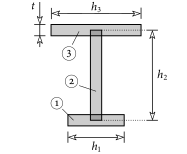{#fig-offener-qs-zusammen}

::: {#exm-torsion-querschnitte}
Eine starre Platte wird an einen kreisrunden Stab aus Stahl ($G=8076\,\text{kN/cm}^2$) angeschweißt.
An dieser Platte greift ein Kräftepaar an und beansprucht den Stab auf Torsion.
Am anderen Ende wird der Stab festgehalten.
Zu bestimmen ist die Vertikalverschiebung an den Angriffspunkten der Kräfte für die nachfolgenden drei kreisrunden Querschnitte!
Alle Querschnitte haben den gleichen Außenradius.
Welcher der drei Querschnitte ist der effizienteste, d.h. bei welchem ist das Verhältnis von Materialeinsatz zu Verschiebung am günstigsten?

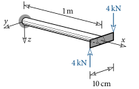{fig-align="center"}

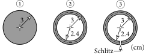{fig-align="center"}
:::

::: {.callout-tip .loesung collapse="true" icon=false}
## Lösung

Das Kräftepaar erzeugt ein Torsionsmoment im Stab von

$$
M_t = 4\cdot 10 = 40\,\text{kNcm} \; .
$$

Alle anderen Schnittgrößen sind Null.

Zur Bestimmung der Vertikalverschiebung an den Angriffspunkten der Kräfte benötigen wir zuerst die Verdrehung des Stabes.
Dazu integrieren wir ([-@eq-verdrillung]) und erhalten für die Verdrehung am Ende des Stabes

$$
\theta = \int\limits_0^l\theta'\,dx = \int\limits_0^l\dfrac{M_t}{GI_t}\,dx = \dfrac{M_t}{GI_t}l = \dfrac{40\cdot 100}{8076}\dfrac{1}{I_t} = 0.4953\dfrac{1}{I_t} \; .
$$

Nun gilt es noch das Torsionsträgheitsmoment der einzelnen Querschnitte zu bestimmen.

- Querschnitt $\circled{1}$: Runde Welle nach ([-@eq-It-kreis])
  $$
  I_t = \dfrac{\pi\cdot 3^4}{2} = 127.2\,\text{cm}^4
  $$
- Querschnitt $\circled{2}$: Dünnwandiger *geschlossener* Querschnitt nach ([-@eq-It-geschlossen])
  $$
  I_t = \dfrac{4\cdot(2.7^2\cdot\pi)^2\cdot 0.6}{2\cdot2.7\cdot\pi} = 74.2\,\text{cm}^4
  $$
- Querschnitt $\circled{3}$: Dünnwandiger *offener* Querschnitt nach ([-@eq-It-offen])
  $$
  I_t = \dfrac{0.6^3}{3}\cdot 2\cdot 2.7\cdot\pi = 1.2\,\text{cm}^4
  $$

Die Stabendverdrehung ergibt sich somit zu

$$
\circled{1}\rightarrow\theta = 0.0039\,\text{rad} = 0.22^\circ \quad \circled{2}\rightarrow\theta = 0.0067\,\text{rad} = 0.38^\circ \quad \circled{3}\rightarrow\theta = 0.4128\,\text{rad} = 23.7^\circ \; .
$$

Unter der Annahme von kleinen Verdrehungen ($\tan\theta\approx\theta$) ergibt sich die Vertikalverschiebung der Kraftangriffspunkte zu $w=\theta\cdot 10/2$.
Für die drei Querschnitte erhält man somit

$$
\circled{1}\rightarrow w = 0.02\,\text{cm} \quad \circled{2}\rightarrow w = 0.03\,\text{cm} \quad \circled{3}\rightarrow w = 2.06\,\text{cm} \; .
$$

Die kleinste Verschiebung wird erwartungsgemäß mit der runden Welle erreicht.
Bei der Hohlwelle (Querschnitt $\circled{2}$) vergrößert sie sich um das 1.5-fache und beim Querschnitt $\circled{3}$ um das 103-fache!

Die Vertikalverschiebung hängt primär vom Torsionsträgheitsmoment des Querschnittes ab.
Setzen wir dieses ins Verhältnis zum Volumen $V$ (= Material) des Stabes, erhalten wir

$$
\circled{1}\rightarrow V/I_t = 22.2 \quad \circled{2}\rightarrow V/I_t = 13.7\rightarrow\text{min!} \quad \circled{3}\rightarrow V/I_t = 848.2 \; .
$$

Daraus sehen wir, dass Querschnitt $\circled{2}$ der effizienteste ist, da bei gleichem Materialeinsatz dort die größte Torsionssteifigkeit erzielt wird.
Gleichzeitig wird ersichtlich, dass dünnwandige offene Querschnitte nur für sehr kleine Torsionsbeanspruchungen geeignet sind!
:::

::: {#exm-biegung-torsion}
Berechne vom nachfolgenden System die Vertikalverschiebung des Kraftangriffspunktes zufolge Biegung und Torsion (Stahl: $E=21000\,\text{kN/cm}^2$ und $G=8076\,\text{kN/cm}^2$)!
Welcher Anteil ist größer und warum?

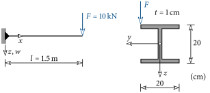{fig-align="center"}
:::

::: {.callout-tip .loesung collapse="true" icon=false}
## Lösung

Biegung: $w_B = 0.13\,\text{cm}$, Torsion: $w_T = 0.96\,\text{cm}$, Gesamt: $w = 1.1\,\text{cm}$ $\;\rightarrow\; w_T>w_B$!
:::

::: {#exm-torsionsmoment-verlauf}
Der nachfolgende Stab wird auf Torsion beansprucht.
Gesucht ist der Verlauf des Torsionsmoments entlang des Stabes für $F=10\,\text{kN}$ und $h=2\,\text{m}$.
Des Weiteren sind die Verdrehungen um die Stabachse im Punkt $A$ und $B$ für den angegebenen Querschnitt zu bestimmen (Stahl: $G=8076\,\text{kN/cm}^2$).
Die Bemaßung bezieht sich auf die Skelettlinie!

{fig-align="center"}
:::

::: {.callout-tip .loesung collapse="true" icon=false}
## Lösung

$\theta_A = 0.039\,\text{rad} = 2.2^\circ$ und $\theta_B = 0.019\,\text{rad} = 1.1^\circ$
:::
