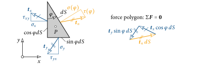
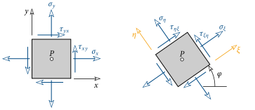
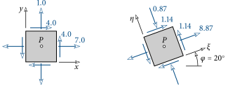
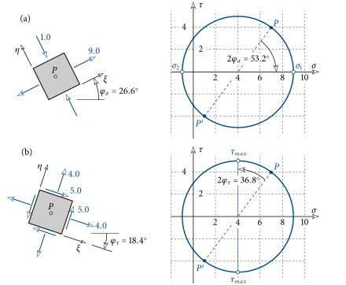
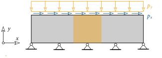
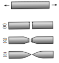
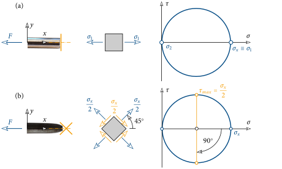
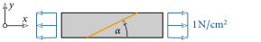
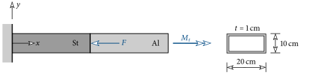
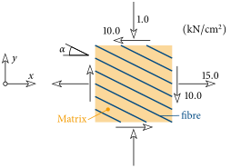



# The State of Stress in a Plane Element {#sec-scheibe}

## The Stress Tensor {#sec-spannungstensor}

First it must be defined what in mechanics is understood by a plane element (disc).
As an example of this we consider the gusset plate of a high-voltage tower, see @fig-knotenblech.

{#fig-knotenblech}

A plane element is a *planar* body whose thickness $t$ is substantially smaller than the two other dimensions of the body.
Furthermore, the external forces all act *in* the plane of the element.
For the gusset plate these are the forces in the struts (single forces in @fig-knotenblech(b)).
Through this type of loading, *no* displacement normal to the element occurs, i.e. it remains plane.

Now the internal forces acting at an arbitrary point $P$ of the element must be determined.
To make these visible, one cuts an infinitesimal element out around the considered point (@fig-esz(a)).
This element is now viewed with a viewing direction normal to the plane of the element.
Furthermore, a Cartesian $x$-$y$ coordinate system is defined.
In analogy to the bar, the positive and negative cut faces can thus be determined.
If the normal vector points in the positive coordinate direction, it is the positive cut face (blue areas in @fig-esz(a)).
For the opposite direction it is the negative cut face (orange areas).

{#fig-esz}

Thus the acting normal stresses (blue) and shear stresses (orange) can now be entered in each of the four surfaces (@fig-esz(b)).
As a reminder: on the positive cut face the stresses act in the positive coordinate directions!
So that we can distinguish these stresses, *two* indices are appended to both the normal stress $\sigma$ and the shear stress $\tau$.
The first gives the direction of the normal vector of the surface in which the stress acts, and the second the direction of the stress itself.
Thus the naming of the stresses results, as given in @fig-esz(c).

So that *equilibrium* is satisfied, the two horizontal normal stresses $\sigma_{xx}$ are of equal magnitude.
The same applies to the two vertical normal stresses $\sigma_{yy}$.
From the moment equilibrium it follows that all four acting shear stresses are of equal magnitude (theorem of associated shear stresses).
Thus at a point $P$ of the element the three stresses act:

$$
\sigma_x\;,\quad \sigma_y\;, \quad \text{and} \quad \tau_{xy}=\tau_{yx} \;.
$$ {#eq-spannungen-punkt}

For simpler notation, in the following only one index is written for the normal stress ($\sigma_{xx}\equiv\sigma_x$ and $\sigma_{yy}\equiv\sigma_y$).
These stresses are now written into a tensor (matrix), where the normal stresses are on the diagonal:

$$
\bs{\sigma} =
\begin{bmatrix}
\sigma_x & \tau_{xy} \\ \tau_{yx} & \sigma_y
\end{bmatrix}
$$ {#eq-spannungstensor}

The *stress tensor* $\bs{\sigma}$ is *symmetric* due to the theorem of associated shear stresses ($\tau_{xy}=\tau_{yx}$).
Like the internal forces ($N$, $Q$ and $M_y$) in a bar, it describes the loading at a point due to the external load.
If the stress tensor is known, a strength verification can be carried out.

## Coordinate Transformation and Principal Stresses {#sec-hauptspannungen}

Already for the tension bar it was recognised that the magnitude of the normal and shear stresses depends on the orientation of the cut surface (see @fig-normalspannungen to @fig-schubspannungen).
The same naturally also applies in a plane element!
To derive the relations for determining the stresses in arbitrarily oriented surfaces, one now cuts an infinitesimal triangle out around the point $P$ from the element (@fig-koordinatentransformation).

{#fig-koordinatentransformation}

It is assumed that the stress tensor ([-@eq-spannungstensor]) with respect to the $x$-$y$ coordinate system at point $P$ is known.
The stresses acting in the vertical and horizontal surface are now written into vectors:

$$
\bs{t}_x = \begin{Bmatrix}
\sigma_x \\ \tau_{xy}
\end{Bmatrix} \quad \text{and} \quad
\bs{t}_y = \begin{Bmatrix}
\sigma_y \\ \tau_{yx}
\end{Bmatrix} \; .
$$ {#eq-t-xy}

Likewise, the *unknown* normal and shear stress in the inclined surface $dS$ are entered into a vector:

$$
\bs{t}_n = \begin{Bmatrix}
\sigma(\vp) \\ \tau(\vp)
\end{Bmatrix} \; .
$$ {#eq-tn}

In the infinitesimal triangular element in @fig-koordinatentransformation all these (stress) vectors are entered.

How can $\bs{t}_n$ now be computed?
The *forces* must be in *equilibrium*!
To get from the stresses to the resultant forces, these must be multiplied by the respective area ($\cos\vp\, dS$, $\sin\vp\, dS$, $dS$).
The equilibrium condition reads (closed force polygon in @fig-koordinatentransformation):

$$
\sum\bs{F}=\bs{0}: \bs{t}_x\cos\vp\,\cancel{dS} + \bs{t}_y\sin\vp\,\cancel{dS} +\bs{t}_n\,\cancel{dS} = \bs{0} \quad \rightarrow \quad \bs{t}_n(\vp) = -\bs{t}_x\cos\vp - \bs{t}_y\sin\vp \; .
$$ {#eq-gg-dreieck}

From this it emerges clearly that $\bs{t}_n$, and hence the normal and shear stress in the inclined surface $dS$, *depend* on the angle $\vp$, i.e. on the orientation of the surface!
As a reminder: $\bs{t}_x$ and $\bs{t}_y$ are indeed known.

On the basis of this equilibrium consideration, the so-called coordinate transformations for the stresses can be derived.
To be able to describe the orientation of an arbitrary surface, a $\xi$-$\eta$ coordinate system is introduced.
This is obtained by a rotation through the angle $\vp$, see @fig-esz-transf.

{#fig-esz-transf}

Note that $\vp$ is counted positive in the counter-clockwise direction.
In @fig-esz-transf the indices of the stresses in the $\xi$-$\eta$ coordinate system are also entered according to the convention explained at the outset.
Their magnitudes are computed as:

$$
\begin{aligned}
\sigma_\xi &= \dfrac{\sigma_x+\sigma_y}{2}+\dfrac{\sigma_x-\sigma_y}{2}\cos 2\vp + \tau_{xy}\sin 2\vp \\
\sigma_\eta &= \dfrac{\sigma_x+\sigma_y}{2}-\dfrac{\sigma_x-\sigma_y}{2}\cos 2\vp - \tau_{xy}\sin 2\vp \\
\tau_{\xi\eta} &= -\dfrac{\sigma_x-\sigma_y}{2}\sin 2\vp + \tau_{xy}\cos 2\vp \; .
\end{aligned}
$$ {#eq-transformation}

([-@eq-transformation]) are the so-called transformation relations of the stress tensor of a plane element.

As an example, in @fig-transformation the state of stress (stress tensor) at point $P$ of a plane element is given.
These stresses refer initially to an $x$-$y$ coordinate system.
Subsequently the system is rotated by $20^\circ$ in the counter-clockwise direction.
With the help of ([-@eq-transformation]) the stresses in the $\xi$-$\eta$ coordinate system are computed.

::: {#fig-transformation}


$$
\bs{\sigma} =
\begin{bmatrix}
\sigma_x & \tau_{xy} \\ \tau_{yx} & \sigma_y
\end{bmatrix} =
\begin{bmatrix}
7.0 & 4.0 \\ 4.0 & 1.0
\end{bmatrix}
\qquad\qquad
\bs{\sigma} =
\begin{bmatrix}
\sigma_\xi & \tau_{\xi\eta} \\ \tau_{\eta\xi} & \sigma_\eta
\end{bmatrix} =
\begin{bmatrix}
8.87 & 1.14 \\ 1.14 & -0.87
\end{bmatrix}
$$

Example of the transformation of the stress tensor (N/mm²)
:::

The normal stress in a horizontal fibre ($x$-direction) is initially $7.0\,\text{N/mm}^2$.
A fibre inclined by $20^\circ$ relative to the horizontal experiences in this case a higher normal stress (tension) of magnitude $8.87\,\text{N/mm}^2$.

Furthermore, one recognises that in the $x$-$y$ coordinate system both normal stresses are tensile stresses.
If, on the other hand, one considers a fibre in the $\eta$-direction, it experiences a compressive stress ($\sigma_\eta=-0.87\,\text{N/mm}^2$)!
With this example the change of the magnitude of the stresses in differently oriented surfaces is to be underlined.
Note that the element itself is *not* rotated, only the cut surfaces!
Interestingly, however, the trace and determinant of $\bs{\sigma}$ do not change under a coordinate transformation.

The transformation relations ([-@eq-transformation]) can also be represented graphically in the so-called [Mohr]{.smallcaps}'s stress circle.
From this the changes of the stresses can be estimated in a very simple way.
[Mohr]{.smallcaps}'s stress circle is constructed in the following way (see @fig-mohr-kreis):

- An axis system is chosen in which the normal stress $\sigma$ is plotted on the horizontal axis and the shear stress $\tau$ on the vertical axis.
- Over the value of the normal stress $\sigma_x$ the shear stress $\tau_{xy}$ is plotted, and over $\sigma_y$ the *negative* value of $\tau_{xy}$.
- The points $P$ and $P'$ thus obtained are connected to each other. The intersection of this line with the $\sigma$-axis is the centre of the stress circle.

![Construction of [Mohr]{.smallcaps}'s stress circle](images-en/MohrCircle.svg){#fig-mohr-kreis}

The blue circle in @fig-mohr-kreis is [Mohr]{.smallcaps}'s stress circle.

According to these construction rules, for the numerical example in @fig-transformation [Mohr]{.smallcaps}'s stress circle is shown in @fig-bsp-mohr.
From the circle the values for the stresses $\sigma_\xi$, $\sigma_\eta$ and $\tau_{\eta\xi}$ can be read off.
To accomplish this, the line $P-P'$ must first be rotated about the centre of the circle through *twice* the angle $2\vp$ and in the *opposite* sense of rotation (to $\vp$).
For the present case, the dashed blue line must therefore be rotated by $40^\circ$ clockwise.
This gives the points $Q$ and $Q'$ in @fig-bsp-mohr.
The coordinates of these two points then correspond to the stresses in the $\xi$-$\eta$ coordinate system, for point $Q$ lies at ($\sigma_\xi=8.87\,\text{N/mm}^2$, $\tau_{\xi\eta}=1.14\,\text{N/mm}^2$) and $Q'$ at ($\sigma_\xi=-0.87\,\text{N/mm}^2$, $\tau_{\xi\eta}=-1.14\,\text{N/mm}^2$).

![Example of [Mohr]{.smallcaps}'s stress circle (N/mm²)](images-en/BspMohrscheKreis.svg){#fig-bsp-mohr}

For the dimensioning of a plane element, the maximum values of the stresses are naturally of interest.
As one recognises in the example in @fig-transformation, the normal stresses change as a function of the angle $\vp$.
Via an extremum problem the maximum values of the normal stresses can be determined.
More easily, however, these can be determined from [Mohr]{.smallcaps}'s stress circle.
As emerges from @fig-mohr-kreis, the largest occurring normal stresses are reached at the left and right vertices of the circle.
These maximum values are called *principal normal stresses* $\sigma_1$ and $\sigma_2$.
One further recognises from [Mohr]{.smallcaps}'s stress circle that the shear stresses occurring there are equal to zero!
The magnitude of the principal normal stresses is computed as

$$
\sigma_{1,2}=\dfrac{\sigma_x+\sigma_y}{2}\pm\sqrt{\left(\dfrac{\sigma_x-\sigma_y}{2}\right)^2+\tau_{xy}^2} \; .
$$ {#eq-hauptspannungen}

These are ordered by magnitude, i.e. $\sigma_1>\sigma_2$.
A comparison with @fig-mohr-kreis shows that the first term on the right-hand side of ([-@eq-hauptspannungen]) is the centre and the root expression equals the radius of [Mohr]{.smallcaps}'s stress circle.
Likewise, the direction of the principal normal stresses $\vp_\sigma$ results from this as

$$
\tan 2\vp_\sigma=\dfrac{2\tau_{xy}}{\sigma_x-\sigma_y} \; .
$$ {#eq-hauptrichtung}

For the example in @fig-transformation the principal normal stresses are shown in @fig-hauptspannungen(a).
In the stress circle the line $P-P'$ must be rotated by $53.2^\circ$ clockwise to arrive at the line of the principal normal stresses $\sigma_1-\sigma_2$.
The largest tensile stress of $\sigma_1=9.0\,\text{N/mm}^2$ occurs at an angle of $26.6^\circ$, and the largest compressive stress $\sigma_2=-1.0\,\text{N/mm}^2$ occurs at an angle of $116.6^\circ$.
It is emphasised once again that in these directions *no* shear stresses act!

{#fig-hauptspannungen}

From analogous considerations on [Mohr]{.smallcaps}'s stress circle, the largest shear stresses (principal shear stresses), which occur at the upper and lower vertices, can also be determined.
Their magnitude corresponds exactly to the radius of the stress circle:

$$
\tau_{max}=\pm\sqrt{\left(\dfrac{\sigma_x-\sigma_y}{2}\right)^2+\tau_{xy}^2} \; ,
$$ {#eq-tau-max}

and they occur in a direction of

$$
\tan 2\vp_\tau=-\dfrac{\sigma_x-\sigma_y}{2\tau_{xy}}
$$ {#eq-schubrichtung}

The normal stresses are not zero in these directions, but are of equal magnitude and correspond to the centre of the stress circle.
In @fig-hauptspannungen(b) the direction and the magnitude of the principal shear stresses for the numerical example are shown.

Principal normal stresses are, however, today – especially in finite-element programs – predominantly determined by solving an eigenvalue problem.
The eigenvalues of the stress tensor correspond in this to the principal normal stresses.
To show this, we first formulate the eigenvalue problem^[From mathematics: $\bs{Ax}=\lambda\bs{x}\;\rightarrow\;(\bs{A}-\lambda\bs{I})\bs{x}=\bs{0}$]

$$
(\bs{\sigma}-\lambda\bs{I})\bs{n}=\bs{0} \;\rightarrow\;
\begin{bmatrix}
\sigma_x-\lambda & \tau_{xy} \\ \tau_{xy} & \sigma_y-\lambda
\end{bmatrix}
\begin{Bmatrix}n_x \\ n_y\end{Bmatrix} =
\begin{Bmatrix}0 \\ 0\end{Bmatrix} \; ,
$$ {#eq-eigenwertproblem}

with the eigenvalues $\lambda$ and the associated eigenvectors $\bs{n}$.
By setting the determinant of the coefficient matrix to zero

$$
\det\left[\bs{\sigma}-\lambda\bs{I}\right] = (\sigma_x-\lambda)(\sigma_y-\lambda)-\tau_{xy}^2 =\lambda^2-\lambda(\sigma_x+\sigma_y) + \sigma_x\sigma_y - \tau_{xy}^2= 0 \; ,
$$ {#eq-charakteristisch}

the eigenvalues can be computed from this quadratic equation^[$x^2+px+q=0\;\rightarrow\;x_{1,2}=-\dfrac{p}{2}\pm\sqrt{\left(\dfrac{p}{2}\right)^2-q}$]:

$$
\lambda_{1,2} = \dfrac{\sigma_y+\sigma_x}{2}\pm\sqrt{\left(\dfrac{\sigma_x+\sigma_y}{2}\right)^2-\sigma_x\sigma_y+\tau_{xy}^2} \; .
$$ {#eq-eigenwerte}

A comparison of the eigenvalues $\lambda_{1,2}$ with ([-@eq-hauptspannungen]) shows that these two expressions are identical, i.e. $\lambda_1\equiv\sigma_1$ and $\lambda_2\equiv\sigma_2$ holds.
Since the stress tensor ([-@eq-spannungstensor]) is a *symmetric* matrix, the eigenvalues (principal stresses) are always real.
The eigenvectors $\bs{n}_1$ and $\bs{n}_2$ give the direction of action of the principal normal stresses.
Likewise, due to the symmetry, these are orthogonal to each other, cf. @fig-hauptspannungen(a).

::: {#exm-glasscheibe}
A glass pane of thickness $t=5\,\text{mm}$ is held at its lower edge and loaded uniformly at the upper edge.
The magnitude of the load in the vertical direction is $p_y=3.5\,\text{kN/cm}$ and in the horizontal direction $p_x=2.0\,\text{kN/cm}$.
The tensile strength (max. admissible tensile stress) for glass is given as $f_t=3.0\,\text{kN/cm}^2$ and the compressive strength (max. admissible compressive stress) as $f_c=90\,\text{kN/cm}^2$.

{fig-align="center"}

In the central region of the glass pane (orange region) the state of stress can be approximated as

$$
\bs{\sigma} = \begin{bmatrix}\sigma_x & \tau_{xy} \\ \tau_{yx} & \sigma_y\end{bmatrix} = \begin{bmatrix}0 & \dfrac{p_x}{t} \\ \dfrac{p_x}{t} & -\dfrac{p_y}{t}\end{bmatrix} = \begin{bmatrix}0 & 4.0 \\ 4.0 & -7.0\end{bmatrix} \quad (\text{kN/cm}^2)
$$

Does material failure (fracture) occur in this region, i.e. are stresses larger than the given strengths reached?
If not, by how much can $p_x$ (with $p_y$ remaining constant) be increased at most?
:::

::: {.callout-tip .loesung collapse="true" icon=false}
## Solution

First the largest normal stresses, i.e. the principal normal stresses, must be determined for this.
The associated [Mohr]{.smallcaps}'s stress circle is shown in blue in the figure below.
For the given stress tensor the principal normal stresses are computed according to ([-@eq-hauptspannungen]) as

$$
\sigma_{1,2} = -\dfrac{7}{2}\pm\sqrt{\left(\dfrac{7}{2}\right)^2+4^2} = -3.5\pm 5.3 \; .
$$

From the numerical values one recognises that $\sigma_1$ is a tensile and $\sigma_2$ a compressive stress.
A comparison with the associated strengths gives:

$$
\sigma_1 = 1.8\,\text{kN/cm}^2 < f_t=3.0\,\text{kN/cm}^2 \quad \text{and} \quad |\sigma_2| = 8.8\,\text{kN/cm}^2 < f_c=90\,\text{kN/cm}^2 \; .
$$

Neither $\sigma_1$ nor $\sigma_2$ takes values larger than the given strengths.
Therefore no failure of the glass occurs in this region.

Consequently, $p_x$ can still be increased.
From the above result one sees that on a further increase of $p_y$ the tensile strength $f_t$ is reached *first*.
For brittle materials, tensile failure usually occurs.
If $p_x$ is now increased by the factor $\lambda$, the shear stress also changes by this value.
Fracture then occurs when $\sigma_1$ reaches the value of the tensile strength.
From this we can determine $\lambda$:

$$
\sigma_1 = f_t \;\rightarrow\; \sigma_1 = -\dfrac{7}{2}\pm\sqrt{\left(\dfrac{7}{2}\right)^2+(\lambda 4)^2} = 3.0 \;\rightarrow\; \lambda = 1.3693
$$

The horizontal load, with the vertical load remaining constant, of magnitude

$$
p_{x,c} = \lambda p_x= 2.7\,\text{kN/cm}^2
$$

leads to tensile failure of the glass!

An increase of the shear stress simultaneously increases the radius of [Mohr]{.smallcaps}'s stress circle (orange circle).
The centre remains at the same location.
If the circle touches the failure limit ($\sigma_1=f_t$), fracture occurs!

{fig-align="center"}

How large would the load increase be if $p_x$ and $p_y$ are increased simultaneously?
(Solution: $\lambda=1.667$).
Why can the load take larger values in this case?
:::

## Failure of Brittle and Ductile Materials {#sec-versagen}

In this section it is briefly described which stresses lead to the failure of brittle (glass, cast iron, ceramics, …) and ductile (steel, aluminium, …) materials.
Instructive in this is to consider the deformation and failure surface of the specimen of a tensile test.

{#fig-brueche-zugversuch}

In @fig-brueche-zugversuch the fracture pattern of the tensile specimen for brittle and ductile materials is shown schematically.
For the brittle material the fracture surface is exactly perpendicular to the bar axis (direction of force).
With increasing ductility the deformation at the fracture location becomes ever more pointed.
The largest plastic deformations occur in planes inclined to the bar axis.

{#fig-duktiler-bruch}

In @fig-duktiler-bruch real fracture and failure surfaces of a brittle and ductile material are shown.
The change in length $\Delta l$ of the tensile specimen at failure increases with growing ductility.
At the same time the deformation at the fracture location becomes ever flatter.

With the help of [Mohr]{.smallcaps}'s stress circle the stresses in these fracture and failure surfaces are now to be determined.
In the tensile test, in a surface normal to the bar axis only a normal stress $\sigma_x$ of magnitude $F/A$ prevails, if a coordinate system is chosen as in @fig-mohr-zugversuch.
Since the shear stresses are zero, $\sigma_x$ is a principal normal stress.
The normal stress in the $y$-direction is zero.
Therefore the [Mohr]{.smallcaps}'s stress circle shown in @fig-mohr-zugversuch results.
From @fig-mohr-zugversuch(a) one recognises that for the brittle material the fracture surface stands exactly orthogonal to the largest normal stress in tension $\sigma_1$.
From this it can be deduced that failure occurs at a point of a *brittle* material when the largest normal stress in *tension* (that is $\sigma_1$) reaches the tensile strength of the material.
According to this criterion the glass pane in the previous example was also dimensioned.

{#fig-mohr-zugversuch}

From materials technology it is known that plastic deformations (as they occur in a ductile material) arise from the sliding of atomic layers along slip planes.
This phenomenon, however, occurs only when shear stresses act in the slip planes.
From [Mohr]{.smallcaps}'s stress circle one recognises that the largest shear stresses in the tensile test occur in a plane at $45^\circ$ to the bar axis, see @fig-mohr-zugversuch(b).
Sliding therefore often sets in in these planes.
If, for a brittle material, the largest tensile stress leads to failure, it is the large shear stresses that bring a ductile material to yield.

Finally, let another example of the failure of a brittle material be mentioned, namely a torsion fracture (@fig-torsionsfraktur).
For simplicity, the bones are considered as a bar with a circular cross-section, loaded by a torsional moment.

{#fig-torsionsfraktur}

As discussed in the section on torsion of the circular shaft (cf. @fig-torsion-welle), only shear stresses appear in the bar cross-section.
The maximum values are reached at the surface.
Since in an element at the surface only shear stresses act (@fig-torsionsfraktur(b)), this state is called pure shear.
The centre of the stress circle is in this case exactly the origin of the $\sigma$-$\tau$ coordinate system.
Due to the brittle behaviour of the bones, the largest tensile stress is again decisive for the failure.
From the stress circle it follows that this occurs in a plane at $45^\circ$ to the bar axis.
This plane is at the same time the fracture surface, which one clearly also recognises in the X-ray image in @fig-torsionsfraktur(a).

::: {#exm-leimfuge-schraeg}
A wooden bar is loaded axially with a tensile stress of $1\,\text{N/cm}^2$ and is connected by an inclined glue joint.
The glue joint can transmit a maximum shear stress of $0.4\,\text{N/cm}^2$ and a maximum tensile stress of $0.3\,\text{N/cm}^2$.
How large may the angle $\alpha$ be chosen at most?

{fig-align="center"}
:::

::: {.callout-tip .loesung collapse="true" icon=false}
## Solution

:::

::: {#exm-hohlprofil}
A bar in the form of a rectangular hollow section consists of steel in the lower region and aluminium in the upper region.
The bar is loaded by a torsional moment of $M_t = 17\,\text{kNm}$.
In addition, the steel region is also loaded axially by a force $F=620\,\text{kN}$.
It is assumed that a maximum shear stress of $5\,\text{kN/cm}^2$ in aluminium and $7\,\text{kN/cm}^2$ in steel leads to yielding.
Is one of the two regions loaded plastically?

{fig-align="center"}
:::

::: {.callout-tip .loesung collapse="true" icon=false}
## Solution

:::

::: {#exm-faserverbund}
In a plane element made of a fibre-composite material, the given state of stress acts.
In such a material, reinforcing fibres are embedded in a matrix.
The fibre direction is given as $\alpha=30^\circ$.
How large is the normal stress in the fibres?
What would be the optimal direction of the fibres if their tensile strength is significantly greater than that of the matrix?

{fig-align="center"}
:::

::: {.callout-tip .loesung collapse="true" icon=false}
## Solution

- $\sigma_{\text{Faser}} = 19.7\,\text{kN/cm}^2$
- $\alpha_{\text{opt}} = 25.7^\circ$
:::

::: {#exm-matlab-eigenwerte}
Determine the principal normal stresses of the stress tensor in @fig-transformation by solving the eigenvalue problem in [Matlab]{.smallcaps}.
By entering

```matlab
sig = [ 7.0   4.0 ; 4.0   1.0 ]
```

the stress tensor is defined.
The eigenvalue problem is solved by

```matlab
[n,sig12] = eig(sig)
```

Does the solution agree with the values given in @fig-hauptspannungen(a)?
:::
