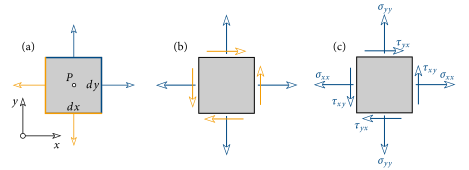
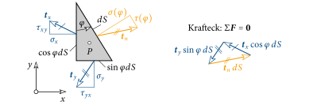
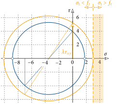
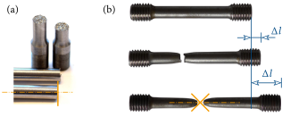
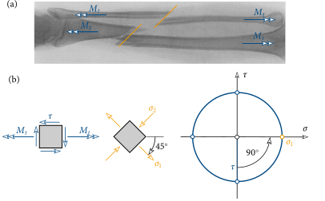
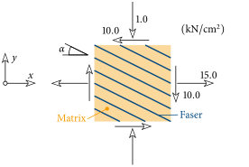



# Der Spannungszustand in einer Scheibe {#sec-scheibe}

## Der Spannungstensor {#sec-spannungstensor}

Zunächst gilt es zu definieren, was in der Mechanik unter einer Scheibe verstanden wird.
Als Beispiel dafür betrachten wir das Knotenblech eines Hochspannungsmasten, siehe @fig-knotenblech.

{#fig-knotenblech}

Eine Scheibe ist ein *ebener* Körper, dessen Dicke $t$ wesentlich kleiner als die beiden anderen Körperabmessungen ist.
Des Weiteren greifen die äußeren Kräfte alle *in* der Scheibenebene an.
Für das Knotenblech sind dies die Kräfte in den Streben (Einzelkräfte in @fig-knotenblech(b)).
Durch diese Art der Beanspruchung kommt es zu *keiner* Verschiebung normal zur Scheibe, d.h. sie bleibt eben.

Nun gilt es die in einem beliebigen Punkt $P$ der Scheibe wirkenden inneren Kräfte zu bestimmen.
Damit diese sichtbar werden, schneidet man ein infinitesimales Element um den betrachteten Punkt heraus (@fig-esz(a)).
Betrachtet wird dieses Element nun mit Blickrichtung normal zur Scheibenebene.
Des Weiteren wird ein kartesisches $x$-$y$-Koordinatensystem definiert.
In Analogie zum Stab lassen sich damit die positiven und negativen Schnittufer bestimmen.
Zeigt der Normalenvektor in die positive Koordinatenrichtung, handelt es sich um das positive Schnittufer (blaue Flächen in @fig-esz(a)).
Bei entgegengesetzter Richtung handelt es sich um das negative Schnittufer (orange Flächen).

{#fig-esz}

Somit lassen sich nun in jede der vier Flächen die wirkenden Normal- (blau) und Schubspannungen (orange) eintragen (@fig-esz(b)).
Zur Erinnerung: Am positiven Schnittufer wirken die Spannungen in die positiven Koordinatenrichtungen!
Damit wir diese Spannungen unterscheiden können, werden sowohl der Normalspannung $\sigma$ wie auch der Schubspannung $\tau$ *zwei* Indizes angehängt.
Der erste gibt die Richtung des Normalenvektors der Fläche an, in der die Spannung wirkt, und der zweite die Richtung der Spannung selbst.
Somit ergibt sich die Benennung der Spannungen, wie sie in @fig-esz(c) angegeben ist.

Damit *Gleichgewicht* erfüllt ist, sind die beiden horizontalen Normalspannungen $\sigma_{xx}$ gleich groß.
Gleiches gilt für die beiden vertikalen Normalspannungen $\sigma_{yy}$.
Aus dem Momentengleichgewicht folgt, dass alle vier wirkenden Schubspannungen gleich groß sind (Satz der zugeordneten Schubspannungen).
Damit wirken in einem Punkt $P$ der Scheibe die drei Spannungen:

$$
\sigma_x\;,\quad \sigma_y\;, \quad \text{und} \quad \tau_{xy}=\tau_{yx} \;.
$$ {#eq-spannungen-punkt}

Zur einfacheren Schreibweise wird nachfolgend nur mehr ein Index für die Normalspannung angeschrieben ($\sigma_{xx}\equiv\sigma_x$ und $\sigma_{yy}\equiv\sigma_y$).
Diese Spannungen werden nun in einen Tensor (Matrix) geschrieben, wobei auf der Diagonale die Normalspannungen stehen:

$$
\bs{\sigma} =
\begin{bmatrix}
\sigma_x & \tau_{xy} \\ \tau_{yx} & \sigma_y
\end{bmatrix}
$$ {#eq-spannungstensor}

Der *Spannungstensor* $\bs{\sigma}$ ist aufgrund des Satzes der zugeordneten Schubspannungen ($\tau_{xy}=\tau_{yx}$) *symmetrisch*.
Wie die Schnittgrößen ($N$, $Q$ und $M_y$) in einem Stab beschreibt dieser die Beanspruchung in einem Punkt durch die äußere Belastung.
Ist der Spannungstensor bekannt, kann ein Festigkeitsnachweis durchgeführt werden.

## Koordinatentransformation und Hauptspannungen {#sec-hauptspannungen}

Bereits beim Zugstab wurde erkannt, dass die Größe der Normal- und Schubspannungen abhängig von der Orientierung der Schnittfläche ist (siehe @fig-normalspannungen bis @fig-schubspannungen).
Gleiches gilt natürlich auch in einer Scheibe!
Um die Beziehungen zur Bestimmung der Spannungen in beliebig gerichteten Flächen herzuleiten, schneidet man nun ein infinitesimales Dreieck um den Punkt $P$ aus der Scheibe heraus (@fig-koordinatentransformation).

{#fig-koordinatentransformation}

Es wird davon ausgegangen, dass der Spannungstensor ([-@eq-spannungstensor]) bezogen auf das $x$-$y$-Koordinatensystem im Punkt $P$ bekannt ist.
Die in der vertikalen und horizontalen Fläche wirkenden Spannungen werden nun in Vektoren geschrieben:

$$
\bs{t}_x = \begin{Bmatrix}
\sigma_x \\ \tau_{xy}
\end{Bmatrix} \quad \text{und} \quad
\bs{t}_y = \begin{Bmatrix}
\sigma_y \\ \tau_{yx}
\end{Bmatrix} \; .
$$ {#eq-t-xy}

Ebenso werden die *unbekannte* Normal- und Schubspannung in der schrägen Fläche $dS$ in einen Vektor eingetragen:

$$
\bs{t}_n = \begin{Bmatrix}
\sigma(\vp) \\ \tau(\vp)
\end{Bmatrix} \; .
$$ {#eq-tn}

Im infinitesimalen Dreieckselement in @fig-koordinatentransformation sind all diese (Spannungs-)Vektoren eingetragen.

Wie kann nun $\bs{t}_n$ berechnet werden?
Die *Kräfte* müssen im *Gleichgewicht* sein!
Um von den Spannungen auf die resultierenden Kräfte zu kommen, müssen diese mit der jeweiligen Fläche ($\cos\vp\, dS$, $\sin\vp\, dS$, $dS$) multipliziert werden.
Die Gleichgewichtsbedingung lautet (geschlossenes Krafteck in @fig-koordinatentransformation):

$$
\sum\bs{F}=\bs{0}: \bs{t}_x\cos\vp\,\cancel{dS} + \bs{t}_y\sin\vp\,\cancel{dS} +\bs{t}_n\,\cancel{dS} = \bs{0} \quad \rightarrow \quad \bs{t}_n(\vp) = -\bs{t}_x\cos\vp - \bs{t}_y\sin\vp \; .
$$ {#eq-gg-dreieck}

Daraus geht eindeutig hervor, dass $\bs{t}_n$ und damit die Normal- und Schubspannung in der schrägen Fläche $dS$ *abhängig* vom Winkel $\vp$ sind, d.h. von der Orientierung der Fläche!
Zur Erinnerung: $\bs{t}_x$ und $\bs{t}_y$ sind ja bekannt.

Auf Basis dieser Gleichgewichtsbetrachtung lassen sich die sogenannten Koordinatentransformationen für die Spannungen herleiten.
Um die Ausrichtung einer beliebigen Fläche beschreiben zu können, wird ein $\xi$-$\eta$-Koordinatensystem eingeführt.
Dieses wird durch eine Drehung um den Winkel $\vp$ erhalten, siehe @fig-esz-transf.

{#fig-esz-transf}

Zu beachten ist, dass $\vp$ im Gegenuhrzeigersinn positiv gezählt wird.
In @fig-esz-transf sind auch die Indizes der Spannungen im $\xi$-$\eta$-Koordinatensystem nach der eingangs erläuterten Konvention eingetragen.
Ihre Größen berechnen sich zu:

$$
\begin{aligned}
\sigma_\xi &= \dfrac{\sigma_x+\sigma_y}{2}+\dfrac{\sigma_x-\sigma_y}{2}\cos 2\vp + \tau_{xy}\sin 2\vp \\
\sigma_\eta &= \dfrac{\sigma_x+\sigma_y}{2}-\dfrac{\sigma_x-\sigma_y}{2}\cos 2\vp - \tau_{xy}\sin 2\vp \\
\tau_{\xi\eta} &= -\dfrac{\sigma_x-\sigma_y}{2}\sin 2\vp + \tau_{xy}\cos 2\vp \; .
\end{aligned}
$$ {#eq-transformation}

Bei ([-@eq-transformation]) handelt es sich um die sogenannten Transformationsbeziehungen des Spannungstensors einer Scheibe.

Als Beispiel ist in @fig-transformation der Spannungszustand (Spannungstensor) im Punkt $P$ einer Scheibe angegeben.
Diese Spannungen beziehen sich anfänglich auf ein $x$-$y$-Koordinatensystem.
Anschließend wird das System um $20^\circ$ im Gegenuhrzeigersinn gedreht.
Mit Hilfe von ([-@eq-transformation]) werden die Spannungen im $\xi$-$\eta$-Koordinatensystem berechnet.

::: {#fig-transformation}


$$
\bs{\sigma} =
\begin{bmatrix}
\sigma_x & \tau_{xy} \\ \tau_{yx} & \sigma_y
\end{bmatrix} =
\begin{bmatrix}
7.0 & 4.0 \\ 4.0 & 1.0
\end{bmatrix}
\qquad\qquad
\bs{\sigma} =
\begin{bmatrix}
\sigma_\xi & \tau_{\xi\eta} \\ \tau_{\eta\xi} & \sigma_\eta
\end{bmatrix} =
\begin{bmatrix}
8.87 & 1.14 \\ 1.14 & -0.87
\end{bmatrix}
$$

Beispiel für die Transformation des Spannungstensors (N/mm²)
:::

Die Normalspannung in einer horizontalen Faser ($x$-Richtung) ist zunächst $7.0\,\text{N/mm}^2$.
Eine Faser, die um $20^\circ$ gegenüber der Horizontalen geneigt ist, erfährt in diesem Fall eine höhere Normalspannung (Zug) von der Größe $8.87\,\text{N/mm}^2$.

Des Weiteren erkennt man, dass im $x$-$y$-Koordinatensystem beide Normalspannungen Zugspannungen sind.
Betrachtet man hingegen eine Faser in $\eta$-Richtung, erfährt diese eine Druckspannung ($\sigma_\eta=-0.87\,\text{N/mm}^2$)!
Mit diesem Beispiel soll die Änderung der Größe der Spannungen in unterschiedlich ausgerichteten Flächen untermauert werden.
Es ist zu beachten, dass die Scheibe selbst *nicht* gedreht wird, nur die Schnittflächen!
Interessanterweise ändern sich allerdings die Spur und Determinante von $\bs{\sigma}$ bei einer Koordinatentransformation nicht.

Die Transformationsbeziehungen ([-@eq-transformation]) können auch grafisch im sogenannten [Mohr]{.smallcaps}'schen Spannungskreis dargestellt werden.
Aus diesem lassen sich auf sehr einfachem Wege die Änderungen der Spannungen abschätzen.
Konstruiert wird der [Mohr]{.smallcaps}'sche Spannungskreis auf folgendem Wege (siehe @fig-mohr-kreis):

- Es wird ein Achsensystem gewählt, in dem auf der horizontalen Achse die Normalspannung $\sigma$ und auf der vertikalen Achse die Schubspannung $\tau$ aufgetragen wird.
- Über den Wert der Normalspannung $\sigma_x$ wird die Schubspannung $\tau_{xy}$ aufgetragen und über $\sigma_y$ der *negative* Wert von $\tau_{xy}$.
- Die so erhaltenen Punkte $P$ und $P'$ werden miteinander verbunden. Der Schnittpunkt dieser Geraden mit der $\sigma$-Achse ist der Mittelpunkt des Spannungskreises.

![Konstruktion des [Mohr]{.smallcaps}'schen Spannungskreises](images/MohrCircle.svg){#fig-mohr-kreis}

Der blaue Kreis in @fig-mohr-kreis ist der [Mohr]{.smallcaps}'sche Spannungskreis.

Nach diesen Konstruktionsregeln ist für das Zahlenbeispiel in @fig-transformation der [Mohr]{.smallcaps}'sche Spannungskreis in @fig-bsp-mohr dargestellt.
Aus dem Kreis lassen sich die Werte für die Spannungen $\sigma_\xi$, $\sigma_\eta$ und $\tau_{\eta\xi}$ ablesen.
Um dies zu bewerkstelligen, muss zuerst die Gerade $P-P'$ um den *doppelten* Winkel $2\vp$ und in die *entgegengesetzte* Drehrichtung (zu $\vp$) um den Kreismittelpunkt gedreht werden.
Für den vorliegenden Fall muss also die strichlierte blaue Gerade um $40^\circ$ im Uhrzeigersinn gedreht werden.
So ergeben sich die Punkte $Q$ und $Q'$ in @fig-bsp-mohr.
Die Koordinaten dieser beiden Punkte entsprechen dann den Spannungen im $\xi$-$\eta$-Koordinatensystem, denn Punkt $Q$ liegt bei ($\sigma_\xi=8.87\,\text{N/mm}^2$, $\tau_{\xi\eta}=1.14\,\text{N/mm}^2$) und $Q'$ bei ($\sigma_\xi=-0.87\,\text{N/mm}^2$, $\tau_{\xi\eta}=-1.14\,\text{N/mm}^2$).

![Beispiel zum [Mohr]{.smallcaps}'schen Spannungskreis (N/mm²)](images/BspMohrscheKreis.svg){#fig-bsp-mohr}

Für die Dimensionierung einer Scheibe sind natürlich die Größtwerte der Spannungen von Interesse.
Wie man im Beispiel in @fig-transformation erkennt, ändern sich die Normalspannungen in Abhängigkeit vom Winkel $\vp$.
Über eine Extremwertaufgabe lassen sich die Größtwerte der Normalspannungen bestimmen.
Leichter kann man diese aber aus dem [Mohr]{.smallcaps}'schen Spannungskreis bestimmen.
Wie aus @fig-mohr-kreis hervorgeht, werden die größten auftretenden Normalspannungen am linken und rechten Scheitelpunkt des Kreises erreicht.
Diese Größtwerte werden als *Hauptnormalspannungen* $\sigma_1$ und $\sigma_2$ bezeichnet.
Man erkennt weiters aus dem [Mohr]{.smallcaps}'schen Spannungskreis, dass die dabei auftretenden Schubspannungen gleich Null sind!
Die Größe der Hauptnormalspannungen berechnet sich zu

$$
\sigma_{1,2}=\dfrac{\sigma_x+\sigma_y}{2}\pm\sqrt{\left(\dfrac{\sigma_x-\sigma_y}{2}\right)^2+\tau_{xy}^2} \; .
$$ {#eq-hauptspannungen}

Diese werden der Größe nach geordnet, d.h. $\sigma_1>\sigma_2$.
Ein Vergleich mit @fig-mohr-kreis ergibt, dass der erste Term auf der rechten Seite von ([-@eq-hauptspannungen]) der Mittelpunkt und der Wurzelausdruck gleich dem Radius des [Mohr]{.smallcaps}'schen Spannungskreises ist.
Ebenfalls daraus ergibt sich die Richtung der Hauptnormalspannungen $\vp_\sigma$ zu

$$
\tan 2\vp_\sigma=\dfrac{2\tau_{xy}}{\sigma_x-\sigma_y} \; .
$$ {#eq-hauptrichtung}

Für das Beispiel in @fig-transformation sind die Hauptnormalspannungen in @fig-hauptspannungen(a) dargestellt.
Im Spannungskreis muss die Gerade $P-P'$ um $53.2^\circ$ im Uhrzeigersinn gedreht werden, um auf die Gerade der Hauptnormalspannungen $\sigma_1-\sigma_2$ zu kommen.
Die größte Zugspannung von $\sigma_1=9.0\,\text{N/mm}^2$ tritt unter einem Winkel von $26.6^\circ$ auf, und die größte Druckspannung $\sigma_2=-1.0\,\text{N/mm}^2$ tritt unter einem Winkel von $116.6^\circ$ auf.
Es wird nochmals betont, dass in diesen Richtungen *keine* Schubspannungen wirken!

{#fig-hauptspannungen}

Aus analogen Betrachtungen am [Mohr]{.smallcaps}'schen Spannungskreis lassen sich auch die größten Schubspannungen (Hauptschubspannungen), die am oberen und unteren Scheitelpunkt auftreten, bestimmen.
Ihre Größe entspricht genau dem Radius des Spannungskreises:

$$
\tau_{max}=\pm\sqrt{\left(\dfrac{\sigma_x-\sigma_y}{2}\right)^2+\tau_{xy}^2} \; ,
$$ {#eq-tau-max}

und sie treten in einer Richtung von

$$
\tan 2\vp_\tau=-\dfrac{\sigma_x-\sigma_y}{2\tau_{xy}}
$$ {#eq-schubrichtung}

auf.
Die Normalspannungen sind in diesen Richtungen nicht Null, aber gleich groß und entsprechen dem Mittelpunkt des Spannungskreises.
In @fig-hauptspannungen(b) ist die Richtung und die Größe der Hauptschubspannungen für das Zahlenbeispiel dargestellt.

Hauptnormalspannungen werden heute – vor allem in Finite-Elemente-Programmen – aber vorwiegend durch Lösen eines Eigenwertproblems bestimmt.
Die Eigenwerte des Spannungstensors entsprechen dabei den Hauptnormalspannungen.
Um dies zu zeigen, formulieren wir zunächst das Eigenwertproblem^[Aus der Mathematik: $\bs{Ax}=\lambda\bs{x}\;\rightarrow\;(\bs{A}-\lambda\bs{I})\bs{x}=\bs{0}$]

$$
(\bs{\sigma}-\lambda\bs{I})\bs{n}=\bs{0} \;\rightarrow\;
\begin{bmatrix}
\sigma_x-\lambda & \tau_{xy} \\ \tau_{xy} & \sigma_y-\lambda
\end{bmatrix}
\begin{Bmatrix}n_x \\ n_y\end{Bmatrix} =
\begin{Bmatrix}0 \\ 0\end{Bmatrix} \; ,
$$ {#eq-eigenwertproblem}

mit den Eigenwerten $\lambda$ und den dazugehörigen Eigenvektoren $\bs{n}$.
Durch Nullsetzen der Determinante der Koeffizientenmatrix

$$
\det\left[\bs{\sigma}-\lambda\bs{I}\right] = (\sigma_x-\lambda)(\sigma_y-\lambda)-\tau_{xy}^2 =\lambda^2-\lambda(\sigma_x+\sigma_y) + \sigma_x\sigma_y - \tau_{xy}^2= 0 \; ,
$$ {#eq-charakteristisch}

lassen sich aus dieser quadratischen Gleichung^[$x^2+px+q=0\;\rightarrow\;x_{1,2}=-\dfrac{p}{2}\pm\sqrt{\left(\dfrac{p}{2}\right)^2-q}$] die Eigenwerte berechnen:

$$
\lambda_{1,2} = \dfrac{\sigma_y+\sigma_x}{2}\pm\sqrt{\left(\dfrac{\sigma_x+\sigma_y}{2}\right)^2-\sigma_x\sigma_y+\tau_{xy}^2} \; .
$$ {#eq-eigenwerte}

Ein Vergleich der Eigenwerte $\lambda_{1,2}$ mit ([-@eq-hauptspannungen]) ergibt, dass diese beiden Ausdrücke ident sind, d.h. $\lambda_1\equiv\sigma_1$ und $\lambda_2\equiv\sigma_2$ gilt.
Da es sich beim Spannungstensor ([-@eq-spannungstensor]) um eine *symmetrische* Matrix handelt, sind die Eigenwerte (Hauptspannungen) immer reell.
Die Eigenvektoren $\bs{n}_1$ und $\bs{n}_2$ geben die Wirkungsrichtung der Hauptnormalspannungen an.
Ebenfalls durch die Symmetrie sind diese zueinander orthogonal, vgl. @fig-hauptspannungen(a).

::: {#exm-glasscheibe}
Eine Glasscheibe von der Dicke $t=5\,\text{mm}$ wird an ihrem unteren Rand gehalten und am oberen Rand gleichförmig belastet.
Die Größe der Belastung in vertikaler Richtung ist $p_y=3.5\,\text{kN/cm}$ und in horizontaler Richtung $p_x=2.0\,\text{kN/cm}$.
Die Zugfestigkeit (max. aufnehmbare Zugspannung) für Glas ist zu $f_t=3.0\,\text{kN/cm}^2$ und die Druckfestigkeit (max. aufnehmbare Druckspannung) ist zu $f_c=90\,\text{kN/cm}^2$ gegeben.

{fig-align="center"}

Im mittleren Bereich der Glasscheibe (oranger Bereich) kann der Spannungszustand zu

$$
\bs{\sigma} = \begin{bmatrix}\sigma_x & \tau_{xy} \\ \tau_{yx} & \sigma_y\end{bmatrix} = \begin{bmatrix}0 & \dfrac{p_x}{t} \\ \dfrac{p_x}{t} & -\dfrac{p_y}{t}\end{bmatrix} = \begin{bmatrix}0 & 4.0 \\ 4.0 & -7.0\end{bmatrix} \quad (\text{kN/cm}^2)
$$

angenähert werden.
Kommt es in diesem Bereich zum Materialversagen (Bruch), d.h. werden größere Spannungen als die angegebenen Festigkeiten erreicht?
Wenn nein, um wie viel kann $p_x$ (bei gleichbleibendem $p_y$) maximal gesteigert werden?
:::

::: {.callout-tip .loesung collapse="true" icon=false}
## Lösung

Zuerst müssen dazu die größten Normalspannungen bestimmt werden, d.h. die Hauptnormalspannungen.
Der dazugehörige [Mohr]{.smallcaps}'sche Spannungskreis ist in nachfolgender Abbildung blau dargestellt.
Für den gegebenen Spannungstensor berechnen sich die Hauptnormalspannungen nach ([-@eq-hauptspannungen]) zu

$$
\sigma_{1,2} = -\dfrac{7}{2}\pm\sqrt{\left(\dfrac{7}{2}\right)^2+4^2} = -3.5\pm 5.3 \; .
$$

Aus den Zahlenwerten erkennt man, dass $\sigma_1$ eine Zug- und $\sigma_2$ eine Druckspannung ist.
Ein Vergleich mit den dazugehörigen Festigkeiten ergibt:

$$
\sigma_1 = 1.8\,\text{kN/cm}^2 < f_t=3.0\,\text{kN/cm}^2 \quad \text{und} \quad |\sigma_2| = 8.8\,\text{kN/cm}^2 < f_c=90\,\text{kN/cm}^2 \; .
$$

Weder $\sigma_1$ noch $\sigma_2$ nehmen Werte größer als die gegebenen Festigkeiten an.
Es kommt daher nicht zum Versagen des Glases in diesem Bereich.

Folglich kann $p_x$ noch gesteigert werden.
Aus dem oberen Ergebnis sieht man, dass bei einer weiteren Steigerung von $p_y$ *zuerst* die Zugfestigkeit $f_t$ erreicht wird.
Bei spröden Materialien kommt es meist zu Zugversagen.
Wird nun $p_x$ um den Faktor $\lambda$ gesteigert, ändert sich die Schubspannung ebenfalls um diesen Wert.
Es kommt dann zum Bruch, wenn $\sigma_1$ den Wert der Zugfestigkeit erreicht.
Daraus können wir $\lambda$ bestimmen:

$$
\sigma_1 = f_t \;\rightarrow\; \sigma_1 = -\dfrac{7}{2}\pm\sqrt{\left(\dfrac{7}{2}\right)^2+(\lambda 4)^2} = 3.0 \;\rightarrow\; \lambda = 1.3693
$$

Die horizontale Belastung, bei gleichbleibender vertikaler Belastung, von der Größe

$$
p_{x,c} = \lambda p_x= 2.7\,\text{kN/cm}^2
$$

führt zum Zugversagen des Glases!

Eine Vergrößerung der Schubspannung vergrößert gleichzeitig den Radius des [Mohr]{.smallcaps}'schen Spannungskreises (oranger Kreis).
Der Mittelpunkt bleibt an der gleichen Stelle.
Berührt der Kreis die Versagensgrenze ($\sigma_1=f_t$), kommt es zum Bruch!

{fig-align="center"}

Wie groß wäre die Laststeigerung, wenn $p_x$ und $p_y$ gleichzeitig gesteigert werden?
(Lösung: $\lambda=1.667$).
Warum kann die Last in diesem Fall größere Werte annehmen?
:::

## Versagen von spröden und duktilen Werkstoffen {#sec-versagen}

In diesem Abschnitt wird kurz beschrieben, welche Spannungen zum Versagen von spröden (Glas, Gusseisen, Keramik, …) und duktilen (Stahl, Aluminium, …) Werkstoffen führen.
Aufschlussreich ist dabei, die Verformung und Versagensfläche der Probe eines Zugversuches zu betrachten.

{#fig-brueche-zugversuch}

In @fig-brueche-zugversuch ist das Bruchbild der Zugprobe für spröde und duktile Werkstoffe schematisch dargestellt.
Beim spröden Werkstoff ist die Bruchfläche genau rechtwinkelig zur Stabachse (Kraftrichtung).
Mit steigender Duktilität wird die Verformung an der Bruchstelle immer spitzer.
Die größten plastischen Verformungen treten in geneigten Ebenen zur Stabachse auf.

{#fig-duktiler-bruch}

In @fig-duktiler-bruch sind reale Bruch- und Versagensflächen eines spröden und duktilen Werkstoffs dargestellt.
Die Längenänderung $\Delta l$ der Zugprobe beim Versagen nimmt mit wachsender Duktilität zu.
Gleichzeitig wird die Verformung an der Bruchstelle immer flacher.

Mit Hilfe des [Mohr]{.smallcaps}'schen Spannungskreises sollen nun die Spannungen in diesen Bruch- und Versagensflächen bestimmt werden.
Beim Zugversuch herrscht in einer Fläche normal zur Stabachse nur eine Normalspannung $\sigma_x$ von der Größe $F/A$, wenn ein Koordinatensystem wie in @fig-mohr-zugversuch gewählt wird.
Da die Schubspannungen Null sind, handelt es sich bei $\sigma_x$ um eine Hauptnormalspannung.
Die Normalspannung in $y$-Richtung ist Null.
Daher ergibt sich der in @fig-mohr-zugversuch dargestellte [Mohr]{.smallcaps}'sche Spannungskreis.
Aus @fig-mohr-zugversuch(a) erkennt man, dass beim spröden Werkstoff die Bruchfläche genau orthogonal zur größten Normalspannung in Zug $\sigma_1$ steht.
Daraus lässt sich ableiten, dass es in einem Punkt eines *spröden* Werkstoffs dann zum Versagen kommt, wenn die größte Normalspannung auf *Zug* (das ist $\sigma_1$) die Zugfestigkeit des Werkstoffes erreicht.
Nach diesem Kriterium wurde auch die Glasscheibe im vorherigen Beispiel bemessen.

{#fig-mohr-zugversuch}

Aus der Werkstofftechnologie ist bekannt, dass plastische Verformungen (wie sie bei einem duktilen Werkstoff auftreten) durch das Abgleiten von Atomschichten entlang von Gleitebenen entstehen.
Zu diesem Phänomen kommt es aber nur dann, wenn in den Gleitebenen Schubspannungen wirken.
Aus dem [Mohr]{.smallcaps}'schen Spannungskreis erkennt man, dass die größten Schubspannungen beim Zugversuch in einer Ebene unter $45^\circ$ zur Stabachse auftreten, siehe @fig-mohr-zugversuch(b).
Häufig setzt Gleiten daher in diesen Ebenen ein.
Führt bei einem spröden Werkstoff die größte Zugspannung zum Versagen, so sind es große Schubspannungen, die einen duktilen Werkstoff zum Plastizieren bringen.

Abschließend sei noch ein weiteres Beispiel für das Versagen eines spröden Werkstoffes erwähnt, nämlich eine Torsionsfraktur (@fig-torsionsfraktur).
Vereinfachend werden dazu die Knochen als ein Stab mit kreisrundem Querschnitt betrachtet, der durch ein Torsionsmoment beansprucht wird.

{#fig-torsionsfraktur}

Wie im Abschnitt der Torsion der runden Welle (vgl. @fig-torsion-welle) diskutiert, treten im Stabquerschnitt nur Schubspannungen auf.
Die Größtwerte werden an der Oberfläche erreicht.
Da in einem Element an der Oberfläche nur Schubspannungen wirken (@fig-torsionsfraktur(b)), wird dieser Zustand als reiner Schub bezeichnet.
Der Mittelpunkt des Spannungskreises ist in diesem Fall genau der Ursprung des $\sigma$-$\tau$-Koordinatensystems.
Durch das spröde Verhalten der Knochen ist für das Versagen wiederum die größte Zugspannung ausschlaggebend.
Aus dem Spannungskreis folgt, dass diese in einer Ebene unter $45^\circ$ zur Stabachse auftritt.
Diese Ebene ist zugleich die Bruchfläche, die man eindeutig auch im Röntgenbild in @fig-torsionsfraktur(a) erkennt.

::: {#exm-leimfuge-schraeg}
Ein Holzstab wird axial mit einer Zugspannung von $1\,\text{N/cm}^2$ belastet und ist durch eine schräge Leimfuge verbunden.
Die Leimfuge kann eine maximale Schubspannung von $0.4\,\text{N/cm}^2$ und eine maximale Zugspannung von $0.3\,\text{N/cm}^2$ übertragen.
Wie groß darf der Winkel $\alpha$ maximal gewählt werden?

{fig-align="center"}
:::

::: {.callout-tip .loesung collapse="true" icon=false}
## Lösung

:::

::: {#exm-hohlprofil}
Ein Stab in Form eines rechteckigen Hohlprofils besteht im unteren Bereich aus Stahl und im oberen Bereich aus Aluminium.
Beansprucht wird der Stab durch ein Torsionsmoment von $M_t = 17\,\text{kNm}$.
Zusätzlich wird der Bereich aus Stahl noch durch eine Kraft $F=620\,\text{kN}$ axial belastet.
Es wird angenommen, dass eine maximale Schubspannung von $5\,\text{kN/cm}^2$ in Aluminium und $7\,\text{kN/cm}^2$ in Stahl zum Fließen führt.
Wird einer der beiden Bereiche plastisch beansprucht?

{fig-align="center"}
:::

::: {.callout-tip .loesung collapse="true" icon=false}
## Lösung

:::

::: {#exm-faserverbund}
In einer Scheibe, hergestellt aus einem Faserverbundwerkstoff, wirkt der gegebene Spannungszustand.
Bei einem derartigen Werkstoff werden verstärkende Fasern in einer Matrix eingebettet.
Die Faserrichtung ist mit $\alpha=30^\circ$ gegeben.
Wie groß ist die Normalspannung in den Fasern?
Was wäre die optimale Richtung der Fasern, wenn ihre Zugfestigkeit deutlich größer ist als jene der Matrix?

{fig-align="center"}
:::

::: {.callout-tip .loesung collapse="true" icon=false}
## Lösung

- $\sigma_{\text{Faser}} = 19.7\,\text{kN/cm}^2$
- $\alpha_{\text{opt}} = 25.7^\circ$
:::

::: {#exm-matlab-eigenwerte}
Bestimme die Hauptnormalspannungen des Spannungstensors in @fig-transformation durch Lösen des Eigenwertproblems in [Matlab]{.smallcaps}.
Durch Eingabe von

```matlab
sig = [ 7.0   4.0 ; 4.0   1.0 ]
```

wird der Spannungstensor definiert.
Das Eigenwertproblem wird gelöst durch

```matlab
[n,sig12] = eig(sig)
```

Stimmt die Lösung mit den in @fig-hauptspannungen(a) angegebenen Werten überein?
:::
